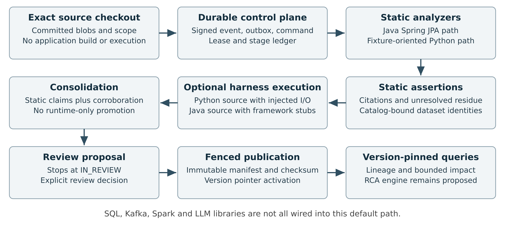
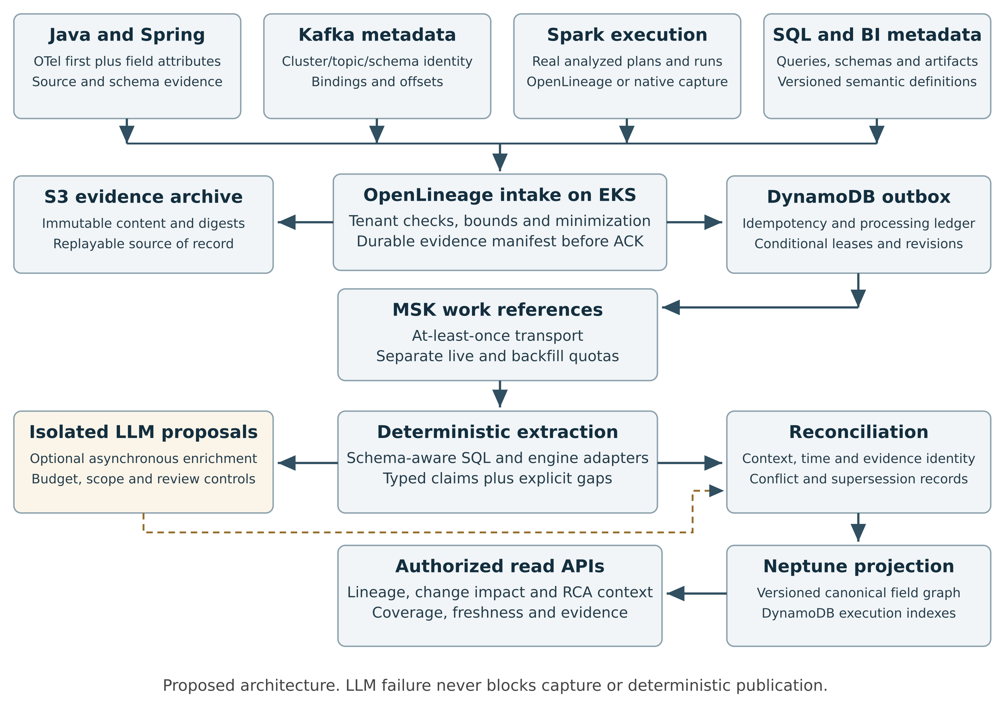

# Lineage Collection Architecture Review
Enterprise readiness, market benchmark, product requirements, and technical design

6 October 2026 | Repository assessment and proposed engineering plan

Repository: [Kart rc lineage collection](https://github.com/Kart-rc/lineage-collection). Source snapshot: [32958a35cdf49341b15a4d6cb05f596811396b06](https://github.com/Kart-rc/lineage-collection/tree/32958a35cdf49341b15a4d6cb05f596811396b06). Code findings below apply to this revision. Product documentation was checked on 6 October 2026; vendor pages may change.

## Executive verdict

**The evidence-first architecture is viable for a bounded enterprise lineage service. The audited implementation is a substantial prototype, not yet an authoritative enterprise lineage, impact or RCA platform.** Retain immutable evidence, durable processing, review and fenced publication. First fix semantic errors, identity incompatibilities, stale evidence and disconnected integrations.

Use OTel first for services and feasible field-attribute customization, a separate SDK only when that is infeasible, Spark-native capture, and OpenLineage for all lineage exchange. Reuse schema-aware SQL analysis, compiler artifacts and catalog identities. Keep LLM proposals optional and separately labeled.

Runtime has distinct mechanisms: actual Python functions with injected I/O, selected Java source with framework stubs, and signed external SDK/OTel/OpenLineage observations. Their capture, comparison and promotion limits differ. Corroboration does not by itself prove production transformation semantics.

The first release should prove one versioned Java/Spring → Kafka → Spark/SQL → output-table → downstream-service chain. Both service and analytical field mappings are required; transport connectivity alone is insufficient. Opaque mappings must remain visible breaks.

At 100,000 executions/day, mean arrival is 1.16/s. Field fan-out, bursts, graph history and replay drive capacity. All service levels, quality thresholds, cost examples and rollout gates below are proposed targets, not achieved performance.

## Reading guide

- Part I: implemented paths, verification results and release-blocking defects
- Part II: reusable components, enterprise platforms and the build decision
- Part III: product requirements, semantics, coverage and support boundaries
- Part IV: architecture, contracts, reconciliation, impact/RCA, capacity and release tests
- Part V: OTel-first instrumentation, OpenLineage normalization and independent ATDD coverage

## Evidence and limits

Code inspection, locked-dependency tests, synthetic semantic probes and in-process API tests support the findings at the pinned revision. No live LLM, AWS/EKS deployment, Kafka broker, Spark cluster, warehouse or enterprise identity provider was exercised. Library, adapter and API findings are distinguished. The adversarial probes do not establish production precision or recall.

# Part I Architectural review



Figure 1 Current local collection path at the audited revision. Harness verification is opt-in and disabled by default. Signed external runtime input is a separate path. This diagram does not claim AWS parity or production telemetry.

## What is implemented, and where

### Actual local product path

`POST /api/collections` / CLI exact checkout → acquisition and immutable source descriptor → signed `repo.push` → durable command/outbox/lane/lease → Incremental I1–I10 → classification → analyzer → optional generated runtime harness → consolidation → proposal `IN_REVIEW` → explicit review and synchronous resumable publication → version-pinned query.

- Every collection is emitted as `repo.push` and uses the entire snapshot path list as `changedFiles`: [repository_collection.py L169–201](https://github.com/Kart-rc/lineage-collection/blob/32958a35cdf49341b15a4d6cb05f596811396b06/apps/api/src/lineage_api/application/repository_collection.py#L169-L201).
- Local composition constructs a catalog from checked-in fixture JSON, the Python analyzer, and `AnalyzerRegistry.default(python_analyzer)`: [dependencies.py L154–210](https://github.com/Kart-rc/lineage-collection/blob/32958a35cdf49341b15a4d6cb05f596811396b06/apps/api/src/lineage_api/dependencies.py#L154-L210).
- Java/Spring uses Tree-sitter syntax facts plus SQLGlot schema grounding. The evidence compiler requires a complete invocation→repository→entity→schema-table proof chain and emits unresolved reasons when it cannot prove one: [java_spring_sca.py L614–678](https://github.com/Kart-rc/lineage-collection/blob/32958a35cdf49341b15a4d6cb05f596811396b06/apps/api/src/lineage_api/services/java_spring_sca.py#L614-L678), [source lines 893–1006](https://github.com/Kart-rc/lineage-collection/blob/32958a35cdf49341b15a4d6cb05f596811396b06/apps/api/src/lineage_api/services/java_spring_sca.py#L893-L1006).
- The registry declares Python fixture, Java/Spring JPA, Kafka binding, and SQL transformation packs, but SQL and Kafka handlers require resolvers supplied to the registry; the default local composition does not supply those resolvers: [analyzer_registry.py L198–295](https://github.com/Kart-rc/lineage-collection/blob/32958a35cdf49341b15a4d6cb05f596811396b06/apps/api/src/lineage_api/services/analyzer_registry.py#L198-L295), [dependencies.py L171–174](https://github.com/Kart-rc/lineage-collection/blob/32958a35cdf49341b15a4d6cb05f596811396b06/apps/api/src/lineage_api/dependencies.py#L171-L174).

### Actual AWS product path

There are real CDK stacks, Lambda entrypoints, DynamoDB/S3/SQS/Kinesis/Neptune adapters, Step Functions definitions, and a Fargate SCA worker. These are useful assets. However:

- AWS collection submission explicitly returns **501 COLLECTION_SUBMIT_NOT_CONFIGURED**, because repository-acquisition Fargate stage is absent: [query_projection.py L290–303](https://github.com/Kart-rc/lineage-collection/blob/32958a35cdf49341b15a4d6cb05f596811396b06/apps/api/src/lineage_api/infrastructure/aws/query_projection.py#L290-L303).
- AWS SCA accepts only `pack == "python-ast"`, then uses the fixture-oriented Python analyzer. The Java repository cell is not bound into that use case: [sca_execution.py L65–81](https://github.com/Kart-rc/lineage-collection/blob/32958a35cdf49341b15a4d6cb05f596811396b06/apps/api/src/lineage_api/application/sca_execution.py#L65-L81), [source lines 173–209](https://github.com/Kart-rc/lineage-collection/blob/32958a35cdf49341b15a4d6cb05f596811396b06/apps/api/src/lineage_api/application/sca_execution.py#L173-L209).
- AWS interactions projection explicitly returns **501 NOT_IMPLEMENTED**: [query_projection.py L379–388](https://github.com/Kart-rc/lineage-collection/blob/32958a35cdf49341b15a4d6cb05f596811396b06/apps/api/src/lineage_api/infrastructure/aws/query_projection.py#L379-L388).
- AWS infrastructure is **ECS/Fargate plus Lambda**, not an EKS deployment. EKS workload discovery/admission/daemonset/OTel distribution is not implemented by the inspected stacks: [engines-stack.ts L54–82](https://github.com/Kart-rc/lineage-collection/blob/32958a35cdf49341b15a4d6cb05f596811396b06/infra/lib/engines-stack.ts#L54-L82).

### Library/script capabilities that must not be described as normal product integration

Call-site search finds `analyze_spark_sources`, `compose_repository_documents`, `simulate_impact`, and `analyze_java_interactions` in tests and measurement/verification/Floci scripts, not the normal `build_services` collection wiring. The LLM gateway likewise has no production caller. Local FastAPI does not expose `/api/interactions`; AWS exposes the contract but returns 501. Floci's special collection runner assembles richer behavior. This distinction must be explicit in PRD acceptance and architecture diagrams.

## Static analysis: assessment

### Strengths

- No repository builds, Maven/Gradle execution, hooks or application execution in the static phase.
- Committed blob identity, exact revision/origin, explicit scope digest, source disposition accounting, deterministic order and typed residue are a good base.
- Java parser bounds: 5,000 files, 2 MiB/file, 64 MiB total, 100,000 facts, 10,000 residue, 500,000 AST nodes: [java_spring_sca.py L215–235](https://github.com/Kart-rc/lineage-collection/blob/32958a35cdf49341b15a4d6cb05f596811396b06/apps/api/src/lineage_api/services/java_spring_sca.py#L215-L235).
- SQL transformation cell uses parsed INSERT/CREATE statements, alias qualification and residue for ambiguous columns; it is meaningfully better than regex-only SQL: [sql_transformation_sca.py L109–216](https://github.com/Kart-rc/lineage-collection/blob/32958a35cdf49341b15a4d6cb05f596811396b06/apps/api/src/lineage_api/services/sql_transformation_sca.py#L109-L216).
- Schema migrations are replayed rather than simply unioned, a necessary architectural choice.

### Limits and concrete gaps

The Python pack is not general Python lineage: it scans only top-level functions and direct statements, recognizes exact function names `read_dataset`/`write_dataset`, uses the first source binding, and selects only the first recognized source-element token per mapping. Loops, branches, arbitrary library calls, multi-source expressions, classes and dynamic flows are not a general supported surface: [sca.py L72–134](https://github.com/Kart-rc/lineage-collection/blob/32958a35cdf49341b15a4d6cb05f596811396b06/apps/api/src/lineage_api/services/sca.py#L72-L134), [source lines 225–251](https://github.com/Kart-rc/lineage-collection/blob/32958a35cdf49341b15a4d6cb05f596811396b06/apps/api/src/lineage_api/services/sca.py#L225-L251).

The Spark cell is Java-only and method-level, not DataFrame logical-plan/dataflow analysis. It stores one read path per method (`reads[method] = literal`), then pairs every write in the method with that path; all `withColumn` calls in the method are collected without tracing which DataFrame reaches which sink. Multi-input joins or two independent DataFrames can yield wrong edges, not merely missing edges: [spark_sca.py L139–214](https://github.com/Kart-rc/lineage-collection/blob/32958a35cdf49341b15a4d6cb05f596811396b06/apps/api/src/lineage_api/services/spark_sca.py#L139-L214), [source lines 222–244](https://github.com/Kart-rc/lineage-collection/blob/32958a35cdf49341b15a4d6cb05f596811396b06/apps/api/src/lineage_api/services/spark_sca.py#L222-L244).

Kafka support recognizes Spring Cloud Stream binding conventions and some literal Kafka Streams API calls. The YAML reader is an explicitly restricted hand-written flattener; it drops text after `#`, skips list-shaped lines and does not implement YAML/profile semantics. Raw topology matching gates on the Kafka import string existing anywhere in the file and method names, without receiver-type resolution. This is not end-to-end Kafka lineage through serializers, message schemas, repartition/internal topics, consumer groups and offsets: [kafka_binding_sca.py L59–162](https://github.com/Kart-rc/lineage-collection/blob/32958a35cdf49341b15a4d6cb05f596811396b06/apps/api/src/lineage_api/services/kafka_binding_sca.py#L59-L162), [source lines 181–258](https://github.com/Kart-rc/lineage-collection/blob/32958a35cdf49341b15a4d6cb05f596811396b06/apps/api/src/lineage_api/services/kafka_binding_sca.py#L181-L258).

### Reproduced P1: migration identity collision

`replay_migrations` uses `dict[str, SchemaTable]` keyed by bare name; CREATE, DROP and ALTER use table.name rather than (catalog,schema,name). Input `CREATE TABLE finance.orders (id INT, amount INT); CREATE TABLE audit.orders (id INT, change_code TEXT);` returned:

`{"complete": true, "tables": [["audit", "orders", ["id", "change_code"]]], "residue": []}`

The first table silently disappears. Enterprise multi-schema databases are ordinary, so this can cause false absence/wrong resolution while claiming completeness. Fix identity throughout replay to qualified physical identity, preserve quote/case/dialect semantics, and add duplicate-name/across-module tests.

Source: [schema_migrations.py L182–238](https://github.com/Kart-rc/lineage-collection/blob/32958a35cdf49341b15a4d6cb05f596811396b06/apps/api/src/lineage_api/services/schema_migrations.py#L182-L238), [source lines 259–270](https://github.com/Kart-rc/lineage-collection/blob/32958a35cdf49341b15a4d6cb05f596811396b06/apps/api/src/lineage_api/services/schema_migrations.py#L259-L270).

## Runtime and OpenLineage: assessment

The external runtime plane has useful building blocks: signed short-lived non-production sessions, artifact and dataset scope binding, producer buffer/drop/retry accounting, explicit drain/close outcome, OTel/OpenLineage normalization, metadata-only policy and replay protection. A complete transport window is distinct from complete application behavior coverage; that distinction needs to survive into the UI.

- Session grant blocks environments whose name starts `prod`, bounds TTL to one hour, and pins repo/artifact/dataset scope: [runtime.py L73–132](https://github.com/Kart-rc/lineage-collection/blob/32958a35cdf49341b15a4d6cb05f596811396b06/apps/api/src/lineage_api/services/runtime.py#L73-L132).
- Complete session requires expected counts, zero rejected/buffered/dropped, and drained=true: [runtime.py L184–228](https://github.com/Kart-rc/lineage-collection/blob/32958a35cdf49341b15a4d6cb05f596811396b06/apps/api/src/lineage_api/services/runtime.py#L184-L228).
- OpenLineage adapter validates configured schema/facet/producer support, limits payload and counts, and can consume columnLineage facets: [openlineage.py L43–98](https://github.com/Kart-rc/lineage-collection/blob/32958a35cdf49341b15a4d6cb05f596811396b06/apps/api/src/lineage_api/runtime/adapters/openlineage.py#L43-L98), [source lines 151–260](https://github.com/Kart-rc/lineage-collection/blob/32958a35cdf49341b15a4d6cb05f596811396b06/apps/api/src/lineage_api/runtime/adapters/openlineage.py#L151-L260).
- The actual session parser only permits one pinned Spark producer URL prefix, OpenLineage 2-0-2 plus specific facet versions; it also requires custom artifactDigest/sequence fields. This is a controlled adapter contract, not an installed universal OpenLineage receiver: [runtime.py L532–577](https://github.com/Kart-rc/lineage-collection/blob/32958a35cdf49341b15a4d6cb05f596811396b06/apps/api/src/lineage_api/services/runtime.py#L532-L577).

### Runtime capture comparison and graph promotion

Runtime really executes code and can reveal observations missing from static analysis. The question is what that execution observes, what its comparison checks, and which observations become graph claims. These are three separate contracts. Python recording uses field-name occurrences in declared mapping strings; it does not evaluate real rows or independently trace arbitrary transformation semantics.

| Path | What is executed or received | What the current result establishes |
|---|---|---|
| Python generated harness | Actual module bodies/functions execute in-process with recording dataset primitives and generated cases. The library can observe an extra dynamic or conditional a→c edge even when SCA emits only a→b. | CORROBORATED means the supplied static endpoint pairs were observed. Extra runtime-only observations may coexist. Transform, edge type, and entry point are not part of that comparison. Normal collection requires at least one groundable static edge, executes only the first selected Python source, and emits matched static assertions only. |
| Java generated harness | Selected actual application classes compile with Spring/JPA stubs; recording repository proxies enumerate entity fields and generated callers invoke methods. | Repository interaction is observed inside the harness, but the field list is not independent database-column access telemetry. Table/operation/field matching can corroborate the wrong service endpoint. |
| Signed external runtime input | SDK, OTel or OpenLineage observations enter a separately validated session and can reflect genuine instrumented workload events independently of SCA. | Capture granularity and producer support determine meaning. Supported reconciliation matches existing admitted edges; a valid unmatched observation is retained without automatically becoming a new graph edge. Matching edge type does not establish transform equivalence. |

The Python library reproduced both a→b and a→c from the same source while SCA produced only a→b. It reported CORROBORATED plus one runtime-only observation; the normal stage emitted only b as a runtime assertion. With predicted a→b but only observed a→c, the library reports partial corroboration and b remains unobserved; the normal orchestration path with no matched assertions reduces this to NOT_PROVIDED. A signed SDK session can accept a→c and close COMPLETE even with zero static edges, while supported observation reconciliation creates no graph edge. Thus capture can discover more than current graph promotion admits.

The restriction is specific to generated collection and supported observation-reconciliation paths. Generic merge or explicitly supplied assertion references can create a runtime-only graph edge; that is not a wired discovery/admission workflow. A robust product should retain unmatched observations as governed candidates, preserve their evidence and uncertainty, and evaluate admission independently of static coverage.

Sources: [Python execution](https://github.com/Kart-rc/lineage-collection/blob/32958a35cdf49341b15a4d6cb05f596811396b06/apps/api/src/lineage_api/services/runtime_verification.py#L204-L314), [endpoint comparison](https://github.com/Kart-rc/lineage-collection/blob/32958a35cdf49341b15a4d6cb05f596811396b06/apps/api/src/lineage_api/services/runtime_verification.py#L324-L364), [Java recording proxy](https://github.com/Kart-rc/lineage-collection/blob/32958a35cdf49341b15a4d6cb05f596811396b06/apps/api/src/lineage_api/services/java_runtime_verification.py#L1264-L1323), [normal Python selection](https://github.com/Kart-rc/lineage-collection/blob/32958a35cdf49341b15a4d6cb05f596811396b06/apps/api/src/lineage_api/services/orchestration.py#L1116-L1193), [external dispatch](https://github.com/Kart-rc/lineage-collection/blob/32958a35cdf49341b15a4d6cb05f596811396b06/apps/api/src/lineage_api/services/runtime.py#L410-L471), [observation reconciliation](https://github.com/Kart-rc/lineage-collection/blob/32958a35cdf49341b15a4d6cb05f596811396b06/apps/api/src/lineage_api/services/consolidation.py#L238-L341).

Keep runtime verification and label its source kind and claim strength separately: generated call reachability, observed dataset access, observed field mapping, and independently checked transformation semantics. Signed origin and a drained session establish transport properties, not semantic truth. The local OTel path uses a bounded legacy envelope; richer generic OTLP code is not a wired universal receiver. [OTel normalization](https://github.com/Kart-rc/lineage-collection/blob/32958a35cdf49341b15a4d6cb05f596811396b06/apps/api/src/lineage_api/runtime/adapters/otel.py#L372-L408).

### P1 correctness risks

1. Java runtime edge matching compares only table + operation + any entity field. It ignores service endpoint, call site and repository/method identity. One observed method can corroborate an unexecuted method on the same table/column: [java_runtime_stage.py L93–116](https://github.com/Kart-rc/lineage-collection/blob/32958a35cdf49341b15a4d6cb05f596811396b06/apps/api/src/lineage_api/application/java_runtime_stage.py#L93-L116).
2. Python harness verification matches only (sourceURN,targetURN); edge type and transformation are not compared: [runtime_verification.py L54–64](https://github.com/Kart-rc/lineage-collection/blob/32958a35cdf49341b15a4d6cb05f596811396b06/apps/api/src/lineage_api/services/runtime_verification.py#L54-L64), [source lines 324–364](https://github.com/Kart-rc/lineage-collection/blob/32958a35cdf49341b15a4d6cb05f596811396b06/apps/api/src/lineage_api/services/runtime_verification.py#L324-L364).
3. Supported runtime observation reconciliation only adds corroboration to existing admitted edges; unmatched observations are not promoted into new graph claims: [consolidation.py L238–260](https://github.com/Kart-rc/lineage-collection/blob/32958a35cdf49341b15a4d6cb05f596811396b06/apps/api/src/lineage_api/services/consolidation.py#L238-L260). That limits graph expansion through this path, even when capture discovers a dependency absent from SCA, and works against zero-source-change support for dynamic SQL/configuration/UDF/framework paths. Accept trusted runtime-discovered facts into a separate candidate/provenance lane, rather than automatically publishing or discarding them.
4. Product confidence calls SCA+RUNTIME `HIGH`, projects that to VERIFIED/92, without distinguishing synthetic harness from actual workload observations or statistical calibration: [confidence.py L25–39](https://github.com/Kart-rc/lineage-collection/blob/32958a35cdf49341b15a4d6cb05f596811396b06/apps/api/src/lineage_api/domain/confidence.py#L25-L39), [product_confidence.py L1–26](https://github.com/Kart-rc/lineage-collection/blob/32958a35cdf49341b15a4d6cb05f596811396b06/apps/api/src/lineage_api/domain/product_confidence.py#L1-L26). The source correctly warns percentages are not calibrated probabilities. UI/PRD must retain that warning and source-kind distinctions.

A separate direct merge probe supplied an external-kind runtime MAX(x) assertion against an existing SUM(x) assertion with the same endpoints and edge type. The result remained HIGH/PROPOSED with SUM selected. Runtime evidence was retained but excluded from transform-conflict construction, which considers SCA/LLM assertions. This is a comparison-policy gap, not a failure to receive the runtime event. [Conflict construction](https://github.com/Kart-rc/lineage-collection/blob/32958a35cdf49341b15a4d6cb05f596811396b06/apps/api/src/lineage_api/application/consolidation.py#L54-L63).

### P1 deployment prerequisite: execution isolation; P2 reproduced deadline weakness

The repository explicitly says execution is opt-in for trusted sources only, and untrusted code requires an isolated worker that is not present. The repository does not promise that this is a sandbox. Enterprise repository runtime execution should not be enabled until it is isolated from the control plane with independent credentials, filesystem, network and hard CPU/memory/output/time/process-group limits.

Python exec occurs before the deadline starts; timeout is checked only between cases. A trusted test calling `time.sleep(0.03)` with timeout_seconds=0.001 completed successfully in 0.0302s. This is an advisory inter-case deadline, not a hard execution timeout. Java has 120s subprocess timeouts and a reduced environment, but `capture_output` is unbounded and no runtime network/filesystem sandbox is applied by that function. Sources: [runtime_verification.py L263–314](https://github.com/Kart-rc/lineage-collection/blob/32958a35cdf49341b15a4d6cb05f596811396b06/apps/api/src/lineage_api/services/runtime_verification.py#L263-L314), [java_runtime_stage.py L316–373](https://github.com/Kart-rc/lineage-collection/blob/32958a35cdf49341b15a4d6cb05f596811396b06/apps/api/src/lineage_api/application/java_runtime_stage.py#L316-L373).

## LLM: actual workflow versus intended workflow

There is **no live model/provider integration** in the audited product path. `LlmTransport` is a protocol; `RecordedTransport` replays fixture responses and is_live=false; no default transport exists. Baseline residue handling records SKIPPED_WITH_RECORD / LLM_NOT_CONFIGURED: [llm_gateway.py L54–104](https://github.com/Kart-rc/lineage-collection/blob/32958a35cdf49341b15a4d6cb05f596811396b06/apps/api/src/lineage_api/services/llm_gateway.py#L54-L104), [stage_handlers.py L1051–1078](https://github.com/Kart-rc/lineage-collection/blob/32958a35cdf49341b15a4d6cb05f596811396b06/apps/api/src/lineage_api/application/stage_handlers.py#L1051-L1078).

P1 activation blockers in the library:
- Constructor accepts a resolver but guardrails never use it. They require nonempty strings, a citation substring, dataset name in known_urns, and proposal-count budget. They do not prove the relation, verify elements/catalog, validate transform grammar, or require a meaningful citation. The assertion that fabrication is structurally impossible is too strong.
- Cache key includes only chunk hash, prompt version and model ID. It excludes known_urns, catalog snapshot, resolver/ruleset, authorization scope and budget; cached accepted results bypass guardrail evaluation for a different scope.
- A result-count limit is not token/cost/latency/context/redaction protection. Transport exceptions and malformed non-mapping items lack a robust failure boundary. The cache is in-process/unbounded, not durable controlled inference evidence.

Source: [llm_gateway.py L76–159](https://github.com/Kart-rc/lineage-collection/blob/32958a35cdf49341b15a4d6cb05f596811396b06/apps/api/src/lineage_api/services/llm_gateway.py#L76-L159).

Recommended workflow: identify exact unresolved residue → assemble minimal approved source/schema/config context → redact/separate untrusted source instructions → version model/prompt/input/deployment determinants → enforce inference budget → typed hypothesis output → resolve every endpoint/element → validate citations and independently check semantics → retain hypothesis and rejected outputs as evidence → human/policy review → measure precision/recall against an independent held-out corpus. LLM agreement with its own static input is correlated evidence; do not add equal independent confidence weight.

## Identity, reconciliation and impact

### Good foundations

Resolver has snapshot pinning, vocabulary checks, ambiguous-name quarantine, catalog-owned dataset kind, element validation and longest governed object-prefix resolution. Durable publication checks both fence ownership and active base; it verifies staged checksum/count before pointer activation. These should be kept. Sources: [resolver.py L103–198](https://github.com/Kart-rc/lineage-collection/blob/32958a35cdf49341b15a4d6cb05f596811396b06/apps/api/src/lineage_api/services/resolver.py#L103-L198), [source lines 294–340](https://github.com/Kart-rc/lineage-collection/blob/32958a35cdf49341b15a4d6cb05f596811396b06/apps/api/src/lineage_api/services/resolver.py#L294-L340), [publisher.py L96–129](https://github.com/Kart-rc/lineage-collection/blob/32958a35cdf49341b15a4d6cb05f596811396b06/apps/api/src/lineage_api/services/publisher.py#L96-L129), [source lines 167–219](https://github.com/Kart-rc/lineage-collection/blob/32958a35cdf49341b15a4d6cb05f596811396b06/apps/api/src/lineage_api/services/publisher.py#L167-L219).

### P1: supported endpoint types are inconsistent across stages

Java emits `service://repo/FQCN#method` nodes. Local query `.lineage()` and `.impact()` parse every node/target as `LineageUrn`, which accepts only `urn:ldp:...`. AWS consolidation similarly parses every endpoint as `LineageUrn`; Neptune lineage serialization does the same. Thus Java analysis can succeed but downstream collection/publication/query combinations are incompatible. Define a tagged graph NodeId contract and exhaustive validators/serializers for datasets, elements, services, operations, jobs and runs; do not overload dataset URNs.

Sources: [java_spring_sca.py L893–912](https://github.com/Kart-rc/lineage-collection/blob/32958a35cdf49341b15a4d6cb05f596811396b06/apps/api/src/lineage_api/services/java_spring_sca.py#L893-L912), [urns.py L7–36](https://github.com/Kart-rc/lineage-collection/blob/32958a35cdf49341b15a4d6cb05f596811396b06/apps/api/src/lineage_api/domain/urns.py#L7-L36), [query.py L130–144](https://github.com/Kart-rc/lineage-collection/blob/32958a35cdf49341b15a4d6cb05f596811396b06/apps/api/src/lineage_api/services/query.py#L130-L144), [source lines 271–278](https://github.com/Kart-rc/lineage-collection/blob/32958a35cdf49341b15a4d6cb05f596811396b06/apps/api/src/lineage_api/services/query.py#L271-L278), [stage_handlers.py L1095–1106](https://github.com/Kart-rc/lineage-collection/blob/32958a35cdf49341b15a4d6cb05f596811396b06/apps/api/src/lineage_api/application/stage_handlers.py#L1095-L1106), [neptune_projection.py L175–185](https://github.com/Kart-rc/lineage-collection/blob/32958a35cdf49341b15a4d6cb05f596811396b06/apps/api/src/lineage_api/infrastructure/aws/neptune_projection.py#L175-L185).

### P1: local incremental retraction and temporal evidence are not complete

Normal local Incremental demands changedFiles equal the full supplied expectedScope, hardcodes removedPaths=[] and reusedScope=[]. ReviewService.create always constructs `added=all edges, removed=[], bandChanged=[]`; zero-edge proposals are refused. Broader AWS contracts have tombstones, but they are not implemented in this local path. Code deletion/all-edge removal can therefore leave stale published lineage.

Consolidation loads latest edge, appends all prior provenance plus new assertion, and never scopes active evidence by artifact/revision/validity time. Edge identity excludes version/transform. Old runtime evidence may continue raising confidence on a new static revision; changed transforms can appear as permanent contradictions rather than a superseding revision. Separate immutable observations from a derived active assertion view, with supersession/retraction per repo+artifact+scope and valid-time/system-time semantics.

Sources: [orchestration.py L864–900](https://github.com/Kart-rc/lineage-collection/blob/32958a35cdf49341b15a4d6cb05f596811396b06/apps/api/src/lineage_api/services/orchestration.py#L864-L900), [review.py L37–48](https://github.com/Kart-rc/lineage-collection/blob/32958a35cdf49341b15a4d6cb05f596811396b06/apps/api/src/lineage_api/services/review.py#L37-L48), [source lines 89–102](https://github.com/Kart-rc/lineage-collection/blob/32958a35cdf49341b15a4d6cb05f596811396b06/apps/api/src/lineage_api/services/review.py#L89-L102), [consolidation.py L191–225](https://github.com/Kart-rc/lineage-collection/blob/32958a35cdf49341b15a4d6cb05f596811396b06/apps/api/src/lineage_api/services/consolidation.py#L191-L225), [application/consolidation.py L20–89](https://github.com/Kart-rc/lineage-collection/blob/32958a35cdf49341b15a4d6cb05f596811396b06/apps/api/src/lineage_api/application/consolidation.py#L20-L89).

### P1: impact can understate strong paths

Local BFS retains the first shortest path to a target; same-depth or longer paths are skipped even if they carry stronger evidence/severity. Neptune likewise retains only a shorter path. A low-confidence route encountered first can yield INFO while another valid HIGH route should BLOCK a destructive change. Query results need explicit aggregation semantics (e.g. strongest supported destructive consequence plus alternative-path witnesses) independent of edge ordering.

Sources: [query.py L107–146](https://github.com/Kart-rc/lineage-collection/blob/32958a35cdf49341b15a4d6cb05f596811396b06/apps/api/src/lineage_api/services/query.py#L107-L146), [neptune_projection.py L266–288](https://github.com/Kart-rc/lineage-collection/blob/32958a35cdf49341b15a4d6cb05f596811396b06/apps/api/src/lineage_api/infrastructure/aws/neptune_projection.py#L266-L288).

Impact semantics themselves are rudimentary: destructive changes BLOCK only HIGH+, rename is classified non-destructive, and the separate script-only simulator declares one-hop BREAK and later-hop WARN regardless of transformation semantics. Distance is not a reliable proxy for whether a downstream transform absorbs a schema change. Sources: [domain/impact.py L13–42](https://github.com/Kart-rc/lineage-collection/blob/32958a35cdf49341b15a4d6cb05f596811396b06/apps/api/src/lineage_api/domain/impact.py#L13-L42), [impact_simulation.py L41–44](https://github.com/Kart-rc/lineage-collection/blob/32958a35cdf49341b15a4d6cb05f596811396b06/apps/api/src/lineage_api/services/impact_simulation.py#L41-L44).

### RCA is a proposed capability, not a delivered one

The inspected API provides traversal, impact, provenance, run history, audit and operational health. It does not provide an incident-time RCA engine combining quality anomalies, failed runs, deployments, schema changes, ownership, temporal lineage, ranked causal hypotheses and counterevidence. An upstream walk is necessary context, not root-cause proof. Equal weighting of change impact, incident blast radius and RCA requires separate use-case acceptance suites, not one generic graph traversal.

## Security and enterprise operability

### Keep

Remote acquisition is carefully restricted: public HTTPS only, rejects private/link-local addresses, pins prevalidated addresses, disables redirects/proxies/credential helpers/hooks/submodules, verifies immutable committed blobs, bounds output/time and terminates process groups. This is a real strength, though current policy needs an approved private-enterprise-Git route rather than simply relaxing SSRF controls. Sources: [remote_git_source.py L37–112](https://github.com/Kart-rc/lineage-collection/blob/32958a35cdf49341b15a4d6cb05f596811396b06/apps/api/src/lineage_api/infrastructure/remote_git_source.py#L37-L112), [source lines 132–219](https://github.com/Kart-rc/lineage-collection/blob/32958a35cdf49341b15a4d6cb05f596811396b06/apps/api/src/lineage_api/infrastructure/remote_git_source.py#L132-L219), [local_git_source.py L180–224](https://github.com/Kart-rc/lineage-collection/blob/32958a35cdf49341b15a4d6cb05f596811396b06/apps/api/src/lineage_api/infrastructure/local_git_source.py#L180-L224).

Webhook secret fails closed outside explicit development mode. AWS product API uses IAM authorization. Network is private-isolated/no-NAT with scoped endpoints, and Fargate uses non-root/read-only root filesystem. Sources: [config.py L29–52](https://github.com/Kart-rc/lineage-collection/blob/32958a35cdf49341b15a4d6cb05f596811396b06/apps/api/src/lineage_api/config.py#L29-L52), [api-stack.ts L89–106](https://github.com/Kart-rc/lineage-collection/blob/32958a35cdf49341b15a4d6cb05f596811396b06/infra/lib/api-stack.ts#L89-L106), [network-stack.ts L25–91](https://github.com/Kart-rc/lineage-collection/blob/32958a35cdf49341b15a4d6cb05f596811396b06/infra/lib/network-stack.ts#L25-L91), [engines-stack.ts L122–138](https://github.com/Kart-rc/lineage-collection/blob/32958a35cdf49341b15a4d6cb05f596811396b06/infra/lib/engines-stack.ts#L122-L138).

### Close before enterprise rollout

- Local API auth is optional and open when token absent; one shared token is not user/tenant RBAC. Review actor is client-supplied. Demo reset exists on the application surface. UI does not send bearer tokens. Treat local mode as explicitly local-only; require OIDC/SSO, authenticated principal-derived audit, dataset/system-level authorization and separation of approver/publisher roles for shared deployment. Sources: [main.py L77–104](https://github.com/Kart-rc/lineage-collection/blob/32958a35cdf49341b15a4d6cb05f596811396b06/apps/api/src/lineage_api/main.py#L77-L104), [source lines 146–148](https://github.com/Kart-rc/lineage-collection/blob/32958a35cdf49341b15a4d6cb05f596811396b06/apps/api/src/lineage_api/main.py#L146-L148), [source lines 222–232](https://github.com/Kart-rc/lineage-collection/blob/32958a35cdf49341b15a4d6cb05f596811396b06/apps/api/src/lineage_api/main.py#L222-L232).
- Catalog currently comes from fixture JSON. Enterprise onboarding needs connectors/exports, authority selection, catalog versioning and change triggers, aliases, physical resource identity (account/region/cluster/database/schema), ownership and access control.
- Runtime production prohibition is name-based and means the current product cannot observe production-only dynamic behavior. Keep active test execution prohibited in production; separately permit passive metadata-only collection under governed deployment policy, or explicitly accept the RCA/recall limits of promotion-only lineage.
- Graph metadata, raw source and SQL can be sensitive even without data values. Define collection minimization, attribute allowlists, PII/secret scanning, inference data boundary, retention/deletion and audit controls.

## Scalability and maintenance

The bounded/fenced controls are promising; enterprise performance is unproven. Local queries load the full graph into memory and rescan all edges per BFS frontier; runtime reconciliation loads all latest edges for each observation. Per-assertion transactions append growing provenance to growing versioned JSON payloads, which can be superlinear across repeated runs. Namespace copying and checksum reads are whole-graph operations in the Neptune adapter. These require scale measurements and partition/index designs; CDK synthesis is not proof of throughput or recovery.

Sources: [query.py L38–67](https://github.com/Kart-rc/lineage-collection/blob/32958a35cdf49341b15a4d6cb05f596811396b06/apps/api/src/lineage_api/services/query.py#L38-L67), [source lines 238–247](https://github.com/Kart-rc/lineage-collection/blob/32958a35cdf49341b15a4d6cb05f596811396b06/apps/api/src/lineage_api/services/query.py#L238-L247), [consolidation.py L351–365](https://github.com/Kart-rc/lineage-collection/blob/32958a35cdf49341b15a4d6cb05f596811396b06/apps/api/src/lineage_api/services/consolidation.py#L351-L365), [neptune_projection.py L45–100](https://github.com/Kart-rc/lineage-collection/blob/32958a35cdf49341b15a4d6cb05f596811396b06/apps/api/src/lineage_api/infrastructure/aws/neptune_projection.py#L45-L100).

Maintainability risk: local orchestration, AWS stage use cases and Floci overrides are separate implementations with demonstrable semantic drift. A 5,311-line Java analyzer, 2,340-line stage handler module, 2,088-line orchestrator and 1,547-line generated Java runtime module concentrate coupling. Refactor by typed fact/identity contracts and reusable use cases, not merely smaller files. One canonical end-to-end acceptance harness should drive local and AWS adapters and compare normalized results on the same corpus.

## Additional integration and identity findings

### P1: SQL catalog identity is lost before resolution (reproduced)

SQL `_table_name()` returns only `table.db + table.name`, ignoring `table.catalog`. Parsing `INSERT INTO DB2.PUBLIC.TARGET (x) SELECT x FROM DB1.PUBLIC.SOURCE` with the Snowflake dialect produced `source=PUBLIC.SOURCE`, `target=PUBLIC.TARGET`, residue=[]; the database identity has disappeared. Qualified physical identifiers must include catalog/database/schema/table with dialect-aware case and quote rules. This reinforces the migration-schema collision finding rather than being a separate cosmetic naming issue. Source: [sql_transformation_sca.py L105–106](https://github.com/Kart-rc/lineage-collection/blob/32958a35cdf49341b15a4d6cb05f596811396b06/apps/api/src/lineage_api/services/sql_transformation_sca.py#L105-L106).

### Dependency semantics: value lineage is insufficient for impact/RCA (reproduced scope gap)

For `INSERT INTO out_table (customer_name) SELECT a.name FROM customers a JOIN accounts b ON a.id=b.customer_id WHERE b.active=true`, the SQL analyzer produced only the value projection from customers.name, with residue=[]. It omitted a.id, b.customer_id and b.active influence. For `INSERT INTO alerts (alarm) SELECT 1 FROM payments WHERE amount>1000`, it emitted no shapes and constant-projection residue, even though output existence depends on payments.amount. This is a value-versus-influence coverage gap; do not misdescribe predicate columns as value transfer. Define dependency kind (VALUE, PREDICATE, JOIN_KEY, GROUP_KEY, ORDER_KEY, PARTITION_KEY, CONTROL, UNKNOWN), with propagation semantics per change type. Source: [sql_transformation_sca.py L167–216](https://github.com/Kart-rc/lineage-collection/blob/32958a35cdf49341b15a4d6cb05f596811396b06/apps/api/src/lineage_api/services/sql_transformation_sca.py#L167-L216).

### PR-gate integration is a contract, not a real GitHub freshness check

The local composition's head_reader returns the expected head passed in, and its check writer is SQLite. CoverageComplete and changes are caller-supplied request fields. The workflow correctly defines a two-phase head/environment freshness check, but the local adapter cannot discover a newer remote head. Do not market a working GitHub merge gate until a verified GitHub App/provider integration, authenticated analysis evidence, fail-closed status semantics and required-check wiring are tested. Sources: [dependencies.py L233–250](https://github.com/Kart-rc/lineage-collection/blob/32958a35cdf49341b15a4d6cb05f596811396b06/apps/api/src/lineage_api/dependencies.py#L233-L250), [pr_gate.py L100–153](https://github.com/Kart-rc/lineage-collection/blob/32958a35cdf49341b15a4d6cb05f596811396b06/apps/api/src/lineage_api/application/workflows/pr_gate.py#L100-L153).

### Current NFR tests explicitly do not prove product latency or scale

The local p95 smoke benchmark times 200 calls to `json.dumps`, not end-to-end collection or graph queries. The lane test deliberately asks the interactive lane first then checks bounded fairness over 300 queued messages. Sustained 100 triggers/s, 10,000 burst, 10,000-repository/12-hour baseline, 99.9% availability and 15-minute RPO/4-hour RTO are retained as AWS_REQUIRED declarations. This is honest evidence plumbing, not completed enterprise NFR proof. Sources: [test_nfr_smoke.py L17–79](https://github.com/Kart-rc/lineage-collection/blob/32958a35cdf49341b15a4d6cb05f596811396b06/tests/acceptance/test_nfr_smoke.py#L17-L79), [test_lane_fairness.py L25–86](https://github.com/Kart-rc/lineage-collection/blob/32958a35cdf49341b15a4d6cb05f596811396b06/tests/acceptance/test_lane_fairness.py#L25-L86).

## Independently reproduced semantic failures

The following probes were run against the pinned code with synthetic source and catalog data. The SQL adapter was called directly: default local service construction registers SQL and Kafka names but does not supply their resolver-backed handlers. These are activation blockers for those adapters, not claims that the default collection API currently executes them. The citation flag `exact=true` describes source-location accuracy, not semantic truth.

### Derived and shadowed SQL aliases

For `SELECT q.x FROM (SELECT amount * 2 AS x FROM src) q`, with physical fields `src.amount` and unrelated `src.x`, the direct SQL adapter emitted `src.x → out.x` with `COMPLETE` and no residue. Correct value lineage is `src.amount → out.x`. The lateral equivalent produced the same false edge. With amount 10 and x 999, in-memory SQLite produced 20 for the derived query, independently contradicting the reported field source.

In `SELECT s.amount FROM src s WHERE EXISTS (SELECT 1 FROM zother s WHERE s.id=1)`, the inner alias overwrote the outer alias and produced `zother.amount → out.amount`. The expected value source is `src.amount`; `zother.id` is a control influence. The root problem is a whole-tree alias map without lexical scope and output-symbol propagation. [Projection and alias extraction](https://github.com/Kart-rc/lineage-collection/blob/32958a35cdf49341b15a4d6cb05f596811396b06/apps/api/src/lineage_api/services/sql_transformation_sca.py#L134-L215), [direct adapter](https://github.com/Kart-rc/lineage-collection/blob/32958a35cdf49341b15a4d6cb05f596811396b06/apps/api/src/lineage_api/services/analyzer_registry.py#L799-L846).

### Star expansion and opaque operations

The library path with a schema callback maps `INSERT INTO out (b,a) SELECT * FROM src` by matching names, producing a→a and b→b instead of the positional a→b and b→a. The direct registered adapter omits that callback and correctly returns `INTEGRATION_REQUIRED` with `star-projection` and no edges. Fix both the missing supported path and the latent positional defect before enabling expansion. [Star implementation](https://github.com/Kart-rc/lineage-collection/blob/32958a35cdf49341b15a4d6cb05f596811396b06/apps/api/src/lineage_api/services/sql_transformation_sca.py#L315-L345), [adapter call](https://github.com/Kart-rc/lineage-collection/blob/32958a35cdf49341b15a4d6cb05f596811396b06/apps/api/src/lineage_api/services/analyzer_registry.py#L810-L817).

CTE compilation can retain a qualified column token and then fail to resolve it; chained CTEs stop at the intermediate relation. A dialect-parsed pivot probe reported the pivot dimension as the value source instead of the aggregate input. Window and correlated-subquery inputs are all labeled DERIVES, while ordinary filter controls are omitted. Some of these are real influences represented without roles, not false dependencies. An opaque UDF argument edge is legitimate structural information but cannot establish completeness or absence of hidden reads. [CTE compilation](https://github.com/Kart-rc/lineage-collection/blob/32958a35cdf49341b15a4d6cb05f596811396b06/apps/api/src/lineage_api/services/sql_transformation_sca.py#L485-L564).

### API and reconciliation boundaries

In-process HTTP tests with a synthetically inserted published-shaped dataset→service edge returned HTTP 500 from both lineage and impact routes because query serialization accepts only dataset URNs. This is a query-boundary proof, not a completed real Java collection pipeline. A four-edge impact diamond with genuine edge keys reported SINGLE/INFO for the destination after encountering a weak path first, although a same-length all-HIGH path existed. Current traversal suppresses the stronger path. [Query parsing and traversal](https://github.com/Kart-rc/lineage-collection/blob/32958a35cdf49341b15a4d6cb05f596811396b06/apps/api/src/lineage_api/services/query.py#L107-L146), [node parsing](https://github.com/Kart-rc/lineage-collection/blob/32958a35cdf49341b15a4d6cb05f596811396b06/apps/api/src/lineage_api/services/query.py#L271-L278).

Direct consolidation retained HIGH/ELEMENT after SCA v1 plus runtime v1 was followed by SCA v2 with no new runtime. A subsequent transform change from SUM to MAX retained HIGH/ELEMENT and became a permanent-looking conflict. Equivalent evidence reuse needs a proved compatibility determinant; a new artifact alone cannot inherit old corroboration. [Consolidation provenance](https://github.com/Kart-rc/lineage-collection/blob/32958a35cdf49341b15a4d6cb05f596811396b06/apps/api/src/lineage_api/services/consolidation.py#L191-L210).

## Test and build results

| Suite | Observed result | Interpretation |
|---|---|---|
| Backend | 1,286 passed; 59 failed; 34 skipped | Not a green release gate; environmental restrictions materially affected acquisition and Java acceptance. |
| Frontend | 94 passed across 15 files | Component behavior in this environment. |
| Infrastructure | 31 passed across 3 files | Local infrastructure tests, not live AWS verification. |
| Build | Passed | Web TypeScript and Vite plus infrastructure TypeScript. |
| Focused backend rerun | 78 passed | Subset of the backend suite, not 78 additional tests. |

Runtime versions were Python 3.12.14, Node 24.19.0, and npm 11.9.0, with locked dependencies. npm lifecycle install scripts were disabled. The final failure classification was 58 Git-trust/ownership failures across direct acquisition, wrappers and downstream collection tests, plus one Java runtime expectation blocked by the absent JDK. The environment supplied Git owned by a non-root account, which the repository deliberately refuses. A Java runtime acceptance case expected CORROBORATED but received NOT_PROVIDED with `javac` absent. All 59 failures were classified as environmental blockers in this run, not established product regressions; the run remains failed. A compliant Git/JDK environment must rerun the complete gate; no security check was bypassed. [Executable trust policy](https://github.com/Kart-rc/lineage-collection/blob/32958a35cdf49341b15a4d6cb05f596811396b06/apps/api/src/lineage_api/infrastructure/local_git_source.py#L492-L529).

The focused green suite did not detect the independently reproduced semantic failures. Broad unit coverage, fixed edge counts, and a passing deterministic fixture are useful evidence of stability, but do not measure field-edge precision, recall, completeness honesty, or enterprise readiness.

# Part II Market benchmark and build decision

This is a documented-capability comparison, not a measured vendor accuracy, throughput, or price benchmark. Component libraries, event contracts, runtime listeners, and enterprise platforms have different responsibilities. Score extraction, capture, identity resolution, graph serving, governance, and operational ownership separately.

## Deterministic SQL and compiler artifacts

**SQLGlot** is a strong primary candidate for schema-aware SQL parsing, qualification, and field lineage. Its lineage machinery accepts schema and source-query context and contains set-operation, UDTF, pivot, and unpivot handling. Parsing success does not prove target-engine validity or complete semantics; DML assignment, nested fields, correlation, UDF boundaries, and indirect dependencies still need the same oracle. It does not collect production telemetry or become a catalog by itself. MIT licensed. [Official repository](https://github.com/tobymao/sqlglot), [lineage implementation](https://sqlglot.com/sqlglot/lineage.html).

**SQLLineage** supplies static script analysis, multi-statement chaining, intermediate-table handling, column lineage, and graph visualization. Its metadata provider is essential for ambiguous unqualified fields and stars. It is a useful secondary baseline or SQL-script tool; database metadata lookup is not runtime capture, and it does not solve arbitrary Python or BI semantics. MIT licensed. [Official repository](https://github.com/reata/sqllineage), [metadata requirements](https://sqllineage.readthedocs.io/en/latest/gear_up/metadata.html).

**dbt manifest** supplies resource identities, configurations, macros, sources, exposures, and resource dependency maps. Column descriptions do not themselves create field-to-field lineage, and compiled properties depend on the producing invocation. Prefer authoritative compilation and column artifacts when present. Current dbt v2 strict static analysis documents local column lineage through `target/info_schema/` and a `dbt.column_lineage` Parquet artifact. dbt Catalog separately documents SELECT-oriented lineage and caveats for join/filter usage, JSON/lateral cases, and Python models; do not transfer every Catalog limit to every compiler artifact. The current repository distinguishes Apache-2.0 source from distribution licensing. [Manifest specification](https://docs.getdbt.com/reference/artifacts/manifest-json), [current column lineage](https://docs.getdbt.com/docs/explore/column-level-lineage), [licensing source](https://github.com/dbt-labs/dbt).

## Runtime capture and interoperability

**OpenLineage** provides event contracts, SDKs, and integrations, including field lineage with direct and indirect transformation classes. Its Spark integration derives dependencies from logical-plan expressions. Actual fidelity depends on Spark version, supported visitors, connectors, and source identity; JDBC subquery parsing has less type/transformation information. Airflow may emit task metadata even when an operator lacks dataset or field extraction. Arbitrary Python callables and RDD transformations do not become transparent automatically. [Column facet](https://openlineage.io/docs/spec/facets/dataset-facets/column_lineage_facet/), [Spark capture](https://openlineage.io/docs/integrations/spark/spark_column_lineage/), [Airflow support](https://airflow.apache.org/docs/apache-airflow-providers-openlineage/stable/supported_classes.html).

**Marquez** is an OpenLineage-compatible backend with job/run/dataset metadata and column-lineage APIs. It reduces backend construction work; emitted metadata determines extraction quality. Retention, permissions, scale, recovery, and enterprise user workflows still need requirements-driven evaluation. OpenLineage and Marquez are Apache-2.0 projects. [Marquez architecture](https://marquezproject.ai/about/), [column API](https://marquezproject.ai/docs/api/get-column-lineage/), [OpenLineage repository](https://github.com/OpenLineage/OpenLineage), [Marquez repository](https://github.com/MarquezProject/marquez).

**Spline** captures Spark logical plans through a driver-side Scala agent and supports dispatch via HTTP, Kafka, and other routes, with an optional server/UI. Dataset operations are supported; the agent explicitly excludes RDD transformations and has limited DDL coverage. Persistent writes are the default boundary; nonpersistent actions need an optional plugin. A 2023 maintainer discussion said streaming work was abandoned; require a current release-specific streaming demonstration rather than treating that historical statement as a universal current guarantee. Apache-2.0. [Agent](https://github.com/AbsaOSS/spline-spark-agent), [server](https://github.com/AbsaOSS/spline), [streaming discussion](https://github.com/AbsaOSS/spline-spark-agent/discussions/724).

## Enterprise platform comparison

**Collibra** is relevant when governed catalog adoption and technical lineage are the requirement. Its technical documentation covers DML, nested queries, aliases, joins, cross-database references, and invocation-specific procedure/UDF objects, with limitations around dynamic/streaming SQL and complex structured-data cases. CTAS capture depends on ingestion route: a JDBC route can miss statements that folder ingestion analyzes. Its OpenLineage route can parse SQL facets and stitch namespaces; Airflow/Glue scope remains connector-specific. AI marketing does not establish a universally LLM-authored authoritative graph. [SQL support](https://productresources.collibra.com/docs/collibra/latest/Content/CollibraDataLineage/ref_supported-sql-syntax.htm), [ingestion caveats](https://productresources.collibra.com/docs/collibra/latest/Content/CollibraDataLineage/TechnicalLineage/ref_data-lineage-sql-statements.htm?data-source=snowflake&topic=root_general-ddl_procedure.html), [OpenLineage route](https://productresources.collibra.com/docs/collibra/latest/Content/CollibraDataLineage/DataSources/OpenLineage/ref_openlineage-supported-transformations.htm).

**Monte Carlo** combines observability, incident context, lineage, and catalog information. Its AI architecture places investigation agents over collected metadata; core lineage continues when AI degrades. Field documentation distinguishes SELECT field-to-field edges from non-SELECT field-to-table influences and lists wildcard-table/nested-field limits. Databricks uses Unity Catalog lineage/query history; its FAQ describes expiration of unchanged lineage nodes after seven days, which matters for infrequently refreshed dependencies. Generic Spark support and connector-specific pushed SQL logs must be evaluated separately. [AI architecture](https://docs.getmontecarlo.com/docs/ai-architecture-data-handling), [field lineage](https://docs.getmontecarlo.com/docs/field-lineage), [Databricks retention caveat](https://docs.getmontecarlo.com/docs/databricks-troubleshooting-faq), [IOMETE route](https://docs.getmontecarlo.com/docs/example-iomete).

**Atlan** combines SQL parsing, metadata APIs, and custom ingestion. Documented representation choices exclude broad JOIN/FILTER/GROUP BY links from some column views; this is not equivalent to an inability to parse joins. Object-storage and nonrelational granularity depends on structured catalog mappings. Power BI measure/column-to-page edges need additional report-definition permissions and configuration. Atlan AI documents natural-language transformation explanations, not proof that model-generated edges are the authoritative source. [Lineage architecture](https://docs.atlan.com/product/capabilities/lineage/concepts/what-is-lineage), [capture semantics](https://docs.atlan.com/product/capabilities/lineage/best-practices/capture-and-troubleshoot-lineage), [Power BI details](https://docs.atlan.com/apps/connectors/business-intelligence/microsoft-power-bi/references/what-lineage-does-atlan-extract-from-microsoft-power-bi), [AI explanation](https://docs.atlan.com/product/capabilities/atlan-ai/how-tos/use-atlan-ai-for-lineage-analysis).

**Acceldata** documents cross-system and column-level lineage at platform level, but its Spark OpenLineage matrix specifically lists automated job/table lineage as supported and automated column lineage as unsupported. That page was retrieved through the search index when direct retrieval failed, so confirm the current connector in a procurement proof. Dataset correlation also depends on an onboarded source and compatible namespace/name or symlink identity. Do not choose that route alone for automatic Spark field lineage without demonstrating the capability. [Platform lineage](https://docs.acceldata.io/acceldata-data-observability-cloud/documentation/lineage), [Spark support matrix](https://documentation.acceldata.io/docs/acceldata/adoc/documentation/spark-openlineage-integration), [asset correlation](https://documentation.acceldata.io/adoc/documentation/asset-correlation).

## Recommended ownership boundary

Reuse or extend SQLGlot/SQLLineage, dbt artifacts, OpenLineage or Spline, engine-native metadata, and platform BI APIs. Build evidence identity, temporal reconciliation, coverage reporting, missing justified adapters, and independent evaluation. Choose Collibra/Atlan when governance and catalog workflows dominate, or Monte Carlo/Acceldata when observability and incident workflows dominate, subject to the actual installed estate and connector proof.

The defensible differentiation is measured additional correct coverage with explicit provenance, calibrated abstention, useful impact/RCA workflows, and acceptable operating cost. “Hybrid” and “AI-powered” are not differentiators by themselves. Commercial pricing, entitlements, export rights, regional deployment, and support terms need direct contract validation. No comparative vendor accuracy or cost advantage has been demonstrated here.

# Part III Product requirements

**Status:** proposed requirements for review. P0 identifies release acceptance, not work already completed. A launch claim requires measured evidence for the stated cohort.

## Supported guarantee

For a declared engine/version/operator matrix, complete source artifacts, resolved catalog and schema snapshots, and the selected lineage semantics, the service should emit reproducible typed dependencies with source evidence or return an explicit partial/unsupported result. A deterministic extractor can still be wrong: “deterministic” describes how a result was produced, not proof of correctness.

The service provides three different answers:

1. **Definition lineage:** dependencies structurally present in a versioned transformation definition, potentially applicable across executions. Static control flow can produce a conservative set with explicit conditions.
2. **Execution lineage:** dependencies represented by captured plans or metadata for a particular execution, inputs, parameters, and schema context. A captured optimized plan is an observation of the engine's representation, not row-level causal tracing.
3. **Inferred lineage:** candidate relationships and explanations lacking a fully supported deterministic derivation. These remain visibly separate and cannot silently become verified edges.

This is field-level structural lineage. It is not a promise of minimal mathematical dependence, record-level provenance, universal information-flow noninterference, or automatic proof that sensitive data was irreversibly anonymized. For example, a source expression `a - a` can structurally reference `a` even though algebraically it is constant. The benchmark must score the chosen contract, not alternate between syntactic and minimal semantic dependence.

### Personas and principal journeys

- **Data engineer:** starts with a failing output field, selects a specific run and schema version, follows upstream value and control dependencies, opens the exact expression/plan evidence, and finds an unresolved boundary without mistaking it for a source-free value.
- **Platform operator:** sees which execution sources are instrumented, detects event gaps and stale graphs, replays a bounded interval, and verifies recovery without duplicate canonical claims or interference with production jobs.
- **Analytics engineer or BI owner:** follows a metric through semantic definitions, measures, dimensions, relationships, filters, model versions, and warehouse fields; compares the definition and last observed execution.
- **Data owner or governance analyst:** exports a reproducible lineage view and evidence manifest as of a time; sees confidence, unsupported sections, masking claims, and access limitations before making a governance decision.
- **Change reviewer:** proposes renaming, dropping, or changing a field and obtains bounded downstream impact, including filters and joins, with affected reports and uncertainty. The service does not automatically approve destructive schema changes.

### Priority and acceptance requirements

**P0 is necessary for a trustworthy first release.** P1 expands coverage after P0 integration and evidence gates pass. P2 is optional sophistication.

| ID | Priority | Requirement | Proposed acceptance evidence |
|---|---|---|---|
| FR01 | P0 | Accept SQL text, supported source artifacts, catalog snapshots, and genuine runtime events through one authenticated, versioned OpenLineage ingest contract with standard and explicitly versioned extension facets. | An actual engine run reaches durable raw evidence, extraction, reconciliation, and a user query in an integration test; every hop retains execution correlation. |
| FR02 | P0 | Resolve fields by dialect, lexical scope, relation aliases, catalog context, and schema version. | Golden cases cover shadowed names, quoted identifiers, duplicate field names, nested paths, CTEs, and view expansion; ambiguous resolution returns a reason code. |
| FR03 | P0 | Separate value dependencies, row-set/control dependencies, ordering dependencies, and uncertainty. | Relation-specific gold tests and API fixtures prove filters/join keys are not misrepresented as copied values; `COUNT(*)` is not connected to every column. |
| FR04 | P0 | Preserve transformation definition and execution identities independently. | Repeated runs reuse a definition where appropriate; changed parameters, schema bindings, UDF versions, and environment remain distinguishable. |
| FR05 | P0 | Store immutable source evidence and versioned extraction assertions. | Each returned claim resolves to source digest, extractor/rule version, relevant location, and collection context; supersession never overwrites history silently. |
| FR06 | P0 | Reconcile static and runtime evidence without assuming runtime completeness. | Tests cover optimized-away expressions, unexecuted branches, missing events, conflicting schema versions, and parser disagreements. |
| FR07 | P0 | Expose upstream, downstream, run-specific, as-of, and definition-lineage queries. | Responses include policy-filtered graph, completeness state, provenance, cursor, graph revision, and bounded-traversal warnings. |
| FR08 | P0 | Show a coverage ledger for all registered workloads, including failures and absent artifacts. | Counts reconcile against a separately collected scheduler/query inventory; unsupported or failed work cannot disappear from denominators. |
| FR09 | P0 | Support replay, late events, duplicates, schema changes, and explicit tombstones. | Crash/fault tests establish eventual convergence and no silent skip after crashes between archive, index, graph, and offset updates. |
| FR10 | P0 | Isolate tenants and authorize every traversal and evidence read. | Cross-tenant identifier, path, search, export, cache, and LLM-context attacks all fail closed. |
| FR11 | P0 | Operate without LLM availability. | Disabling the model leaves deterministic intake, extraction, queries, and service SLOs working; uncertain work stays unresolved. |
| FR12 | P0 | Capture supported Spark SQL and DataFrame plans through centrally deployed runtime integration. | Compatibility suite for every supported Spark distribution/version validates real jobs, writes, failures, retries, nested schema, and listener failure behavior. |
| FR13 | P1 | Connect supported BI semantic definitions and artifacts to physical fields. | Hand-authored gold covers measures, filters, relationships, aliases, calculation context, imported snapshots, and model revisions. |
| FR14 | P1 | Offer LLM suggestions with explicit abstention and review. | Only allowlisted identifiers and citations are accepted; no unreviewed model suggestion enters the deterministic graph; enrichment quality is evaluated separately. |
| FR15 | P1 | Explain changes between two comparable revisions. | Added, removed, changed, unresolved, and source-only differences retain evidence and context; incomparable versions are clearly reported. |
| FR17 | P0 | Connect bounded Java/Spring field mappings, serializer/deserializer schemas, Kafka topics, Spark inputs/outputs, and downstream-service fields. | One real reference chain has field mappings and source evidence across every supported boundary; transport-only links and opaque mappings remain explicitly different. |
| FR16 | P2 | Maintain optional vetted UDF contracts and semantic models. | Contracts are signed/versioned, tied to executable digests, expire on change, and display their authoritative source. |

### Nonfunctional requirements and service levels

These are proposed pilot/GA targets to ratify after workload discovery. They are not an achieved SLA. Explicitly define measurement windows, failure handling, and eligible populations in the eventual service contract.

- **Availability:** 99.9% monthly for authenticated lineage read and accepted-event ingest endpoints, measured independently. Outages of connectors are still visible in freshness/coverage; they are not hidden by API uptime. No user-job availability dependency on the lineage service.
- **Freshness:** for supported runtime events, durable-ingest-to-queryable deterministic results p95 ≤ 2 minutes and p99 ≤ 10 minutes at accepted design load. Also measure engine-completion-to-queryable latency separately, including collection delay. Connector poll interval is part of the source-specific external freshness target. Late events and source outages remain visible, not silently excluded.
- **Queries:** p95 ≤ 2 seconds for one-hop lookup and ≤ 5 seconds for a bounded five-hop traversal returning at most 10,000 visible edges, at a proposed 50 concurrent clients. Large traversals use asynchronous export; no full-estate unconstrained latency promise.
- **Durability:** an ingest acknowledgement means the accepted event and checksum are durably recorded. Recovery objective for accepted events is no logical loss within the approved replay-retention window. Uninstrumented or unacknowledged source events are outside that durability guarantee and inside capture-coverage reporting.
- **Recovery:** proposed service restoration RTO ≤ 60 minutes and graph rebuild from archived facts RTO ≤ 24 hours for the pilot's measured graph size. Regional disaster RPO/RTO require an explicit replication design and tested failover, not an assumption that a managed database supplies them automatically.
- **Runtime overhead:** proposed median job wall-clock increase ≤ 1%, p95 ≤ 3%, and no attributable job failures in controlled A/B trials. Report confidence intervals, job-size buckets, listener CPU/memory, driver pressure, event bytes, and dropped/spooled events; zero failures in a finite test is not proof of zero failure risk.
- **Security:** no raw row values collected by default; sensitive literals and secrets redacted before transport; least-privilege access; encryption and audit for source artifacts and metadata. Lineage metadata itself can reveal sensitive business information.
- **Maintainability:** deterministic replay with pinned extractor and schema versions; a compatibility matrix; a documented support boundary; every new operator includes oracle cases and adversarial negative controls before support status changes.

### Accuracy and coverage definitions

Use different denominators rather than a single “accuracy” percentage.

- **Capture coverage:** registered eligible executions with required capture artifacts / all registered eligible executions in the window, using an independent execution inventory. Separately report coverage of the entire discovered estate and inventory uncertainty.
- **Resolution coverage:** eligible output-field instances whose complete required dependency set is resolved under the declared contract / all eligible output-field instances. Report partial sets separately. Runtime repetition must not dominate distinct-definition coverage.
- **Support coverage:** inventoried unique transformation definitions inside the supported engine/operator contract / all inventoried unique definitions. A syntactically parsed query is not necessarily supported lineage.
- **Transport connectivity coverage:** expected service/topic/table transport segments observed or authoritatively declared / all inventoried expected transport segments. This only measures connectivity, not column/field lineage.
- **End-to-end field path completeness:** preselected source-to-consumer field questions for which every oracle-required boundary and dependency segment is resolved with admissible evidence / all preselected questions in the bounded cohort. An unresolved serializer, missing service mapping, or unknown final consumer fails that case even when every known edge is individually correct. Fix the questions before evaluation; do not select only paths the system already finds. Report full expected path-set exactness separately to penalize spurious extra routes.
- **Edge precision:** true predicted typed edges / all predicted typed edges in the scored view. False identifiers, incorrect source/target/version, and wrong relation type count as false positives. Score deterministic and inferred views separately.
- **Edge recall:** true predicted typed edges / all oracle typed edges in the relevant population. Unsupported and abstained cases count as misses in estate-level recall; report a second supported-cohort recall without confusing it with overall recall.
- **Exact-field accuracy:** output fields whose entire predicted typed dependency set matches the oracle / all scored output fields. Include empty expected sets to test constants, unknowns, and spurious edges.
- **Exact-transformation accuracy:** definitions or executions with the entire required graph correct / all scored definitions or executions. This stringent score prevents micro-averaged edge counts from hiding important errors.
- **Completeness honesty:** unsupported, ambiguous, incomplete, or conflicting cases labeled as such / all oracle cases with that condition. “Unresolved” is a valid service result, but never an accuracy success for a task requiring the actual edge.
- **Inference calibration:** empirical correctness by probability bin, relation, dialect, artifact quality, and model/extractor version. Report Brier score/reliability curves and coverage at each selected threshold. Model self-reported confidence is not a calibrated probability.

Proposed first supported-cohort release gates: a one-sided 95% confidence lower bound of ≥99% edge precision for accepted deterministic claims; ≥95% edge recall; ≥90% exact-field accuracy; and 100% explicit unknown/conflict labeling on the enumerated mandatory adversarial cases. Report direct/control/order strata, micro and macro averages, worst supported operator family, and confidence intervals clustered by transformation family. A pooled average cannot waive a critical regression. Set capture coverage ≥99% of the pilot's registered eligible executions, resolved-field coverage ≥90%, and end-to-end field path completeness ≥90% on the preselected bounded-chain question set; publish all remaining gaps and prioritize them. For the first reference-chain integration gate, all declared supported positive cases must have complete evidenced field paths, and every mandatory opaque/negative case must be labeled honestly. Critical governance workflows may need stricter thresholds or human review. Do not promise these thresholds before the pilot establishes feasibility.

## Supported scope and hard cases

Support is a versioned contract per engine, dialect, operator, connector, and evidence type. First milestone: one real Java/Spring producer and downstream consumer, their deployed Kafka client/serializer/schema versions, and the deployed Spark SQL/DataFrame version plus one enterprise SQL dialect in the same bounded reference chain. Include supported Java field assignments/mappers, typed message serialization/deserialization, Spark structured reads/writes, common SQL projections/aggregates/joins/CTEs, known schemas, and supported views. Where Kafka-to-Spark processing is streaming, a limited microbatch adapter is part of this P0 chain; unrestricted stateful streaming remains later scope. Confirm actual framework and engine versions before finalizing. Add further languages, operators, and dialects by estate prevalence rather than advertised parser breadth.

A schema-aware AST is required. A parser or regex finding column-like names does not resolve scope. SQLGlot's lineage API exposes dialect, schema, sources, and scope inputs, making it a candidate component rather than proof of support. Pin and test the chosen version. [SQLGlot lineage API](https://sqlglot.com/sqlglot/lineage.html)

| Construct | Required handling | Boundary and truthful result |
|---|---|---|
| Projection, casts, arithmetic, aliases | Resolve scope, retain source expression and transformation subtype, distinguish literal/environment inputs. | Ambiguous or absent schemas yield unresolved bindings, not best-name guesses. |
| `SELECT *`, qualified stars, exclusion/replacement extensions | Expand using the schema bound for that statement/run and dialect-specific output order. | Missing historical schema leaves a star placeholder; today's schema must not rewrite yesterday's lineage. |
| CTEs, nested subqueries, views, temporary views | Lexical symbol tables, scope shadowing, recursive expansion limits, versioned view dependencies, session-scoped temporary identity. | Recursive CTEs need explicit fixed-point/cycle semantics; initial unsupported cases are labeled rather than infinitely expanded. |
| Inner/outer/semi/anti joins | Projected values retain direct dependencies; keys and predicates become row-set/join-control dependencies, with null-extension semantics noted. | A table being scanned is not evidence that all its fields contribute values. |
| Correlated and lateral queries | Bind outer references explicitly and connect lateral parameters and correlation predicates to the right output/control scope. | Engines differ; test `LATERAL`, `APPLY`, scalar correlations, EXISTS, and null/empty-result behavior by dialect. |
| Aggregation and grouping sets | Aggregate argument edges plus grouping and HAVING controls; preserve grouping-set distinctions. | `COUNT(*)` depends on row-set membership/cardinality, represented by a dataset/row-set node, not arbitrary invented field edges. |
| Window functions | Value arguments are direct; partition, ordering, and frame expressions are typed controls for that window result. | `ROW_NUMBER` can have no direct value input while depending on partition/order. Nonunique ordering is nondeterministic; a simple SORT edge is insufficient. |
| CASE, IF, COALESCE, null logic | Branch value references and predicate/selection influences retained separately, with scoped conditions where derivable. | An observed branch does not establish that other branches are impossible in other runs or rows. |
| ORDER BY, LIMIT, TOP, QUALIFY | Ordering/selection controls; top-N and qualification influence row membership and possibly values of ranking outputs. | Do not treat simple output ordering as copied-value dependence. Distinguish nondeterministic limit without order. |
| UNION/INTERSECT/EXCEPT, DISTINCT | Dialect-specific positional/name binding, aligned source sets, duplicate/elimination controls, and type coercions. | UNION arms with incompatible or unresolved arity produce partial/unsupported results. |
| PIVOT/UNPIVOT and generated columns | Explicit pivots map aggregate inputs, pivot keys, and grouping controls to named outputs; dynamic pivots bind to actual resolved schema and key domain for that run. | A static dynamic-pivot template cannot predict unseen future columns; dynamic unobserved outputs stay unknown. |
| UDFs and external functions | Known built-ins use vetted rules. UDF arguments can be recorded as potential structural dependencies; attach body/artifact digest and contract if available. | Argument presence does not prove minimal value dependence or absence of hidden I/O. Opaque UDFs remain opaque; no blanket “all arguments exactly contribute” claim. |
| MERGE/UPDATE/DELETE, procedural SQL | Treat branch conditions, join matching, old target values, assignments, and schema/write effects distinctly. | Phase after read-query MVP. Unsupported DML must not be flattened into misleading SELECT lineage. |
| JSON, arrays, maps, explode, nested structs | Structured field paths, wildcard/dynamic path nodes, element/row-expansion controls, known schema transformations. | Dynamic keys/paths retain wildcard uncertainty; exploding a value can affect both fields and row count. |
| Dynamic SQL | Capture generated SQL and resolved context per execution; optionally analyze templates and bounded literal substitutions. | Never execute arbitrary code or SQL merely to discover lineage; missing rendered SQL is an explicit gap. |

PostgreSQL documents lateral scope and evaluation rules; this is why a generic tree walk without lexical environments is insufficient. The actual implementation must follow each selected dialect. [PostgreSQL table expressions](https://www.postgresql.org/docs/current/queries-table-expressions.html)

### Java and Spring services through Kafka

Use build-aware Java AST/symbol resolution and bounded interprocedural data-flow analysis for supported source code: controller/request DTO fields, service method assignments, constructors/builders, known mapper methods, serializer annotations, consumer handlers, repository/query bindings, and downstream response/event fields. Bind source and generated code to the deployed artifact/image digest and dependency versions. A checked-out branch is not proof of what ran. Use explicit summaries for vetted library methods, generated mappers, and pure transformations; retain the library/summary version in evidence.

For runtime context, approved Java agents or existing observability can expose request/database/messaging activity without editing application source. OpenTelemetry documents Java agent bytecode instrumentation and supported Kafka/Spring libraries. That establishes a feasible transport-observation route; it does not provide automatic arbitrary field taint analysis. HTTP spans, SQL calls, messaging spans, network flows, and eBPF observations can corroborate that services communicate, but none alone proves `request.amount → message.netAmount`. [OpenTelemetry Java agent](https://opentelemetry.io/docs/zero-code/java/agent/) [Supported instrumentation libraries](https://opentelemetry.io/docs/zero-code/java/agent/supported-libraries/)

The initial Java contract should cover a finite set of source-visible DTOs and transformations. Reflection, dependency-injection ambiguity, dynamic dispatch, runtime-generated classes, custom serialization, encrypted payloads, native code, arbitrary collection transformations, and hidden I/O may leave opaque boundaries. Field names, matching Java types, log proximity, or equal sampled values are not enough to infer exact identity. Runtime bytecode tainting would be a separate invasive design requiring its own overhead, privacy, correctness, and compatibility acceptance; do not casually promise it as a zero-cost gap filler.

**Kafka boundary contract:** identify tenant/environment, cluster ID, topic identity/incarnation, key-versus-value schema, writer and reader schema/version, serializer/deserializer configuration, and nested field paths. Topic name alone cannot distinguish two clusters or a deleted/recreated topic. Where available, use partition/offset or offset ranges and committed processing attempts to relate execution observations; a message key is not a unique message ID. Do not store keys or payload values merely for correlation. Kafka semantic conventions expose transport metadata that can help bind observations but are versioned and not guaranteed on every span. [OpenTelemetry Kafka conventions](https://opentelemetry.io/docs/specs/semconv/messaging/kafka/)

Model a schema-resolution transformation explicitly between producer fields and consumer fields. Avro writer/reader schemas and aliases can change the apparent field name. Protobuf field numbers need enclosing message identity and schema version, not name-only joins. Defaults, dropped fields, aliases, unions/oneofs, unknown fields, and custom converter behavior can create, omit, or change mappings. A schema registry compatibility check is not proof of business-field lineage. [Avro specification](https://avro.apache.org/docs/1.12.0/specification/) [Protocol Buffers overview](https://protobuf.dev/overview/)

Do not require correlation headers for definition-level field lineage if authoritative schemas and deployed code already establish the binding. For run-specific stitching, use existing trace context and broker/engine metadata where sufficient; if it is missing, mark execution correlation unknown. Automatically injecting headers changes the messaging behavior/configuration and must be rolled out and verified as such. A trace connects operations, not necessarily every field in a batch. Consumer retries, rebalances, dead-letter routing, Kafka compaction, and asynchronous fan-out must preserve attempt/outcome distinctions; a consumed record does not prove a successful downstream write.

**Concrete P0 chain:** a Spring request or source-table field is mapped into a typed event, serialized into one Kafka topic, deserialized/read by Spark, transformed into a versioned output table, and consumed by a downstream Spring query/handler into a response or emitted event. Include a direct downstream Kafka consumer as a second branch if it exists in the selected reference workload. Record the field mapping at each boundary separately from the transport link. The demonstration needs both end-to-end positive cases and an intentionally opaque mapper/UDF that visibly interrupts only the affected field paths.

### Spark and PySpark

Use plan-level instrumentation for supported Spark SQL/DataFrame work, including DataFrames dynamically constructed in Python. This observes the realized structured computation after Python has built it, without requiring global static analysis of arbitrary Python. Capture both analyzed logical plan and available optimized/physical plan, keeping their evidence types distinct. The analyzed representation can retain intent that optimization removes; execution metadata supplies run identity and resolved bindings.

OpenLineage has a Spark listener integration; Spark's QueryExecutionListener exposes success/failure callbacks with logical/physical-plan context. These are concrete integration mechanisms, not universal column-lineage guarantees. Version compatibility, transport, missing operators, connector identity, and failure behavior need verification. [OpenLineage Spark integration](https://openlineage.io/docs/integrations/spark/) [Spark QueryExecutionListener](https://spark.apache.org/docs/3.5.7/api/java/org/apache/spark/sql/util/QueryExecutionListener.html)

The proposed adapter must distinguish application, SQL execution, logical transformation, stage/task, write action, retry attempt, and output commit. Multiple Spark stages are not multiple business transformations. A failed write plan is an attempted dependency, not evidence that its output snapshot exists. Custom data-source connectors need validated source/field identities. RDD `map`, arbitrary Python object transformations, Python/Pandas UDF bodies, external network calls, and opaque custom operators do not become fully inspectable just because the job uses Spark. Spark itself documents that structured SQL APIs expose more computation structure than the basic RDD API. [Spark SQL guide](https://spark.apache.org/docs/latest/sql-programming-guide)

The minimal Kafka-to-Spark microbatch path required by the connected P0 chain is part of the first milestone. Broader stateful/continuous streaming is a separate support tier: identify query, restart/run, microbatch, source offset ranges, watermark/state context, and committed sink version. Deduplicate unchanged plans and retain run/microbatch occurrence indexes. State dependencies can reach earlier microbatches; do not represent a stateful aggregation as only current-input lineage. A StreamingQueryListener progress event is asynchronous monitoring, not proof that every output field's dependency or commit is known. [Spark StreamingQueryListener](https://spark.apache.org/docs/latest/api/scala/org/apache/spark/sql/streaming/StreamingQueryListener.html)

### BI and semantic models

BI lineage requires both physical query bindings and semantic artifact versions. Model measures as first-class nodes with calculation dependencies, relationships, filter context, role-specific rules, hierarchies, time intelligence, and report/visual references where the connector exposes them. Definition lineage of a metric differs from a particular generated SQL query under one slicer selection. Imported/cached model snapshots must retain refresh/run/snapshot identity instead of appearing to read live warehouse data.

Prioritize actual deployed tools. dbt manifests expose resource definitions and dependencies; compiled SQL is not guaranteed for every node. Power BI metadata scanning can expose model fields, measures, DAX, and mashup definitions when available and appropriately authorized. These are starting inputs, not a free proof of all semantic lineage. [dbt manifest documentation](https://docs.getdbt.com/reference/artifacts/manifest-json?version=1.12) [Microsoft metadata scanning](https://learn.microsoft.com/en-us/power-bi/enterprise/service-admin-metadata-scanning)

A generic table-level BI connector must advertise table-level coverage. Parser support for DAX, M, LookML, Tableau calculations, or equivalent languages needs its own scope and oracle. Unsupported expressions become opaque semantic nodes; LLM text explanations do not substitute for their exact dependencies.

### Airflow and Prefect orchestration

Keep workflow execution metadata separate from data dependencies. Airflow OpenLineage events can provide basic task/run relationships even when an operator lacks input/output extraction; supported operators and hooks add dataset or sometimes column detail. Prefect tasks record run states and can establish dependencies from task results/futures or explicit waiting. Neither execution ordering nor passing an opaque Python object establishes a database-field mapping. [Airflow supported classes](https://airflow.apache.org/docs/apache-airflow-providers-openlineage/stable/supported_classes.html), [Prefect task model](https://github.com/PrefectHQ/prefect/blob/main/docs/v3/concepts/tasks.mdx).

The proposed adapters must capture the realized run graph, dynamic/mapped task instances, retries, cache reuse, and child engine run IDs. Resolve actual data inputs/outputs through supported hooks, query/plan evidence or versioned asset contracts. A dynamic DAG definition is a potential control graph; a particular run is an execution graph. Arbitrary Python callables remain opaque unless a supported evidence source exposes their data behavior. Normalize supported facts into OpenLineage rather than inventing field edges from task adjacency. Add this orchestration breadth after the connected service/Spark release unless the chosen reference workload requires it.

# Part IV Technical design and validation

**Status:** proposed architecture. The AWS/EKS/MSK design below is a target, while the audited repository uses Lambda and ECS/Fargate components and has the integration limits described in Part I.

## Lineage semantics and identity

### Typed dependency model

Represent an edge as a contextual assertion, not just `sourceColumn -> targetColumn`.

- `VALUE_IDENTITY`, `VALUE_TRANSFORM`, `VALUE_AGGREGATE`: fields used to construct a value under structural semantics.
- `FILTER_CONTROL`, `JOIN_CONTROL`, `GROUP_CONTROL`, `CONDITIONAL_CONTROL`: predicates or grouping/matching inputs that influence inclusion, grouping, or selection. Dataset-wide effects target a scoped row-set/operator node rather than copying an edge to every field.
- `ORDER_CONTROL`, `WINDOW_PARTITION`, `WINDOW_ORDER`, `WINDOW_FRAME`: ordering/frame effects distinguished from direct value derivation.
- `ROWSET_CARDINALITY`, `EXPANSION_CONTROL`: dependencies for counts, existence, generated rows, and explode/lateral functions.
- `SCHEMA_DERIVATION`, `SEMANTIC_DEFINITION`, `MATERIALIZES`, `READS`, `WRITES`: separate structural relationships, never confused with direct value lineage.
- `OPAQUE_BOUNDARY`, `UNRESOLVED_BINDING`: missing knowledge, with affected scopes and reason codes.

OpenLineage already distinguishes direct from indirect relationships and allows dataset-level influences; map interoperably where possible, using versioned extensions for richer semantics. Dataset-level control nodes avoid the near-cartesian expansion of copying every indirect dependency onto every output field. [OpenLineage column lineage facet](https://openlineage.io/docs/spec/facets/dataset-facets/column_lineage_facet/)

Show users two impact modes: value-only and value-plus-controls. Neither mode should claim that every downstream asset is known if the graph crosses an unresolved or access-restricted boundary. The sensitive-data policy view may conservatively propagate through both, but masking and aggregation are transformation annotations, not sufficient proof of anonymization.

### Stable identities

1. **Logical dataset:** tenant + environment + provider/account/region + connector-specific native object ID where available. Otherwise use a versioned canonical namespace and fully qualified name with exact quoting/case rules. Keep human names/aliases separate. S3 path and catalog table may be aliases only when verified, not name-matched guesses.
2. **Dataset definition/schema version:** immutable schema fingerprint plus native schema/catalog revision and effective time. A schema hash is not a data snapshot version.
3. **Dataset data version:** native transaction/snapshot/commit ID when exposed; otherwise a named unknown/versionless observation. A timestamp alone does not prove exact snapshot identity.
4. **Field:** native stable field ID when supported; otherwise dataset identity + structured path components + schema-version binding. Nested path arrays avoid ambiguity between a dotted field name and a struct path. Rename continuity requires a native ID or audited explicit mapping; name similarity is inferred. Dropped/recreated same-name fields are new identities unless continuity is proven.
5. **Transformation definition:** source artifact/version, normalized expression/plan digest, dialect and semantics version, schema binding bundle, UDF artifacts, and relevant resolution configuration. Normalization must not erase semantically relevant literals, parameter types, quoting, null behavior, or context.
6. **Execution:** scheduler/workflow/task IDs, engine application/session/query/statement identifiers, execution attempt, optional streaming query and batch identifiers, source offsets, and output commit status. Temporary datasets include application/session scope and lifetime.
7. **Evidence:** tenant-scoped content address, capture type, producer/version, source event ID, retrieval/capture timestamps, immutable object reference and digest, redaction policy version, and retention class.

Maintain both event/valid time and observation/transaction time. An as-of query must specify whether it means “effective in the source then” or “known by the service then.” Late evidence can correct knowledge without pretending the service knew it earlier.

## Technical architecture

### Proposed flow



Figure 2 Proposed enterprise architecture. S3 evidence and durable manifests support replay; Neptune is a derived serving projection. Source adapters, runtime integration, field mappings, and operational targets require acceptance evidence.

Source adapters collect deployed Java source/build mappings, approved service telemetry, schema registry and serializer metadata, Kafka transport bindings, SQL/query history, catalog snapshots, compiled artifacts, Spark plan events, and supported BI definitions. Semantic adapters normalize service OTel, static artifacts and engine-native inputs into OpenLineage before the authenticated ingest service on EKS validates envelopes and tenant scope, archives immutable evidence in S3, and durably records an ingest manifest/outbox. An outbox publisher sends normalized work references to MSK. Stateless deterministic extraction workers fetch the referenced content, run version-pinned adapters and rules, and emit typed assertions. Reconciliation produces versioned canonical claim sets and conflict/coverage records. A materializer maintains the Neptune graph, while DynamoDB serves execution indexes, idempotency/lease records, status, and graph revision pointers. Read APIs authorize tenant/object access before bounded graph traversal and evidence retrieval. An isolated asynchronous LLM queue consumes only policy-approved unresolved subsets.

Use an existing approved API/authentication service where available; this diagram is a logical decomposition, not a demand for a separate microservice per box. Avoid adding a second parallel ingestion implementation if the existing service can own the contract.

**Storage roles:** S3 is the replayable evidence and extraction-result archive; DynamoDB is the keyed operational index and workflow ledger; MSK is transport and bounded replay buffer; Neptune is a query-optimized projection, not the only copy of truth. Keeping a digest in DynamoDB without the recoverable artifact is insufficient provenance.

### Minimal deployable vertical slice

Before enterprise expansion, wire a bounded connected service-and-analytics workload through the actual service entry points:

1. Ingest the deployed Spring producer/consumer artifacts and source mappings, Kafka topic/schema identities, historical table schemas, and relevant engine versions.
2. Run a genuine producer request or source read that maps known source fields into a Kafka event. Resolve the code-level mapper and serialization mapping, independently of the service/topic transport span.
3. Capture the Kafka writer/reader schema binding and available broker/consumer execution context without reading payload values. Identify explicit gaps where run-level correlation is unavailable.
4. Run the real Spark SQL/DataFrame read, transformation, and committed output write; capture actual resolved plans, schema bindings, input offset/snapshot context, and outcome.
5. Run a downstream Spring query/handler that reads the output field, maps it to a response/event, and exposes source evidence for that mapping. Include the real downstream service path, not merely the table node.
6. Extract static and runtime assertions independently through the normal service construction paths, reconcile matched contexts, and persist facts, unresolved boundaries, and serving revisions.
7. Ask preselected source-to-consumer field questions. Show every supported value/control boundary with evidence; separately show transport connectivity and end-to-end field path completeness.
8. Repeat with a duplicate/retried event, schema evolution, failed write, opaque mapper/UDF, downstream field rename, missing telemetry, and a crash during materialization. All declared supported positive paths must be complete; each intentionally unresolved segment must remain visible and prevent a false complete-path claim.

Mock fixtures remain useful unit tests, but this acceptance test must not merely instantiate library objects or post fabricated runtime relations. This is the first release gate given the audit's reported integration gaps.

### Event and assertion contracts

The wire model must distinguish capture, extraction assertion, canonical claim, and serving revision. These are proposed contracts, not existing endpoint schemas.

| Contract | Required fields | Critical invariant |
|---|---|---|
| Capture envelope | Contract version; authenticated tenant; environment; stable event ID; event/observed times; producer/version; execution and attempt; source and schema refs; evidence digest; completeness; redaction version | Reusing an event ID with different content is a conflict. A successful transport does not imply complete semantics. |
| Execution binding | Engine/application/session/query IDs; definition digest; input/output schema and snapshot IDs; commit status; optional Kafka offsets and streaming batch | Failed or attempted writes cannot create a committed output snapshot. Unknown native versions remain explicitly unknown. |
| Extraction assertion | Source and target typed IDs; dependency kind; operator/condition scope; schema bindings; artifact and rule version; source span/plan-node evidence | All endpoint elements resolve in the authorized historical context. Evidence validates admissibility; oracle tests validate correctness. |
| Canonical claim | Claim ID/revision; original assertions; compatible context; status; valid/system times; evidence independence; conflicts; supersession | Do not merge facts merely because column names or SQL text match. No unreviewed inference silently enters the deterministic view. |
| Query result | Serving revision; requested run/as-of semantics; visible nodes/edges; completeness; gaps; conflicts; freshness; truncation and cursor | A bounded or access-filtered answer must not claim the whole estate is safe. |

A compact example is a VALUE_TRANSFORM assertion from versioned `orders.amount` to versioned `daily.net_amount`, attached to the expression digest, input/output schema bundle, extractor version, and execution context. A separate FILTER_CONTROL assertion can connect `orders.status` to that operator's row-set. An inferred serializer mapping is a different assertion with different provenance even if its endpoints match.

### Graph and operational indexes

Neptune nodes: ServiceDeploymentVersion, Endpoint/OperationVersion, MessageSchemaVersion, Dataset (including topic key/value and table datasets), DatasetSchemaVersion, FieldVersion, TransformationDefinition, RowSet/OperatorScope, SemanticArtifactVersion, EvidenceRef, and CanonicalClaimRevision. Edges encode field/schema membership, typed dependencies, definition/semantic dependencies, verified aliases, and evidence support. A canonical claim may have multiple independent or correlated supporting assertions; retain that distinction. Store detailed per-run assertion bundles and historical occurrence lists in S3 with DynamoDB execution indexes instead of replicating every repeated run as hundreds of new Neptune edges.

A useful canonical graph is anchored to schema and definition versions. Run-specific queries bind that graph to execution input/output snapshots using archived assertion bundles and indexes. When a run truly differs, persist the different shape and its occurrence. Never deduplicate away parameter-, schema-, or role-dependent behavior because two SQL strings look similar.

DynamoDB logical keys include tenant and entity scope. Example entities: `INGEST#eventId`, `EXEC#executionId`, `ARTIFACT#digest`, `EXTRACT#artifactDigest#extractorVersion#contextDigest`, `MATERIALIZE#claimSetDigest`, `COVERAGE#source#window`, and `TOMBSTONE#entityId#revision`. Store checksums and state transitions, not giant raw plans or growing unbounded per-tenant arrays. Shard hot indexes and batch large result manifests.

Traversal and storage must support legitimate cycles, such as iterative jobs and read-modify-write pipelines, with version/iteration context and visited-state bounds. Do not delete cycles merely to force a DAG. Do not materialize an unbounded transitive closure: traverse bounded direct claims or use revision-keyed caches with invalidation.

Neptune write scalability must be measured. Adding stateless workers or reader replicas does not remove a write bottleneck; reader endpoints are not general write endpoints. Use small idempotent batches, bounded concurrency, hot-key avoidance, and retry-safe deterministic IDs. Tenant/domain partitioning into separate clusters is a possible later design with explicit cross-partition lineage federation, not a free scale-out switch. [Neptune endpoints](https://docs.aws.amazon.com/neptune/latest/userguide/feature-overview-endpoints.html) [Neptune efficient upserts](https://docs.aws.amazon.com/neptune/latest/userguide/gremlin-efficient-upserts.html)

### Read API contract

Proposed endpoints: `GET /lineage/fields/{id}`, `GET /lineage/executions/{id}`, `POST /lineage/impact-queries`, `GET /lineage/coverage`, and `GET /lineage/evidence/{id}`. An impact request is read-only unless a separate export is explicitly requested. Required filters include tenant from verified identity, environment, schema/definition or run, upstream/downstream, relation classes, deterministic/inferred views, as-of time mode, depth, and edge budget.

Each response includes graph revision, source freshness, completeness state, unresolved boundary summaries, conflicts, authorization-redacted counts without leaking hidden entity names, and pagination/truncation semantics. Do not silently connect around hidden nodes. Evidence payloads have stronger permissions than graph summaries when they contain proprietary SQL or business metadata.

## Reconciliation and confidence

1. Normalize source identities and compare only assertions with compatible tenant, environment, schema bindings, definition, execution scope, and semantics version.
2. Retain original assertions from every method; deduplicate identical assertions but keep distinct evidence support records.
3. Agreement can corroborate a claim. It does not imply independence: a runtime collector may reuse the same SQL parser as the static extractor.
4. Distinguish differing scopes from true conflict. A design-time possible branch and the observed branch of one run can both be correct. An analyzed expression removed by optimization is not automatically an extractor defect.
5. A contradiction within the same scoped semantics creates a conflict record with both sources and an explicit reason. Resolution policy can choose a display preference while preserving unresolved status, not pretend majority vote proves truth.
6. Correct extraction bugs by versioned reprocessing and supersession. Do not rewrite old evidence. Apply a targeted blast-radius/replay plan and show which graph revision changed.
7. Manual adjudications include reviewer identity, reason, evidence, applicability scope, expiry/revalidation conditions, and revision. They are not an eternal universal override.

**Runtime negative evidence rule:** an edge absent from a runtime event is not evidence that the edge does not exist. Causes include incomplete capture, connector limitations, optimizer rewrites, branch/input selection, plan sampling, asynchronous emission, missing schema, and failed writes. Even a complete observed plan only constrains that plan/context under its supported semantics. It cannot delete definition-level potential dependencies for future executions. Removal requires a scoped new definition/version or an explicit validated correction, not “not seen recently.”

Keep method, status, confidence, and coverage orthogonal. Suggested statuses: supported, partial, unresolved, conflicted, inferred, rejected, superseded. An LLM-generated edge accepted by a human remains model-originated with review provenance; it becomes deterministic only if independently derived by a supported deterministic rule and recorded as a new assertion.

## Impact blast radius and RCA contracts

Treat pre-deployment impact, incident blast radius, and root-cause analysis as separate first-release journeys. A read-only impact request supplies a typed change, base/candidate artifact or schema, relation classes, and traversal budget. Evaluate value and control dependencies against change-specific rules, such as a removed field, incompatible type, renamed schema field, or changed unit contract. Return affected consumers, strongest supported path witnesses, contradictions, and unknown boundaries. A bounded, stale, or incomplete graph cannot produce an unconditional SAFE result.

For incident blast radius, bind the affected field/run/snapshot and interval to actual downstream executions and committed outputs. Keep potential downstream exposure separate from confirmed consumption; cached BI snapshots and failed writes change the answer. Cycles, alternate paths, and repeated executions need explicit visitation state rather than a single shortest-path shortcut.

A proposed `POST /lineage/rca-queries` accepts the incident interval, affected entities/runs, symptoms and evidence references. It joins time-scoped lineage to quality failures, run failures, schema changes and deployments. Rank candidates using documented, versioned features: temporal precedence, compatible affected paths, symptom alignment, and corroborating or contradicting observations. A reproducible score is a triage ranking, not a calibrated causal probability. Return supporting and counterevidence, missing observations, alternative hypotheses, and the next discriminating check. Do not label an upstream node the root cause merely because it is reachable.

Acceptance requires known synthetic incidents with a seeded cause, a temporally nearby distractor, an unaffected branch, stale lineage, and missing telemetry. Measure impact false negatives/false positives and path completeness separately from RCA top-k retrieval, incorrect confident diagnoses, and time to find the discriminating evidence. A human-approved causal conclusion may be attached later with its rationale; the system initially returns hypotheses.

## LLM fallback and enrichment

Use the model off the deterministic latency path for explanations, unsupported syntax triage, likely bindings constrained to a known schema, UDF-contract suggestions, and prioritization of missing adapters. It may propose candidate dependencies, never secretly repair or manufacture evidence.

**Routing gates:** deterministic parse/bind/rule extraction runs first; classify the precise unresolved reason; check whether more catalog context, rendered SQL, or a supported runtime plan can resolve it; invoke the model only on the minimum approved fragment with an allowlisted candidate schema. Cache only within tenant and approved policy scope, keyed by source/context/model/prompt/schema versions. Semantically different fragments cannot share a cached answer merely because literals were stripped.

**Privacy gates:** collect no row samples by default; redact secrets, connection strings, tokens, sensitive literals, and unnecessary identities locally before model transmission; use a deployment and data region approved by the enterprise; record provider retention/training settings as configuration evidence; enforce outbound allowlists and access checks before retrieval; prohibit cross-tenant retrieval and prompt logging containing sensitive content. No model request is sent until policy approves the particular source classification and destination. Local/self-hosted inference is a deployment option with its own security and operating cost, not automatically private or free.

**Output gates:** strict schema; all endpoints belong to the allowed catalog/scope; every candidate cites a specific supplied evidence span; relation enums validated; nonexistent names and unsupported certainty rejected; no tool execution or SQL execution from model output; prompt injection in comments or catalog descriptions treated as data. A validator can enforce admissibility, not semantic truth. Abstain on missing schemas, ambiguous scope, truncated source, opaque dynamic behavior, or insufficient evidence. Reason codes and missing requirements are preferable to a plausible false graph.

**Budget and failure gates:** per-tenant tokens/day and spend ceilings, request size and latency limits, bounded retries, circuit breaker, provider/model version pinning, and human-review queue capacity. The deterministic service remains usable if the model is disabled, unavailable, rate-limited, or prohibited for a tenant. Unanswered enrichment does not block capture acknowledgement or graph publication.

**Evaluation gates:** keep deterministic quality, accepted inference quality, rejected-candidate rate, abstention rate, review time, and explanation faithfulness separate. Evaluate on an unseen corpus without gold labels in prompts. No promotion to production auto-display merely because output is valid JSON or an LLM evaluator agrees. Require independent human or deterministic oracle evaluation; recalibrate after any model, prompt, schema, or retrieval change.

## Capacity and cost model

### Units and workload assumptions

Define one transformation execution as one logical dataset-producing statement or DataFrame write with an execution identity and attempt/commit state, not every Spark stage, task, row, or intermediate plan node. Reconcile this definition with the workload inventory. For streaming, explicitly decide whether each committed microbatch is counted; report streaming volume separately. Definition count and execution count are different capacity axes.

Illustrative planning inputs, to replace with actual telemetry:

- D = 100,000 executions/day; three capture/event envelopes per execution.
- Average serialized envelope plus referenced evidence = 50,000 bytes; tails must be measured separately.
- 80 output fields/execution and four typed field dependencies/output on average; dataset-control nodes counted separately.
- Novel definition/context fraction U = 20% of executions for parser/shape cache planning. This is an assumption, not an observed cache-hit rate or a bound on daily novel graph growth.
- Live burst = 100 times daily mean for ten minutes, with bursts not assumed to continue all day.
- A 30-day backfill = 3 million executions completed in 24 hours while live traffic continues.
- Candidate evidence compression ratio = 3:1; archive retention = 180 days; MSK buffer = seven days with replication factor three. These are illustrative storage policies subject to security and operational review.

### Derived quantities

| Quantity | Formula | Illustrative result |
|---|---|---|
| Mean executions/s | D / 86,400 | 1.157 |
| Live burst executions/s | 100D / 86,400 | 115.74 |
| Mean capture envelopes/s | 3D / 86,400 | 3.47 |
| Burst capture envelopes/s | 300D / 86,400 | 347.22 |
| Raw capture bytes/day | D × 3 × 50,000 | 15 GB/day, decimal units |
| Live burst raw bytes/s | 347.22 × 50,000 | 17.36 MB/s before transport/storage overhead |
| 30-day backfill executions/s | 3,000,000 / 86,400 | 34.72 additional |
| Backfill plus live mean | 34.72 + 1.157 | 35.88 executions/s |
| Backfill plus live burst | 34.72 + 115.74 | 150.46 executions/s |
| Field-dependency assertions/day | D × 80 × 4 | 32 million |
| Burst assertion generation/s | 115.74 × 320 | 37,037, before deduplication |
| Novel-context dependency shapes/day upper scenario | D × U × 320 | 6.4 million, if each novel context is genuinely new |
| 180-day raw event archive | 15 × 180 / 3 | 900 GB compressed, excluding indexes/derived results/backups |
| Seven-day replicated MSK payload | 15 × 7 × 3 / 3 | 105 GB compressed physical payload, excluding overhead/headroom |
| 180-day run-level dependencies if retained individually | 32 million × 180 | 5.76 billion records |

If a derived dependency record averages 300 bytes, run-level assertions alone add 9.6 GB/day before compression and about 576 GB over 180 days at 3:1 compression. This is additional to raw capture, not included in its 900 GB figure. Object manifests, index writes, graph vertices/edges, replicas, backups, and logs add further cost. The system should archive compact repeated-shape occurrence records rather than store billions of repeated edge instances in Neptune.

A separate illustrative steady-state inventory of 200,000 datasets × 80 fields produces 16 million current field nodes before versions. Fifty thousand active transformation shapes × 320 dependencies yields 16 million shape dependencies. These inventory numbers are hypothetical; unlike execution volume, they do not follow from 100,000/day. Measure graph size and degree distributions before choosing Neptune instance size and retention. Large control-dependency cartesian expansions can invalidate otherwise reasonable estimates.

### Compute and queue equations

Let lambda be incoming executions/s, U the uncached fraction, `t_parse` average CPU seconds per novel context, `t_norm` CPU seconds per execution for normalization/indexing, and rho the target worker utilization. Proposed needed CPU cores before redundancy are:

`cores >= lambda × (U × t_parse + t_norm) / rho`.

Illustration only: `t_parse = 0.5 s`, `t_norm = 0.02 s`, `U = 0.2`, `rho = 0.6`. At live burst 115.74/s, the arithmetic yields 23.15 CPU cores. At burst plus backfill 150.46/s it yields 30.09. These are assumed service times, not benchmarks; JVM overhead, database I/O, long-tail plans, memory, replication, and failure headroom are additional. Profile each stage independently instead of using one average to promise end-to-end capacity.

If service capacity is mu executions/s and arrivals lambda persist for duration T, backlog grows by `max(0, lambda - mu) × T`. Afterward, drain time is `backlog / (mu - ongoing_lambda)` when mu exceeds ongoing arrivals. Example: a 60/s service receiving 115.74/s for 600 seconds accumulates about 33,444 executions; at 1.157/s afterward it takes about 568 seconds to drain. This deliberately fails a two-minute freshness target during the burst. Either provision sufficient burst capacity, pre-scale, or explicitly revise the burst SLO. Autoscaling alone does not prove a two-minute p95.

For a six-hour outage at average load, roughly 25,000 executions accumulate. To clear them within an hour while live average continues requires at least 8.10 executions/s, plus margin and actual graph materialization capacity. Use source event-time age, outbox age, per-partition lag, unresolved-work age, and graph-watermark lag for scaling and alerts. MSK provides consumer lag metrics, but metric absence is not proof of zero lag. [MSK consumer-lag monitoring](https://docs.aws.amazon.com/msk/latest/developerguide/consumer-lag.html)

### LLM cost sensitivity

Let F be the fraction routed after deterministic analysis; H the inference-cache hit fraction; I/O mean input/output tokens per request; and P_in/P_out the approved model's dollar rates per million tokens. Then:

`calls/day = D × F × (1 - H)`

`model dollars/day = calls/day × (I × P_in + O × P_out) / 1,000,000`.

Illustration: F = 5%, H = 60%, I = 6,000, O = 1,000 gives 2,000 requests/day, 12 million input and two million output tokens. The bill is `12 × P_in + 2 × P_out` dollars/day, before retries, retrieval, hosting, and reviewer effort. With no cache it is `30 × P_in + 5 × P_out`. These are not current vendor prices. At a hypothetical 1% spurious-edge rate, large request volume can still generate substantial review work; model cost is not the only optimization target.

`review hours/day = reviewed candidates/day × mean review minutes / 60`. Even 500 candidates at two minutes each require 16.7 hours/day. Bound inference volume to actual review capacity and value.

### Total cost worksheet and benchmark contract

Monthly cost should explicitly include EKS control plane and workers; MSK brokers/serverless capacity, storage, and networking; S3 payload/derived artifacts/requests/replication; DynamoDB reads/writes/indexes/backups; Neptune writer/readers/storage/I/O/backup; observability; cross-AZ/region transfer; model hosting/API; and engineering/on-call/review effort. Use actual region, purchase model, retention, replicas, and current rate cards when pricing is requested.

Record `cost per 1,000 executions`, `cost per 1,000 fully resolved output fields`, `cost per 1,000 novel transformation contexts`, and steady-state graph retention cost. A lower per-execution cost obtained by silently dropping hard jobs is invalid. Load tests must use observed p50/p95/p99 artifact sizes, edge fan-out, cache hit rates, tenant skew, and query concurrency, not just tiny repeated fixtures.

## Reliability and lifecycle handling

### Acknowledgement and replay

Avoid an uncoordinated “write S3, then publish Kafka, then return success” flow that loses work when publishing fails. Proposed sequence: write a content-addressed immutable artifact; conditionally persist an ingest/outbox manifest in DynamoDB; acknowledge only after that manifest is durable; asynchronously publish to MSK; reconcile unpublished manifests. An orphan S3 object is reclaimable after a safe retention window; a durable manifest without a queued event is recoverable. A repeated event ID with the same checksum is a replay; the same ID with different content is a conflict, never an overwrite.

Downstream processing is at least once with deterministic content/operation keys and idempotent materialization. Kafka exactly-once primitives do not automatically provide an atomic transaction spanning S3, DynamoDB, and Neptune. [Apache Kafka delivery semantics](https://kafka.apache.org/design/)

Use a processing ledger with states such as RECEIVED, EXTRACTED, RECONCILED, MATERIALIZING, APPLIED, RETRYABLE, and QUARANTINED. Acquire leases with conditional revisions; leases can expire and be recovered. Do not mark the entire job done before graph writes succeed. If a consumer crashes after a graph commit but before the ledger/offset update, replay the same idempotent operation. A reconciler detects expired leases and missing materialization revisions. For claims larger than one transaction, publish an immutable revision manifest and only advance the serving pointer after all chunks verify, so readers do not mistake a partial graph for complete lineage.

DynamoDB transaction tokens have a limited idempotency window and do not replace durable deduplication keys. Its transaction/item limits also require bounded manifests and external blobs. [DynamoDB TransactWriteItems](https://docs.aws.amazon.com/amazondynamodb/latest/APIReference/API_TransactWriteItems.html)

### Failure controls

- Retry transient throttling, network, and concurrent-modification failures with jittered exponential backoff and bounded attempts; then retain recoverable failure state with an alert. Permanent schema/authorization errors go to quarantine with a clear reason instead of infinite retries.
- Partition work by tenant plus stable entity/execution key where ordering matters; use event time/revision comparisons for late and out-of-order events. Kafka partition order alone does not resolve multiple independent sources or old collector clocks.
- Isolate live work, backfill, and LLM queues with quotas. Pause/throttle backfill under freshness or database pressure. Preserve per-tenant fairness during a noisy-tenant burst.
- Use bounded listener buffers and nonblocking transport; choose a policy for local durable spool, enqueue failures, and recovery. A full ephemeral driver buffer cannot guarantee later delivery after pod loss. Prefer source-log backfill where available, record drops, and keep the production workload fail-open.
- Large events, decompression bombs, recursive views, deeply nested ASTs, and pathological fan-out have resource budgets and explicit rejection/partial status. Never silently drop tail fields.
- On rollback, keep prior extractor/graph revisions queryable. Canary new versions, run differential checks, and replay only after evidence review.

### Schema changes and deletion

Capture schema events and bind them to effective source revisions; if ordering is uncertain, mark ambiguity. Added fields produce a new schema binding; renamed fields preserve continuity only when identity evidence supports it; type changes revise field versions; drops create tombstones rather than erase historical edges. A view or UDF change invalidates affected definition caches even when its callers' SQL strings remain unchanged.

Separate retention expiry from user-requested deletion and legal hold. Metadata/source artifacts can contain sensitive information. Maintain a deletion manifest spanning raw objects, derived artifacts, index entries, canonical graph, caches, exports, model prompt logs, and backups according to approved policy. Tombstones must prevent replay from resurrecting deleted content. Legal holds and immutable archives require an explicit conflict-resolution process before promising physical erasure. DynamoDB TTL is asynchronous; it cannot enforce a precise deletion deadline by itself. [DynamoDB TTL](https://docs.aws.amazon.com/us_en/amazondynamodb/latest/developerguide/TTL.html)

Retain a minimal non-sensitive audit record of authorized deletion without keeping the removed sensitive payload. Historical lineage after expiry should say evidence expired/deleted, not imply a live verifiable source. Restore and disaster-recovery tests must apply deletion manifests before serving restored data.

## Security and tenancy

Authenticate collectors and users; derive tenant scope from verified identity rather than trusting a request field. Use short-lived workload credentials, scoped service roles, network policies, private service endpoints where required, encryption keys/contexts appropriate to the tenancy model, and separate read/write/evidence-access roles. Namespace separation alone is not a hard security boundary; tenants requiring strong isolation should use dedicated account/cluster/data-store boundaries according to risk. [AWS EKS tenant isolation](https://docs.aws.amazon.com/eks/latest/best-practices/tenant-isolation.html)

All cache keys, object paths, graph IDs, queue routing, logs, outboxes, and query authorization checks include tenant/environment. A source object can have access narrower than the tenant. Enforce object/field policy throughout traversals and exports; do not disclose names through counts, error details, autocomplete, or conflict messages. Access to source SQL may be more restricted than access to a lineage summary.

Audit collection configuration changes, credential scope changes, artifact reads, graph exports, manual corrections, LLM requests, reprocessing versions, deletion, and denied access. Preserve actor, time, target, policy decision, source digest, and request correlation without logging secrets. Validate prompt-injection, malicious metadata, forged source IDs, replay tampering, and cross-tenant retrieval in the security test suite.

## Benchmark and pilot plan

### Corpus and independent oracle

Create an adapted lineage corpus using selected TPC-H/TPC-DS query templates as realistic SQL structure plus purpose-built cases covering the enterprise support matrix. TPC materials are performance workloads, not labeled lineage ground truth. Pin their versions, generator seed, dialect transformations, schemas, and licensed/fair-use terms. Label any results “adapted lineage workload”; do not report them as a compliant TPC benchmark or use official TPC performance metrics for this task. [TPC-H](https://tpc.org/tpch/) [TPC-DS specification](https://tpc.org/TPC_Documents_Current_Versions/pdf/TPC-DS_v4.0.0.pdf)

Proposed corpus composition: at least 1,000 distinct query/transformation families, 5,000 executable variants, 300 mandatory adversarial/negative cases, and 100 representative Spark/BI cross-system chains. These are minimum planning targets, not collected counts. Use weighted production-family samples as a separate evaluation population. Large numbers of trivial variants must not dominate harder families.

Generate versioned synthetic workflow graphs with planted field transformations, fan-out/fan-in, retries, dynamic branches and explicit opaque nodes. Keep the graph generator and planted oracle independent of the extractor. Vary depth, degree, schema churn and missing-event patterns; include cycles separately rather than forcing every production graph into a DAG.

Two independent annotators derive typed field/control sets and unknown boundaries from source specifications and hand-worked examples, without seeing the candidate extractor's output. A third adjudicates disagreements. Store oracle semantics version, source spans, rationale, dataset/field IDs, schema bindings, and applicability conditions. Do not generate the sole oracle with the same parser, runtime adapter, or LLM being evaluated. Keep a separate independently implemented reference interpreter for a bounded relational subset where practical.

Runtime success or matching query results is not a lineage oracle. Two queries can yield identical results on one fixture while having different dependencies. Execution plans can corroborate binding and realized operators; they do not validate all missing or extra edges. Construct tiny adversarial data with one changed input at a time to witness dependencies where possible, but absence of an output change on finite test data is not proof of independence.

### Holdout and leakage control

Split by transformation family/template, repository/source lineage, and semantic construct, not by random parameterized executions of the same template. Use development, calibration, and final locked test sets; prevent equivalent renamed versions from crossing boundaries. Include a later temporal production holdout and unseen schema changes. Model prompts/retrieval may see approved source context but never gold answers or reviewer rationale. Pin model and prompt versions; changes restart affected evaluation. Have an independent reviewer control final gold labels and release scoring.

### Required test families

- Services and messaging: deployed/source mismatch, DTO assignments, generated mappers, nested fields, computed values, field drops/defaults, custom serializers, Avro alias resolution, Protobuf field-number identity, two same-named topics in different clusters, topic recreation, consumer retries/rebalances, batch spans, asynchronous fan-out, missing trace propagation, and downstream response mapping. Score complete source-to-consumer questions in addition to individual edges.
- Standard SQL: projection, arithmetic/casts, nested CTEs/views, shadowing, all join types, aggregates, grouping sets, set operations, nulls, correlated subqueries, lateral/table functions, windows/frames, star expansion, alias collisions, and dialect extensions.
- Dynamic paths: rendered SQL, parameter-driven branches, dynamic pivot, dynamic field names, schema drift, session temporary tables, role-specific view expansion, and opaque UDFs.
- PySpark: generated DataFrame pipelines, joins/aggregates/windows/explode, supported built-ins, pandas/Python UDF boundaries, RDD conversion, custom source/sink, multi-write jobs, failed actions, caching, optimizer elimination, and adaptive plan changes.
- BI: semantic aliases, derived measures, filters, joins/relationships, row-level-security context, cache/import refresh, model revisions, and unsupported expressions.
- Negative controls: constant-only projections, same-named unrelated fields, unused CTEs, comments/string literals containing field names, tautologies/optimizer rewrites, nonexistent identifiers, ambiguous schemas, injection text, intentionally incomplete events, and incorrect source versions.
- Operational: duplicate/reordered events, partial archive/outbox failure, consumer crashes at every commit boundary, expired lease, throttling, database failover, schema update races, replay after deletion, noisy tenants, cold/warm caches, and graph version rollback.

### Metamorphic testing

Use transformations with explicitly stated semantic expectations. Alias renaming and harmless qualification should preserve dependencies modulo identity mappings. CTE inlining/extraction should preserve the applicable structural dependencies. Reordering commutative inner joins can preserve normalized dependencies when predicates and null behavior remain equivalent; do not generalize that to outer joins. Adding an unused CTE must not create output edges. Replacing a projected source with a constant should remove its direct value edge. Adding a filter should add the correct control edge without inventing direct value edges. Adding a previously unselected field to a schema changes `SELECT *` lineage but should not change explicitly enumerated projections. Window frame/order changes must affect the corresponding control semantics.

Not every algebraic rewrite preserves syntactic structural lineage. Tests involving cancellation, dead branches, or optimizer elimination must define whether they score definition or execution lineage and preserve both viewpoints. A metamorphic test does not replace independent gold for its base case.

### Performance and operational trials

1. Baseline statically on novel and repeated artifacts with real size/fan-out distributions; report per-stage CPU, memory, allocations, and p50/p95/p99 latency.
2. Replay at average, 10×, and 100× live rates; hold the specified ten-minute burst; include a sustained high-throughput run to find saturation without pretending the burst is the daily average.
3. Add the 30-day/24-hour backfill while preserving live freshness and query load; verify source/graph watermarks and fairness.
4. Test the explicit graph inventory and skew distribution, including high-degree datasets and multi-hop queries; measure graph mutation and storage growth after deduplication.
5. Run matched instrumented/uninstrumented Spark A/B trials across short/long jobs, skewed joins, wide schemas, failed jobs, and collector outage; report paired confidence intervals and cold-start effects.
6. Inject source and service failures, replay recovered evidence, and compare canonical hashes/coverage counts. Compare output datasets/checksums where practical to verify instrumentation did not change job results, while recognizing that output equality alone does not verify lineage.
7. Measure actual AWS resource consumption and cost from the trial configuration. Report the region, instance sizes, replicas, versions, duration, graph state, data distribution, cache state, and all exclusions.

### Rollout gates

**Gate A — Integration:** the bounded Java/Spring → Kafka → Spark/SQL → output-table → downstream-service vertical slice works using genuine producer/consumer and engine events through the normal submission and service construction paths. Both service and analytics field mappings are P0; success requires complete evidenced paths for all declared supported positive cases and honest breaks for mandatory opaque cases. Transport connectivity alone cannot pass. No placeholder/501 required endpoint, disconnected resolver, fabricated runtime mapping, or test-only gateway counts as passing. Publish the feature-by-feature implementation matrix.

**Gate B — Correctness:** oracle/holdout methodology approved, typed accuracy and coverage metrics meet the supported-cohort targets, no critical unsupported case is falsely labeled complete, and no model-generated claim enters the deterministic view.

**Gate C — Operations and security:** failure/replay, deletion, tenant isolation, audit, job-overhead, load, and restoration gates pass at documented scale. A single-tenant dev proof is not production multitenancy evidence.

**Gate D — Shadow pilot:** start with two or three consenting teams and a representative fraction of workloads; compare independently inventoried executions and actual incident/change journeys. Run long enough to include scheduled and schema-change cycles, proposed two to four weeks subject to workload cadence. Produce a list of unresolved cases and support gaps rather than cherry-pick successes.

**Gate E — Gradual production:** expand by engine/operator/tenant cohorts with kill switches, collector rollback, error budgets, and documented owners. Move from a proposed SLO to an external SLA only after sustained measurements, support ownership, and budget approval.

Do not claim a calendar delivery date without staffing and repository-level implementation estimates. Suggested sequence is integration and data contracts first, deterministic correctness second, production operations third, broader language/runtime/BI coverage beyond the connected P0 chain fourth, and selective LLM enrichment after deterministic gaps are measured. Capacity work should begin early enough to expose graph/retention risks, but does not substitute for correctness.

## Decisions required and evidence checklist

Before signing off the PRD/TDD, establish:

1. What does “100,000 transformations/day” count: executions, definitions, writes, statements, or streaming microbatches? What are actual burst and backfill profiles?
2. Which Java/Spring and Kafka client/schema/serializer versions, engines, Spark distributions/versions, catalogs, UDF languages, and BI tools account for the workload, and who owns their central configuration?
3. What logs, plans, schemas, code artifacts, native snapshot IDs, and semantic metadata are actually accessible? What is their historical retention?
4. Does the primary use case need value lineage, control/impact lineage, run-specific lineage, or compliance evidence? Which errors are intolerable?
5. What source metadata may leave its current boundary, what LLM destinations are approved, and must the feature be disabled for particular tenants or classifications?
6. What tenancy/isolation, retention, deletion, legal-hold, and disaster-recovery policies apply?
7. What graph inventory, active-definition count, fan-out, version churn, query depth, and user concurrency must be tested?
8. Which existing repository paths are real service integrations versus standalone helpers, and what is the minimum safe vertical slice to ship?
9. Who signs off the gold oracle, support matrix, SLOs, cloud budget, runtime rollout, and ongoing adapter maintenance?

Required evidence packet: implementation gap matrix; supported construct/version matrix; representative sanitized workload inventory; immutable test corpus manifest and oracle guide; evaluation splits and confidence intervals; real-runtime integration traces; graph/replay invariants; security and deletion test results; load-test configuration/raw metrics; cost worksheet with actual rate cards and measured consumption; rollback/rebuild runbooks; and signed pilot acceptance decisions.

## Required release test matrix

| Case | Test scope | Passing evidence |
|---|---|---|
| T01 | Typed identity and query boundary | Dataset, field, service, operation, message schema, topic, job and run survive extraction, publication, traversal and UI serialization. No HTTP 500 on supported node kinds. |
| T02 | SQL binding and control semantics | Golden expected pairs and roles for alias shadowing, CTE/lateral scope, target position, dynamic pivot, windows and UDF boundaries; unsupported scope is explicit. |
| T03 | Connected service and analytics chain | Real producer/consumer and Spark events plus field contracts prove the bounded reference path. Repeated field names alone create no bridge. |
| T04 | Temporal reconciliation | v1 corroboration never silently upgrades incompatible v2; deletes and empty successful scopes retract current claims; historical as-of views remain reproducible. |
| T05 | Impact and RCA | Stronger admissible paths cannot be hidden by traversal order. Truncation/unknowns prevent a safe verdict. Incident ranking includes timestamps and counterevidence. |
| T06 | Delivery and recovery | Kill each stage before/after archive, outbox, graph and offset commits; replay converges to the same serving revision without logical duplication or silent loss. |
| T07 | Isolation and privacy | Cross-tenant traversal/cache/evidence attacks fail; sensitive source values are redacted; active execution cannot reach control-plane credentials or uncontrolled networks. |
| T08 | LLM activation | Invalid fields, wrong tenant, cache-scope reuse, prompt injection, malformed responses, outage and budget exhaustion fail closed; deterministic operations continue. |
| T09 | Load and producer overhead | Declared burst/backfill/query mix meets ratified SLOs; paired instrumented/control jobs show overhead distribution, drop behavior and unchanged outputs. |
| T10 | Release and restore | Same normal service contract passes local and deployment-adapter acceptance; rollback and graph rebuild meet measured recovery objectives. |

Each result should include the immutable source/corpus manifest, command or runner, environment and versions, raw outcome artifact, expected-versus-observed comparison, exclusions, owner, and approval state. A test name without this evidence does not close a release requirement.

## Decision required

Approve the bounded support matrix and graph semantics before implementation estimates. Establish the real workload inventory, source access and runtime configuration ownership, metadata privacy boundary, tenancy/retention policy, and independent acceptance owner. Preserve the current evidence kernel while fixing semantic and integration defects. Defer any claim of enterprise authority, universal code understanding, zero workload impact, or calibrated confidence until the corresponding evidence exists.

# Part V Runtime instrumentation and ATDD

**Status:** proposed architecture decision and acceptance design. This section specifies the OTel-first service route, SDK fallback, Spark-native capture, and common OpenLineage boundary. It does not describe an already implemented capability.

## Decision

Use acceptance test driven development (ATDD) to exercise the real connected application. The selected architecture is OTel-first for service lineage, including service attributes and customized OTel field-mapping instrumentation where feasible; Spark-native/OpenLineage listeners for Spark applications; and a separate custom SDK only when OTel customization is infeasible. All lineage is represented in OpenLineage. Keep static analysis as the potential-dependency inventory and compare evidence against independent expectations and actual sink results.

Unexecuted scenarios remain unverified; a decorator does not automatically trace values. “All acceptance scenarios passed” and “all lineage is correct” are different claims.

## What the alternatives actually observe

**OTel auto-agent.** The Java agent instruments supported library boundaries using bytecode injection. The supported-libraries matrix includes JDBC, Kafka clients, Spring Kafka and Spring web frameworks; pin and test the exact versions used. This offers a low-source-change starting point for real HTTP, database and messaging activity. It does not itself derive arbitrary Java field transformations or a Spark column graph. A database span can identify a query operation; SQL plus a compatible schema-aware parser may yield additional dependencies. Record that derivation as parser evidence, not value-flow observation. [Java agent](https://opentelemetry.io/docs/zero-code/java/agent/), [supported libraries](https://opentelemetry.io/docs/zero-code/java/agent/supported-libraries/).

**Customized OTel first; separate SDK fallback.** Java annotations/AOP or agent extensions, Python decorators/context managers and library interceptors can add versioned, metadata-only field-mapping events/attributes to OTel. Prefer this shared instrumentation/export path. A separate SDK is justified only by a demonstrated OTel integration limitation and must emit the same OpenLineage contract. Both require maintained boundaries. Wrapping a repository method alone cannot establish that every entity property was read or written. A serializer interceptor can observe schema/field emission metadata without learning which source value produced it. Broad bytecode or value-taint instrumentation is a separate, much larger undertaking, particularly across native code, serialization and distributed engines.

**Engine-native evidence.** Spark exposes query success/failure callbacks with logical and physical plans. OpenLineage derives column dependencies by traversing logical-plan expressions, including different kinds of influence. Prefer this for SQL/DataFrame transformations rather than manually annotating every projection. A plan containing an opaque UDF can reveal its declared arguments without explaining its internal branches or hidden external reads. PySpark function return can merely construct a lazy plan; require actual action/write execution and sink evidence. [Spark QueryExecutionListener](https://spark.apache.org/docs/latest/api/java/org/apache/spark/sql/util/QueryExecutionListener.html), [OpenLineage column lineage](https://openlineage.io/docs/integrations/spark/spark_column_lineage/).

Start without producer source edits: centrally provision the Java agent and Spark listener; collect existing schema/catalog metadata and supported SQL. For field gaps, first customize OTel; use a separate SDK only if that is infeasible, or retain UNKNOWN. Deployment flags, dependencies, header propagation, permissions and restarts are still changes. Zero source edits cannot mean zero deployment work or zero overhead.

## Honest annotation and decorator examples

These are illustrative OTel extensions, not available repository APIs. `@WithSpan` exists; custom `@LineageMapping` would add a versioned metadata event to its span. OTel also supports configured method spans without editing the method. [OTel annotations](https://opentelemetry.io/docs/zero-code/java/agent/annotations/).

```java
@WithSpan("OrderMapper.toEvent")
@LineageMapping(
    contract = "order-event/v7",
    from = "orders.total_minor",
    to = "OrderCreated.amount_minor",
    kind = "DIRECT_COPY")
OrderCreated toEvent(Order order) {
    return new OrderCreated(order.getTotalMinor(),
                            order.getCountry(), order.getStatus());
}
```

The OTel interceptor emits “this mapping declaration's operation executed successfully,” with contract digest, code artifact, operation ID and run context. The `orders` binding requires separately verified ORM/query evidence. The annotation does not inspect assignments or prove the declaration true. Method success also does not prove a later Kafka acknowledgement or table commit. Those require separate observations.

Python can use a decorator and OTel span context manager. The mapping contract remains custom; its transport is OTel, not a separate SDK. [Python instrumentation](https://opentelemetry.io/docs/languages/python/instrumentation/).

```python
# Pseudocode: metadata only; never serialize args or result.
def lineage_mapping(contract):
    def decorate(fn):
        @wraps(fn)
        def wrapped(*args, **kwargs):
            with tracer.start_as_current_span(contract.operation,
                    record_exception=False, set_status_on_exception=False) as span:
                result = fn(*args, **kwargs)
                span.add_event("company.lineage.mapping", attributes=
                    contract.metadata_only_attributes(
                        evidence="DECLARED_AND_EXECUTED"))
                return result
        return wrapped
    return decorate

@lineage_mapping(Contract(
    operation="normalize_amount/v2",
    inputs=["OrderCreated.amount_minor"],
    output="normalized.amount_major",
    kind="DIRECT_TRANSFORM", expression="amount_minor / 100"))
def normalize_amount(amount_minor):
    return Decimal(amount_minor) / Decimal(100)
```

The emitter must be isolated from application failures and preserve original exceptions/results. This synchronous example needs different wrappers for futures, coroutines, generators and Spark actions; otherwise it can mark completion too early. Classify its evidence as DECLARED_AND_EXECUTED. Assess mapping correctness through independent fixtures, controlled input perturbations, code review and sink assertions. Perturbations demonstrate sensitivity for tested inputs, not a complete semantic dependency proof. Keep engine-derived, declared, inferred and result-validated evidence distinguishable.

## OpenLineage is the common lineage contract

OTLP carries service telemetry into a **semantic adapter**; changing an exporter is insufficient. Validate source, tenant, instrumentation/contract versions and evidence completeness; resolve resource attributes (`service.namespace`, `service.name`, `service.version`, instance identity) against registered operations and schemas. Group relevant spans/events into the chosen business-operation execution, preserve original trace/span/link references, deduplicate retries and bind real outcomes. Never manufacture field mappings from temporal proximity or service connectivity.

Model a stable service operation or route template as an OpenLineage Job; model each execution attempt as a Run with a stable UUID across updates, retaining logical invocation correlation. A process, whole trace or arbitrary span is not automatically the correct Job/Run. Preserve instance/build identity as metadata rather than creating a new Job per request. Span completion supports only its operation's outcome; it does not establish an asynchronous sink commit. Static definitions use JobEvent/DatasetEvent without inventing an executed Run. These are project modeling conventions within the flexible [OpenLineage object model](https://openlineage.io/docs/spec/object-model/), not a universal service-lineage standard.

Use physical identities for tables/topics. Request/response or message-contract Datasets represent explicitly named logical collections with schemas, never individual payloads or trace IDs. A schema document alone is not proof that a message used that schema. Bind contract fingerprint and writer/reader versions to observed operations; do not equate a registry subject with a physical Kafka topic. Document logical-versus-physical identity and consumer compatibility.

Use standard `schema`, `columnLineage`, `sourceCodeLocation` and dataset `version` facets where their defined semantics fit. Encode evidence class, service-operation metadata, schema binding, span links, capture loss and any unrepresentable typed dependency in project-prefixed custom facets, such as `company_lineageEvidence`. Include `_producer` and an immutable, versioned `_schemaURL`; validate against those schemas and version the adapter. Custom-facet support in a UI/backend is not automatic: test storage, retrieval and interpretation. Never overload standard facets or fabricate a column edge to represent mere connectivity. [Facet extensibility](https://openlineage.io/docs/spec/facets/), [custom facets](https://openlineage.io/docs/spec/facets/custom-facets/).

The separate fallback SDK and Spark listener converge on this same OpenLineage envelope and identity policy. Preserve source evidence references; conversion must not upgrade a declared mapping to engine-observed truth. Exclude raw values in both OTLP and OpenLineage, not only after conversion.

## A concrete ATDD acceptance scenario

**Given** an isolated real Spring service, Kafka topic, Spark runtime and table catalog; pinned service images, code digest, writer/reader schemas and database schema; and an independently reviewed scenario `paid-orders-v1`. Synthetic fixtures contain two PAID orders for the same date/country, with 1,250 and 750 minor units, and a CANCELLED order with 999. Their business rule is documented separately from the extractor: sum only PAID amounts and divide by 100. Snapshot the empty sink and freeze the scenario's bounded Kafka offset interval.

**When** the test calls the service's public operation, waits for acknowledged publication, runs Spark over that interval, executes the write and waits for its committed snapshot, then calls the downstream reporting service against that snapshot.

**Then assert business behavior:** the committed daily-sales snapshot contains exactly the expected date/country group with `revenue_major = 20.00`, and the response's `dailyRevenue` equals it. Compare row set, grouping keys, types, null behavior and duplicates, not merely row count. Synthetic values belong in isolated test fixtures/results; lineage events contain no row values.

**Also assert evidence:** a separately authored gold file requires the selected amount-path edges: `orders.total_minor → OrderCreated.amount_minor` DIRECT_COPY; the validated event-schema binding through Kafka; `OrderCreated.amount_minor → daily_sales.revenue_major` DIRECT_TRANSFORM with aggregation/division semantics; and `daily_sales.revenue_major → response.dailyRevenue` DIRECT_COPY. It separately expects status as FILTER influence and date/country as GROUP influence. Check exact field/schema identities, operation identity, edge type, relevant expression and outcome. Do not turn control inputs into copied values.

The gold file is reviewed from requirements and fixtures, never generated from the SCA output, SDK annotations or captured events being tested. Compare independently captured runtime facts with gold and static claims separately. Preserve unexpected runtime edges as candidates and contradictory transformations as counterevidence. Assert missing/extra edges within the scenario's explicit scope, with unresolved cases reported rather than silently omitted. Correct output alone is insufficient: coincidental fixture values can conceal a wrong mapping.

## Six coverage measures with six denominators

1. **Scenario coverage:** scenarios executed / applicable versioned scenario catalog; report passed, failed, skipped and blocked separately. Passing all five scenarios says nothing about missing scenarios.
2. **Potential-operation coverage:** observed eligible operations / static potential operations in the pinned artifact. Include inventories of unsupported and unresolved operations. This measures exercise of known possibilities; an incomplete static inventory cannot prove completeness or define runtime discovery away.
3. **Code branch coverage:** executed branches / instrumentable branches for the named Java classes and Python modules, using JaCoCo and coverage.py. Report scope and exclusions. JaCoCo does not count exception handling as branch coverage; Python branch coverage measures possible line transitions. Worker/executor processes need their own collection and merged reports. SQL plan coverage and UDF branch coverage are not interchangeable. [JaCoCo counters](https://www.jacoco.org/jacoco/trunk/doc/counters.html), [coverage.py branches](https://coverage.readthedocs.io/en/latest/branch.html).
4. **Typed-edge quality:** precision = correct observed scoped edges / all observed scoped edges; recall = correctly observed gold edges / applicable gold edges for the exercised scenarios. Score value, filter, join, grouping and ordering separately; report unknowns and unsupported constructs. Do not use the static prediction set as the gold denominator.
5. **Boundary stitchability:** correctly linked required boundaries / required boundaries in an independently maintained chain manifest. Include service→DB, mapper→writer schema, Kafka publication→consumption, reader schema→Spark relation, Spark→committed table and table→response. A continuous trace ID is not a field-mapping assertion.
6. **Capture completeness:** reconcile scheduled runs and expected operations against sensor registration, emitted/accepted/durable counts, rejected events, queue loss, sequence gaps and completion manifests. Emitted-versus-accepted equality alone cannot detect an absent sensor. Measure loss and unattributed runs independently of edge quality.

Every denominator is a saved artifact. Pin scenario/gold revision, code/build digest, schemas/catalog snapshot, deployed bindings, engine/agent/SDK/parser versions, instrumentation configuration and exclusion policy. Each report binds these to run ID, attempts, source interval and sink snapshot. Empty denominators mean N/A, never 100%. Retain per-scenario results alongside aggregates.

## Cross-process attribution and delivery

Use test-run/scenario IDs outside business payloads where feasible, and record service operation, trace/span IDs, Kafka cluster/topic/partition/offset interval, schema fingerprints, Spark application/query/run/batch IDs and sink snapshot/transaction identity. An authenticated run registry binds them; a caller-supplied header alone is not trusted provenance. Separate logical execution from retry attempts and deduplicate by stable event identity without discarding attempt history.

`traceparent` alone is insufficient across asynchronous Kafka consumption, fan-out, replay, broadcast inputs and microbatch fan-in. OTel messaging conventions use span links for producer/consumer correlation, including multiple message contexts in a batch. Preserve those links where available and bind offset intervals to the Spark query and sink commit. Links express execution association, not field causality. [OTel messaging spans](https://opentelemetry.io/docs/specs/semconv/messaging/messaging-spans/).

Spark exposes topic, partition and offset columns and optional headers; this does not automatically propagate a producer's context through Spark executors or attach a microbatch to one scenario. Build and validate an adapter. Without usable per-message context, isolate scenarios by topic or bounded offset interval and label attribution batch-scoped. Shared state and broadcast reference tables require independent version identities. [Spark Kafka integration](https://spark.apache.org/docs/latest/streaming/structured-streaming-kafka-integration.html).

In tests, request 100% sampling/recording and disable downstream sampling, while checking span/event/link limits and export losses. Still use a durable evidence channel with acknowledgements, replay and idempotency; sampled observability storage is not the authoritative audit record. Collector queues, retries and persistent storage improve resilience but do not establish end-to-end exactly-once delivery or eliminate pre-collector loss. [Collector resiliency](https://opentelemetry.io/docs/collector/resiliency/).

## Negative tests and operational gates

Mutation tests should change the source column, remove the PAID filter, change SUM to MAX, or emit an extra field dependency while leaving stale annotations in place. The independent oracle must reject these. Exercise both opaque-UDF branches, hidden UDF I/O, failed writes, rollback, duplicate delivery, retries, schema mismatch, late Kafka records within/beyond the defined processing window, lost headers, mixed-scenario batches and unavailable collectors. Kill a worker before flush and verify missing evidence produces an incomplete/failing CI result, not false corroboration. Streaming variants must pin watermark, state/checkpoint and sink update semantics.

Keep production instrumentation fail-open for business execution, with bounded queues/time/bytes, local loss counters and explicit degraded-evidence status. CI fails closed on absent required evidence after its declared completion deadline. Benchmark enabled/disabled runs for startup, throughput, p95/p99 latency, CPU, heap/GC, Spark planning time, event size and exporter saturation. Compare baseline, standard OTel, enriched OTel plus Spark listeners, and only where needed the SDK fallback on identical fixtures/load. Report incremental correctly recovered edges, unresolved gaps and overhead for each; select the cheapest configuration meeting the agreed evidence contract. Ratify budgets after measurement; never promise zero impact.

Use least-privilege schema/catalog and test-table access, authenticated tenant-scoped ingest and restricted evidence storage. Allowlist metadata; exclude bodies, row values, SQL literals/bind values, headers containing credentials and exception text containing user data. Schema names themselves may be sensitive. [OTel sensitive-data guidance](https://opentelemetry.io/docs/security/handling-sensitive-data/).

## Repository implication and rollout

The audit found genuine execution and independently ingestible SDK/OTel/OpenLineage observations, but current reconciliation chiefly promotes matching existing claims; it can discard runtime-only discovery and overlook transformation disagreement. Implement the proposed harness through the normal product path, preserve unmatched evidence, compare typed identities/semantics and distinguish transport completion from test coverage. Start with the bounded chain above, then add failure/streaming scenarios before production canaries. The currently configured local OTel route uses a legacy envelope; the richer generic OTLP adapter was not found wired into the normal production path. Standard auto-agent deployment therefore also needs an explicitly implemented and compatibility-tested ingest adapter. The audit source remains the [pinned runtime service](https://github.com/Kart-rc/lineage-collection/blob/32958a35cdf49341b15a4d6cb05f596811396b06/apps/api/src/lineage_api/services/runtime.py) and its configured adapters. This addendum does not claim those implementation steps are complete.

