# Lineage Platform Target AWS Architecture

| Field | Value |
|---|---|
| Status | Canonical |
| Scope | Production AWS target only |
| Companion rendering | [`lineage-platform-target.html`](lineage-platform-target.html) |
| Generator | `scripts/render_target_architecture.py` |
| Last reconciled | 2026-08-10 |

This document is the single authoritative view of the **production AWS target**. It deliberately
contains no SQLite, local filesystem, Vite, in-process worker, or other local development mapping as
an architecture component. Local adapters exist and are normative for verification, but they are
described in the [architecture refactor design](../plans/2026-08-05-lineage-collection-architecture-refactor-design.md),
not here.

## 1. How to read this diagram

### Status legend

| Class | Meaning | Evidence level |
|---|---|---|
| `verified` | Implemented and verified — component behavior is complete and covered by fresh executable evidence. | `LOCAL_PASS` or `LOCAL_REAL_REPOSITORY_PASS` |
| `synthesized` | Implemented and synthesized — the component is defined as production-shaped infrastructure and proven only by CDK synthesis and packaging. | `SYNTH_PASS` |
| `partial` | Partially wired — a contract, port, or adapter exists, but required behavior remains. | Mixed / incomplete |
| `planned` | Planned or deferred — not implemented and not configured. | `NOT_CONFIGURED` |

**Evidence boundary — no component in this diagram carries live AWS evidence.** Every AWS runtime
path remains `AWS_REQUIRED` until the ephemeral deploy, smoke, and cleanup workflow runs in an
approved account. `verified` means the behavior is proven by executable evidence, not that it has
been observed running in AWS.

### Edge legend

| Line | Meaning |
|---|---|
| Solid arrow (`-->`) | Synchronous request/response or in-process invocation within one deployable unit. |
| Dotted arrow (`-.->`) | Durable asynchronous handoff — a queued message, stream record, durable command, event, or immutable object. The producer does not block on the consumer. |

Every arrow carries an explicit artifact or event label. No solid arrow crosses a durable queue,
stream, outbox, or object-store boundary.

### Explicit invariants shown in the diagram

- **Human review is a gate, not a step.** `review` is drawn as a decision gate and is the only path
  from a proposal to publication.
- **Deployment promotes an exact artifact.** The deployment workflow compares an exact artifact
  digest against the pointer table before any promotion.
- **Runtime evidence is non-blocking.** The runtime lane corroborates consolidation; it never gates
  it, and it is metadata-only.
- **Coverage completeness gates consolidation.** Every tracked path must reach a terminal
  disposition before a proposal may be produced.
- **Publication is fenced.** The publisher performs a monotonic fencing-token compare-and-set on the
  pointer table before writing any projection.

## 2. Target architecture

```mermaid
flowchart LR
    classDef verified fill:#e7f6ec,stroke:#1a7f37,stroke-width:2px,color:#0b2b15
    classDef synthesized fill:#eaf1fb,stroke:#1f4e9c,stroke-width:2px,color:#0d2545
    classDef partial fill:#fdf3e2,stroke:#a86a00,stroke-width:2px,color:#3d2600
    classDef planned fill:#f2f2f4,stroke:#6b6b75,stroke-width:2px,color:#2b2b31

    subgraph sources["1 - Triggers and evidence sources"]
        ghSrc["GitHub App and repository webhooks<br/>signed push, pull-request, and branch events"]:::partial
        jenkins["Jenkins CI pipelines<br/>build completion and exact artifact digests"]:::planned
        tas["TAS deployment signals<br/>signed promotion and rollback events"]:::partial
        sched["EventBridge schedules<br/>nightly reconciliation and onboarding sweeps"]:::planned
        catalog["Enterprise catalog snapshots<br/>pinned dataset dictionary"]:::partial
        rtApps["Instrumented non-production runtimes<br/>test and integration workloads"]:::partial
    end

    subgraph ingress["2 - Edge and durable intake"]
        edgeApi["API Gateway REST edge<br/>IAM authorization, throttling, access logs"]:::synthesized
        normalize["Normalization Lambda<br/>authenticate, canonicalize, deduplicate"]:::synthesized
        bus["EventBridge lineage bus<br/>lineage.*.requested routing"]:::synthesized
        archive["EventBridge archive<br/>replayable signed event history"]:::synthesized
        qInt["SQS interactive FIFO lane<br/>PR-gate latency class"]:::synthesized
        qEvt["SQS events FIFO lane<br/>ordered incremental collection"]:::synthesized
        qBulk["SQS bulk lane<br/>fair baseline and reconciliation work"]:::synthesized
        dlq["Per-lane dead-letter queues<br/>age and dead-letter alarms"]:::synthesized
        rtStream["Kinesis runtime-evidence lane<br/>metadata-only runtime observation records"]:::synthesized
    end

    subgraph control["3 - Durable control plane"]
        ctrlCmd["DynamoDB control table<br/>durable commands, dedupe keys, leases"]:::verified
        ctrlLedger["DynamoDB ledger table and stream<br/>stage ledger, coverage, transactional outbox"]:::verified
        ctrlProp["DynamoDB proposal table<br/>proposals and review decisions"]:::verified
        ctrlPtr["DynamoDB pointer table<br/>environment pointers and fencing tokens"]:::verified
        stageExec["Stage execution and lease manager<br/>idempotent stages, fenced retries"]:::verified
        coverageGate["Coverage completeness gate<br/>every tracked path reaches a disposition"]:::verified
    end

    subgraph orchestration["4 - Versioned orchestration"]
        sfnBaseline["Baseline workflow<br/>Step Functions Standard"]:::verified
        sfnIncremental["Incremental workflow<br/>Step Functions Standard"]:::verified
        sfnPrGate["PRGate workflow<br/>Step Functions Standard"]:::verified
        sfnNightly["NightlyReconciliation workflow<br/>Step Functions Standard"]:::verified
        sfnDeployment["Deployment promotion workflow<br/>exact-artifact gate"]:::verified
        sfnRuntime["Runtime session orchestration<br/>windows, leases, revocation"]:::verified
        classifier["Repository classifier<br/>determinant router and analyzer selection"]:::verified
    end

    subgraph engines["5 - Collection and evidence engines"]
        acquire["Repository acquisition<br/>exact-revision checkout under source policy"]:::verified
        scaCompute["Fargate SCA workers<br/>isolated, no repository code execution"]:::synthesized
        javaCell["Java and Spring Data JPA cell<br/>Tree-sitter deterministic analysis"]:::verified
        sqlCell["SQL and PostgreSQL schema profile<br/>pinned resolver bindings"]:::verified
        pyCell["Deterministic Python analyzer<br/>pinned rule pack"]:::verified
        sparkDask["Spark and Dask cells<br/>deferred analyzer packs"]:::planned
        residue["Bounded residue handling<br/>explicit unresolved disposition"]:::partial
        otel["OTel runtime path<br/>metadata-only span export"]:::verified
        openlineage["OpenLineage runtime path<br/>metadata-only lineage events"]:::verified
        rtValidate["Runtime session validator<br/>leases, windows, revocation, kill switch"]:::verified
    end

    subgraph trust["6 - Evidence, consolidation, and trust"]
        s3Evidence["S3 immutable evidence store<br/>versioned, KMS encrypted, replicated"]:::synthesized
        s3Package["S3 immutable package store<br/>exact deployable artifacts"]:::synthesized
        consolidate["Deterministic consolidation<br/>confidence scoring and conflict resolution"]:::verified
        proposal["Versioned lineage proposal<br/>reviewable candidate graph"]:::verified
        review{{"Human review and policy gate<br/>approve, correct, or reject"}}:::verified
        publish["Fenced publisher<br/>resumable, monotonic fencing tokens"]:::verified
    end

    subgraph projections["7 - Projections and product surfaces"]
        neptune["Neptune graph cluster<br/>versioned lineage projection across three AZs"]:::synthesized
        opensearch["OpenSearch discovery projection<br/>rebuildable search index"]:::planned
        productApi["Product and query API<br/>collections, runs, review, impact"]:::partial
        prGate["Read-only PR gate check<br/>bounded impact verdict"]:::verified
        spa["CloudFront and S3 single-page delivery<br/>signed, cached, immutable bundles"]:::synthesized
        webApp["React product application<br/>operations, runs, review, explorer"]:::verified
        identity["Cognito or enterprise OIDC<br/>product authentication"]:::planned
    end

    subgraph platform["8 - Security, operations, and recovery"]
        iam["IAM least-privilege roles<br/>per deployable unit"]:::synthesized
        kms["KMS customer-managed keys<br/>per-domain grants"]:::synthesized
        appconfig["AppConfig policy and kill switches<br/>runtime hard-deny controls"]:::planned
        cw["CloudWatch logs, metrics, and alarms<br/>lane age, DLQ, and error budgets"]:::synthesized
        xray["X-Ray distributed tracing<br/>API and workflow spans"]:::synthesized
        trail["CloudTrail audit trail<br/>control-plane action history"]:::planned
        backup["AWS Backup vault and cross-region recovery<br/>point-in-time restore"]:::synthesized
        redrive["Retry, DLQ redrive, and replay<br/>operator-initiated recovery"]:::partial
    end

    ghSrc -->|"signed webhook request"| edgeApi
    jenkins -->|"build completion signal"| edgeApi
    jenkins -.->|"immutable build artifact"| s3Package
    tas -->|"signed deployment event"| edgeApi
    sched -.->|"scheduled request event"| bus
    catalog -.->|"pinned catalog snapshot"| s3Evidence
    rtApps -->|"in-process instrumentation"| otel
    rtApps -->|"in-process instrumentation"| openlineage

    edgeApi -->|"authenticated intake request"| normalize
    edgeApi -->|"authorized product request"| productApi
    normalize -.->|"canonical signed event"| archive
    normalize -.->|"lineage request event"| bus
    normalize -.->|"durable command with dedupe key"| ctrlCmd
    bus -.->|"interactive request"| qInt
    bus -.->|"ordered incremental request"| qEvt
    bus -.->|"bulk baseline request"| qBulk
    bus -.->|"deployment promotion event"| sfnDeployment
    qInt -.->|"exhausted redelivery"| dlq
    qEvt -.->|"exhausted redelivery"| dlq
    qBulk -.->|"exhausted redelivery"| dlq
    archive -.->|"operator event replay"| bus

    qInt -.->|"PR gate command"| sfnPrGate
    qEvt -.->|"incremental command"| sfnIncremental
    qBulk -.->|"baseline command"| sfnBaseline
    qBulk -.->|"reconciliation command"| sfnNightly
    otel -.->|"metadata-only span export"| rtStream
    openlineage -.->|"metadata-only lineage event"| rtStream
    rtStream -.->|"runtime observation batch"| rtValidate
    sfnRuntime -.->|"session window command"| rtValidate

    ctrlCmd -->|"leased durable command"| stageExec
    sfnBaseline -->|"stage invocation"| stageExec
    sfnIncremental -->|"stage invocation"| stageExec
    sfnPrGate -->|"stage invocation"| stageExec
    sfnNightly -->|"stage invocation"| stageExec
    sfnDeployment -->|"stage invocation"| stageExec
    sfnRuntime -->|"stage invocation"| stageExec
    stageExec -.->|"idempotent stage record"| ctrlLedger
    stageExec -.->|"scope disposition"| coverageGate
    stageExec -->|"classification stage"| classifier
    ctrlLedger -.->|"transactional outbox delivery"| bus

    classifier -->|"determinant-routed acquisition"| acquire
    acquire -->|"immutable exact-revision snapshot"| scaCompute
    scaCompute -->|"analyzer cell selection"| javaCell
    scaCompute -->|"analyzer cell selection"| sqlCell
    scaCompute -->|"analyzer cell selection"| pyCell
    scaCompute -->|"analyzer cell selection"| sparkDask
    scaCompute -->|"unresolved invocation residue"| residue
    javaCell -.->|"static evidence record"| s3Evidence
    sqlCell -.->|"schema binding evidence"| s3Evidence
    pyCell -.->|"static evidence record"| s3Evidence
    residue -.->|"bounded residue record"| s3Evidence
    rtValidate -.->|"runtime observation evidence"| s3Evidence
    rtValidate -->|"session lease and window state"| ctrlCmd

    s3Evidence -->|"immutable evidence read"| consolidate
    coverageGate -->|"completeness verdict"| consolidate
    rtValidate -.->|"non-blocking corroboration only"| consolidate
    consolidate -->|"scored candidate lineage"| proposal
    proposal -.->|"versioned proposal record"| ctrlProp
    proposal -->|"review queue entry"| review
    review -.->|"human decision record"| ctrlProp
    review -->|"approved proposal"| publish
    publish -->|"fencing token compare-and-set"| ctrlPtr
    publish -.->|"versioned graph write"| neptune
    publish -.->|"rebuildable search projection"| opensearch
    publish -.->|"publication decision record"| s3Evidence
    sfnDeployment -->|"exact artifact digest match"| ctrlPtr
    s3Package -->|"exact artifact digest"| sfnDeployment

    neptune -->|"graph query"| productApi
    opensearch -->|"discovery query"| productApi
    ctrlLedger -->|"run and stage projection"| productApi
    ctrlProp -->|"proposal projection"| productApi
    ctrlPtr -->|"active version and fencing state"| productApi
    productApi -.->|"durable collection command"| ctrlCmd
    productApi -->|"bounded impact result"| prGate
    prGate -->|"read-only PR check result"| ghSrc
    spa -->|"signed application bundle"| webApp
    webApp -->|"typed product request"| edgeApi
    identity -->|"OIDC identity assertion"| edgeApi

    iam -.->|"least-privilege execution role"| stageExec
    kms -.->|"customer-managed encryption"| s3Evidence
    kms -.->|"customer-managed encryption"| ctrlCmd
    appconfig -.->|"runtime kill switch and policy"| rtValidate
    cw -.->|"alarm-driven operator action"| redrive
    xray -.->|"request and workflow trace"| productApi
    trail -.->|"control-plane audit record"| s3Evidence
    backup -.->|"point-in-time and vault recovery"| ctrlCmd
    redrive -.->|"bounded redrive"| dlq
    redrive -.->|"event replay"| archive
```

## 3. Layer responsibilities

| Layer | Owns | Must not own |
|---|---|---|
| 1 - Triggers and evidence sources | Producing signed, attributable change and observation signals. | Any lineage decision, resolution, or persistence. |
| 2 - Edge and durable intake | Authentication, canonicalization, deduplication, traffic isolation, and replayability. | Analysis, consolidation, or publication. |
| 3 - Durable control plane | Command durability, leases, stage idempotency, coverage, outbox, and fencing state. | Analyzer semantics or product presentation. |
| 4 - Versioned orchestration | Explicit versioned workflow topology and stage sequencing. | Direct data-store mutation outside stage contracts. |
| 5 - Collection and evidence engines | Deterministic static analysis, bounded acquisition, and metadata-only runtime validation. | Trust decisions or graph publication. |
| 6 - Evidence, consolidation, and trust | Immutable evidence, deterministic consolidation, proposals, human review, fenced publication. | Source acquisition or transport concerns. |
| 7 - Projections and product surfaces | Read-only, rebuildable projections and the product experience. | Authoritative state; every projection is rebuildable from evidence. |
| 8 - Security, operations, and recovery | Identity, encryption, policy, observability, retry, replay, and recovery seams. | Business semantics. |

## 4. Evidence boundaries

| Boundary | Rule | Enforced by |
|---|---|---|
| Source content boundary | Repository content never leaves the analysis engine. Only derived metadata, digests, and dispositions reach retained evidence. | `acquire`, `scaCompute`, `s3Evidence` |
| Runtime metadata boundary | Runtime observations are metadata-only. No payloads, row values, or raw queries are accepted. | `otel`, `openlineage`, `rtValidate` |
| Non-blocking runtime boundary | Runtime evidence corroborates; it never gates consolidation or publication. | `rtValidate`, `consolidate` |
| Human trust boundary | No proposal reaches a projection without an explicit recorded human decision. | `review`, `publish` |
| Fencing boundary | Projection writes require a monotonic fencing-token compare-and-set. | `publish`, `ctrlPtr` |
| Production runtime boundary | Production runtime collection is hard-denied; the kill switch is independent of non-production ATDD. | `appconfig`, `rtValidate` |
| Error-surface boundary | API errors, telemetry, and PR comments carry stable codes and correlation IDs only — never paths, credentials, source, or raw process output. | `productApi`, `prGate` |

## 5. Reconciliation with normative plans

| Plan | Reconciled content |
|---|---|
| [Architecture refactor design](../plans/2026-08-05-lineage-collection-architecture-refactor-design.md) | Layer decomposition, lane isolation, durable command and stage contract, fencing, recovery seams. |
| [Production AWS application design](../plans/2026-08-08-production-aws-application-completion-design.md) | Stack topology, DynamoDB table split, Neptune multi-AZ projection, packaging and synthesis evidence. |
| [Runtime instrumentation design](../plans/2026-08-07-runtime-lineage-instrumentation-design.md) | Metadata-only policy, session leases, windows, revocation, kill switch, production hard-deny. |
| [Java/Spring repository design](../plans/2026-08-09-real-java-spring-repository-lineage-design.md) | Analyzer cell selection, deterministic Tree-sitter analysis, coverage disposition. |
| [Repository collection UI/API design](../plans/2026-08-10-repository-collection-ui-api-design.md) | Collection submit and status contract, product surface, source policy. |
| [Executable acceptance policy](../acceptance/lineage-platform-acceptance.md) | Evidence labels and release gates applied to the status legend above. |
| [Implementation and evidence coverage](../prototype-coverage.md) | Per-component evidence levels behind each status class. |

## 6. Known target gaps

These are gaps in the **target**, stated here so the diagram is not read as complete:

- `productApi` — the durable collection submit and status surfaces exist, but the AWS
  `submit_collection` path is `NOT_CONFIGURED`: in AWS, acquisition runs as a Fargate stage, so an
  honest submit enqueues a durable command rather than collecting synchronously (G3, G6).
- `opensearch`, `sparkDask`, `identity`, `appconfig`, `trail`, `sched`, `jenkins` — planned or
  deferred; no configuration exists.
- Every AWS-hosted component — no live deployment evidence exists (G6, `AWS_REQUIRED`).
