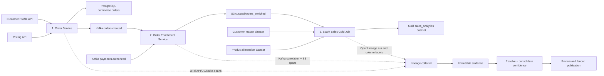

# Commerce Multi-Service Lineage Simulation Design

**Date:** 2026-08-04  
**Status:** Approved  
**Scope:** Docker-free deterministic extension to the local lineage collector prototype

## Objective

Demonstrate how the lineage collection platform discovers, corroborates, reviews, publishes, and queries lineage across three interacting applications:

1. An Order Service that calls multiple APIs, writes PostgreSQL, and produces Kafka events.
2. An Order Enrichment Service that consumes two Kafka streams, transforms and augments records, and writes curated data to S3.
3. A Spark batch job that reads the curated data and reference datasets and writes a gold analytics dataset.

The simulation must remain locally runnable without Docker, cloud credentials, Kafka, Spark, or S3. It must preserve the existing payments-pipeline demonstration and add a separate guided Scenario Lab.

## Selected approach

Use an evidence-driven scenario runner. Small deterministic adapters represent API calls, PostgreSQL writes, Kafka records, S3 objects, and Spark execution. The adapters write inspectable local artifacts and emit realistic lineage evidence. Source fixtures provide independent static evidence.

This gives the prototype the important behavior of the integrations—their identities, schemas, joins, mappings, correlations, evidence, failures, and collection boundaries—without introducing infrastructure whose operation is not the subject of the demonstration.

## Scenario architecture



### Stage 1: Order Service

The service calls the Customer Profile API and Pricing API. It constructs an order, persists it in `commerce.orders`, and produces the same business event to `commerce.orders.created`.

Important fields include `order_id`, `customer_id`, `product_id`, `quantity`, `unit_price`, `customer_tier`, `region`, `total_amount`, and `occurred_at`. `total_amount` is derived as `unit_price * quantity`.

### Stage 2: Order Enrichment Service

The service consumes `commerce.orders.created` and `payments.authorized`, joins them on `order_id`, augments the order with `payment_status`, `authorization_risk_score`, and an enrichment timestamp, then writes `s3://commerce-curated/orders_enriched/`.

### Stage 3: Spark Sales Gold Job

The batch job reads the enriched S3 dataset, a customer master dataset, and a product dimension dataset. It joins by `customer_id` and `product_id`, aggregates revenue, and writes `gold.sales_analytics` for analysts.

The primary demonstration path is:

```text
Pricing.unit_price + Order.quantity
  → commerce.orders.total_amount
  → commerce.orders.created.total_amount
  → curated.orders_enriched.total_amount
  → gold.sales_analytics.gross_revenue
```

## Identity and graph model

The catalog snapshot gains entries with asset kinds `SERVICE`, `API`, `TABLE`, `TOPIC`, `OBJECT_DATASET`, `REFERENCE_DATASET`, and `ANALYTIC_DATASET`. Canonical URNs retain the existing structure:

```text
urn:ldp:<env>:<platform>:<system>:<asset>[#<element>]
```

The platform segment distinguishes `service`, `http`, `postgres`, `kafka`, `s3`, and `snowflake` assets. The catalog provides the asset kind used by the UI. Service and API interactions are visible first-class graph nodes, while element URNs carry exact data derivation.

Every scenario execution receives a stable `scenarioId`, `correlationId`, and trace identity. They propagate through API metadata, database activity, Kafka headers, S3 object metadata, and the OpenLineage run.

## Collection mechanisms

### Static code analysis

Each of the three application fixtures declares its inputs, outputs, join keys, and mappings through deterministic Python calls recognized by the local analyzer. Static evidence includes exact file, line, AST path, repository digest, resolver version, and catalog snapshot.

The analyzer must support multiple inputs, multi-source transforms, service/API calls, tables, topics, S3 datasets, and Spark reads/writes while retaining residue for unsupported dynamic names.

### Runtime and platform evidence

- The Order Service emits OTel-style client, database, and Kafka producer spans.
- The Enrichment Service emits Kafka consumer assertions, message/header correlation, join metadata, and an S3 write span.
- The Spark job emits an OpenLineage-compatible start/complete run pair with input, output, schema, and column-lineage facets.

The raw evidence types are stored independently. Runtime fixtures are clearly identified as simulation artifacts and never described as connections to external systems.

### Resolution and consolidation

The resolver maps raw API routes, table names, Kafka topics, S3 prefixes, and Spark dataset names only through catalog-backed aliases. Unknown or ambiguous names are quarantined.

Confidence is calculated from the collected evidence rather than from the scenario manifest:

- Matching exact SCA and complete runtime element evidence produces `HIGH` confidence and `ELEMENT` corroboration.
- Runtime-only service interactions produce `SINGLE` confidence and retain their observed runtime provenance. This follows the existing confidence contract, where `MEDIUM` requires two distinct mechanisms.
- Contradicting exact mappings are retained as conflicts and are ineligible for automatic publication.

All successful stage assertions form one atomic proposal so review covers the entire source-to-gold chain.

## Local artifact model

The simulation writes deterministic, inspectable artifacts under the existing generated-data boundary:

- API response snapshots
- PostgreSQL row snapshots
- Kafka message envelopes with topic, partition, offset, key, headers, and schema
- S3 object manifests with URI, checksum, metadata, and rows
- Spark/OpenLineage run events
- Gold dataset rows

Reset removes these generated artifacts without modifying fixtures or previously committed files. Replaying the same signed scenario delivery is idempotent and creates no duplicate run, artifact, evidence object, or proposal.

## Scenario API

The API adds a small scenario surface:

- `POST /api/scenarios/commerce/reset`
- `POST /api/scenarios/commerce/run`
- `GET /api/scenarios/commerce`
- `GET /api/scenarios/commerce/{scenarioId}`

The run response includes stage events, interaction events, artifact summaries, evidence references, run identity, and the resulting proposal. Existing proposal approval, publication, lineage, and impact endpoints remain authoritative for the downstream flow.

## Scenario Lab UX

Add `/scenario` and a **Scenario lab** item to the primary navigation. Preserve all existing pages and behavior.

The page presents three synchronized lanes:

1. Business flow: APIs, table, topics, S3, reference data, and gold data.
2. Service execution: the three stages, correlations, counts, and artifacts.
3. Lineage collection: SCA, OTel/Kafka, S3, and OpenLineage evidence.

“Run commerce scenario” executes the deterministic backend run once. The UI replays the returned timestamped events progressively and labels this as a replay. Reduced-motion users receive the completed state immediately.

Selecting an interaction reveals its raw identifier, canonical URN, relevant payload fields, collection mechanism, evidence checksum, and confidence. The completed scenario links to its proposal. After approval, it links to the published full-chain graph and provides an impact-analysis shortcut from `Pricing.unit_price` to `gold.sales_analytics.gross_revenue`.

The page must remain keyboard accessible and responsive. Animation cannot be required to understand or operate the flow.

## Failure behavior

- A failed service stage stops downstream execution.
- Partial artifacts and collected evidence remain inspectable.
- Incomplete scenarios create no proposal.
- Resolver ambiguity is quarantined; the simulation never guesses an asset identity.
- Evidence checksum failure blocks consolidation.
- Duplicate delivery returns the existing scenario and proposal identities.
- API errors use the prototype's typed error envelope and correlation identity.

Failure injection controls are outside this slice. Tests exercise failures directly through the scenario service.

## Testing and acceptance

The implementation is accepted when tests prove:

1. Every API, PostgreSQL, Kafka, S3, Spark, and gold identifier resolves to the intended catalog-backed URN.
2. All three fixtures emit expected SCA edges with exact source citations.
3. Runtime evidence propagates scenario and trace identity across Kafka, S3, and Spark.
4. The enrichment join uses `order_id`.
5. `unit_price * quantity` traces to `gross_revenue` through the published graph.
6. Evidence is immutable and checksum-verifiable.
7. Duplicate delivery creates no duplicate state.
8. An incomplete stage retains partial evidence and creates no proposal.
9. Approval publishes the full graph atomically with a new fencing token.
10. Impact from `Pricing.unit_price` reaches `gold.gross_revenue` with the expected verdict.
11. Scenario Lab exposes all stages and mechanisms accessibly on desktop and mobile.

Verification includes backend domain/service/API tests, frontend component tests, strict TypeScript compilation, a production build, and a complete Chromium walkthrough.

## Explicit non-goals

- Running PostgreSQL, Kafka/Redpanda, S3/MinIO, or Spark
- Calling real Customer or Pricing services
- Production OTel or OpenLineage collector deployment
- Load, latency, throughput, or infrastructure resiliency claims
- Failure-injection controls in the Scenario Lab
- Automatic publication

These remain integration seams, not hidden assumptions.
