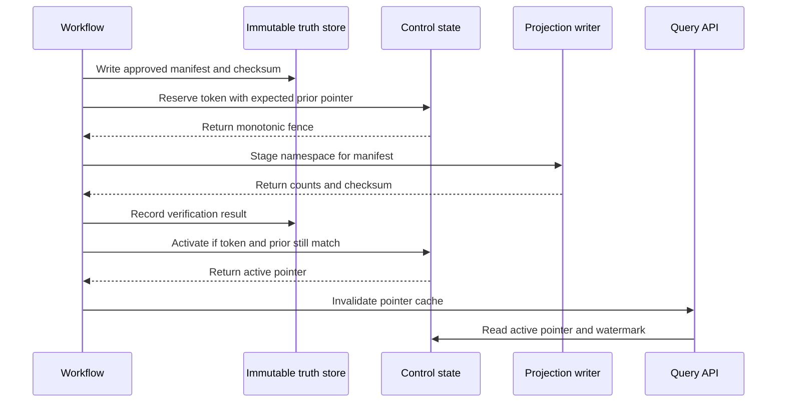

# Lineage Collection Architecture Refactor Design

**Date:** 2026-08-05  
**Status:** Approved  
**Decision:** production-shaped modular core with explicit ports, durable orchestration, immutable evidence, fenced publication, and build-ready component PRDs  
**Source material:** architecture diagrams v3, L01-L16 component PRDs, implementation-readiness review, and the local walking-skeleton prototype

## 1. Outcome

Refactor the lineage collector into a correctness-first platform that can run as one API/worker
codebase locally while preserving the contracts needed for AWS production. The architecture must
support baseline, incremental, PRGate, deployment, nightly, and runtime collection without losing
accepted work, double-applying side effects, publishing stale lineage, or claiming completeness
from partial evidence.

The local system proves the hard behavior with SQLite, files, in-process queues, simulated clocks,
and fault injection. Production adapters map the same domain and application ports to DynamoDB,
S3, SQS, EventBridge, Step Functions, Kinesis, Neptune, and OpenSearch.

## 2. Goals and non-goals

### Goals

- Make every accepted trigger durable, traceable, replayable, and idempotent.
- Define complete Baseline, Incremental, PRGate, Deployment, and Nightly workflows.
- Use deterministic static analysis first and restrict LLM work to explicit residue.
- Integrate OpenLineage, OpenTelemetry, and metadata-only runtime SDKs without confusing telemetry
  with authoritative lineage evidence.
- Preserve immutable evidence and proposals while making projections disposable and rebuildable.
- Publish only verified, approved lineage through a monotonic fencing and pointer protocol.
- Protect interactive work from baseline, backfill, runtime, and LLM saturation.
- Turn every infrastructure, resilience, security, and SLO claim into an executable acceptance
  criterion with retained evidence.
- Keep enterprise-specific values as validated configuration seams instead of invented defaults.

### Non-goals

- Splitting the platform into premature network microservices.
- Treating a queue, Step Functions, OTel, Neptune, or an LLM as a source of truth.
- Inferring production lineage merely because a change merged.
- Blocking CI on unavailable runtime evidence or LLM inference.
- Active/active multi-Region mutation of approvals, commands, or environment pointers.
- Persisting row values, bind values, secrets, tokens, or other runtime payload data.

## 3. Approaches considered

### A. Production-shaped modular core — selected

One local API/worker deployment contains explicit domain and application modules. Ports isolate
durability, scheduling, evidence, review, publication, and projection concerns. Commands, leases,
immutable stage results, a transactional outbox, and fencing make crashes and duplicates safe.

This approach proves correctness early and keeps production adapters replaceable without paying
the operational cost of network boundaries before scale or ownership demands them.

### B. AWS-shaped local service emulation

Mirror EventBridge, SQS, Step Functions, DynamoDB, and S3 using emulators. This appears closer to
production but makes local correctness tests slower and couples domain behavior to infrastructure
quirks. It remains useful for adapter integration tests, not as the primary architecture.

### C. Independent microservices from the start

Deploy intake, orchestration, analysis, review, publication, and query independently. This improves
deployment isolation but adds distributed transactions, compatibility management, and operational
load before those boundaries are justified. The selected ports preserve a future extraction path.

## 4. Architectural principles

1. **Immutable identity:** every run binds to exact source, artifact, resolver snapshot, ruleset,
   policy, prompt/model, and schema versions.
2. **At-least-once everywhere:** correctness comes from idempotency and conditional state, never
   from assuming exactly-once delivery.
3. **Durable acceptance:** an event is acknowledged only after a durable receipt and command exist.
4. **Stage idempotency:** every stage has one logical output for one determinant set; retries return
   or verify that output.
5. **Explicit completeness:** a coverage manifest records expected, completed, reused, skipped,
   unsupported, quarantined, and failed work.
6. **Immutable truth, mutable pointers:** evidence and decisions are append-only; current state is a
   small conditional pointer.
7. **No silent degradation:** dependency failure yields `WARN`, `INCOMPLETE`, `STALE`,
   `QUARANTINED`, or `LINEAGE_OUT_OF_SYNC`, never a false success.
8. **Bounded work:** queues, retries, traversal, concurrency, runtime buffers, LLM tokens, and spend
   all have explicit limits and overload behavior.
9. **Audit is domain data:** OTel helps operate the system but does not replace durable domain audit.
10. **Acceptance is executable:** every requirement, resource, and failure claim has a named test,
    threshold, owner, cadence, artifact, and release consequence.

## 5. Comprehensive architecture

```mermaid
flowchart LR
    subgraph sources["Triggers and evidence sources"]
        scm["GitHub and source control"]
        deployer["CI and deployment systems"]
        scheduler["Onboarding and schedules"]
        catalog["Enterprise catalog snapshots"]
        runtimeApps["Instrumented test runtimes"]
    end

    subgraph ingress["Durable intake and traffic isolation"]
        api["API and webhook gateway"]
        normalize["Authenticate, normalize, deduplicate"]
        archive["Replayable event archive"]
        interactiveQ["Interactive FIFO lane"]
        eventQ["Ordered event FIFO lane"]
        bulkQ["Fair bulk lane"]
        runtimeStream["Runtime dataset stream"]
    end

    subgraph control["Application control plane"]
        commandStore["Durable commands, leases, stage ledger"]
        workflows["Versioned Standard workflows"]
        classifier["Repository classifier and determinant router"]
        outbox["Transactional outbox"]
    end

    subgraph engines["Collection and evidence engines"]
        resolver["Pinned catalog resolver"]
        sca["SCA workers and parser rule packs"]
        llm["Residue-only LLM gateway"]
        runtimeValidator["Runtime session validator and collector"]
        consolidate["Deterministic consolidation"]
    end

    subgraph trust["Human and policy trust boundary"]
        proposals["Versioned proposals and policy"]
        review["Review, correction, and audit sampling"]
        publisher["Staged publisher with fencing"]
    end

    subgraph data["Authoritative and derived data"]
        truth["Immutable evidence, decisions, manifests"]
        controlState["Receipts, commands, leases, pointers"]
        graphDb["Versioned Neptune projection"]
        search["Rebuildable OpenSearch projection"]
    end

    subgraph consumers["Decision and operating surfaces"]
        queryApi["Query and impact API"]
        prGate["Read-only PR gate"]
        reviewUi["Review and operations UI"]
        telemetry["OTel, metrics, alarms, and runbooks"]
    end

    scm --> api
    deployer --> api
    scheduler --> api
    catalog --> resolver
    runtimeApps --> runtimeStream
    api --> normalize
    normalize --> archive
    normalize --> interactiveQ
    normalize --> eventQ
    normalize --> bulkQ
    interactiveQ --> workflows
    eventQ --> workflows
    bulkQ --> workflows
    runtimeStream --> runtimeValidator
    workflows --> commandStore
    workflows --> classifier
    classifier --> sca
    sca --> resolver
    sca --> llm
    runtimeValidator --> resolver
    sca --> consolidate
    llm --> consolidate
    runtimeValidator --> consolidate
    consolidate --> proposals
    proposals --> review
    review --> publisher
    publisher --> graphDb
    publisher --> search
    normalize --> controlState
    commandStore --> controlState
    workflows --> outbox
    outbox --> truth
    resolver --> truth
    sca --> truth
    llm --> truth
    runtimeValidator --> truth
    consolidate --> truth
    proposals --> truth
    publisher --> truth
    publisher --> controlState
    graphDb --> queryApi
    search --> queryApi
    controlState --> queryApi
    queryApi --> prGate
    queryApi --> reviewUi
    commandStore --> reviewUi
    controlState --> telemetry
    workflows --> telemetry
    queryApi --> telemetry
```

The diagram expresses logical ownership, not required network boundaries. Local modules may call
each other in process, but they exchange the same versioned commands and records used by production
adapters.

## 6. Ports and adapter mapping

| Port | Local adapter | Production adapter | Preserved invariant |
|---|---|---|---|
| Receipt and dedupe | SQLite unique rows | DynamoDB conditional put | One logical acceptance per provider event |
| Command and lease | SQLite transaction plus simulated clock | DynamoDB conditional update with lease epoch | Expired worker cannot complete under an old epoch |
| Queue | SQLite/in-process dispatcher | SQS FIFO or Standard fair queue | At-least-once, bounded attempts, visible age |
| Workflow | Application state machine | Step Functions Standard | Versioned stages, timeouts, retry and redrive |
| Artifact and truth | Append-only files with checksum | Versioned S3, Object Lock, replication | Exact key, version, schema, checksum and retention |
| Outbox | SQLite transaction | DynamoDB transactional outbox | State change and notification cannot separate |
| Catalog snapshot | Versioned fixture/files | Signed content-addressed S3 snapshots | One resolver snapshot per run |
| Proposal/control state | SQLite tables | DynamoDB tables and indexes | Conditional transitions and immutable history |
| Projection | Versioned SQLite graph tables | Neptune namespaces and OpenSearch indexes | Projection is rebuildable from manifests |
| Active pointer | SQLite conditional row | DynamoDB transaction | Token plus expected prior controls activation |
| Runtime stream | In-process buffered records | Kinesis and Firehose | Per-dataset ordering and no silent sampling |
| Telemetry | Console/file exporter | OTel Collector and CloudWatch | Same correlation contract; telemetry is non-authoritative |

## 7. Durable command and stage contract

Every workflow stage operates on a `StageExecution` envelope containing:

- `commandId`, `idempotencyKey`, `workflowKind`, `workflowVersion`, and `stageName`;
- scope, repository, environment, exact source/artifact digest, and expected base version;
- resolver snapshot, ruleset, parser, prompt/model, policy, and schema versions;
- input and output evidence references with bucket/key/version/checksum semantics;
- lease owner, lease epoch, lease expiry, attempt, retry class, deadline, and error code;
- correlation, causation, provider event, deployment attempt, and actor identifiers;
- coverage-manifest reference and completion state.

The idempotency key is derived from workflow kind, scope, artifact digest, stage name, determinant
digest, and schema version. A worker must acquire or renew the current lease epoch before making a
side effect and must conditionally record completion under the same epoch.

Every side effect uses one of three patterns:

1. write a content-addressed immutable object and record its reference;
2. update control state and an outbox record in one transaction; or
3. reserve, stage, verify, and conditionally activate with a fencing token.

## 8. Queue behavior and backpressure

| Lane | Production shape | Ordering and fairness | Overload behavior |
|---|---|---|---|
| Interactive | SQS FIFO with reserved consumers | Group by repository/environment or PR head; collapse superseded heads | Never borrowable by bulk; deadline yields explicit PRGate `WARN` |
| Events | SQS FIFO with reserved consumers | Pushes order per repository; deployments order per system/environment | Queue absorbs outage; stale/out-of-order events become audited no-ops |
| Bulk | SQS Standard fair queue plus bounded Distributed Map | Fairness key by owning system/domain; parallel across repositories | Defer or pause at fleet/spend cap; never consume interactive reservation |
| Runtime | Kinesis partitioned by dataset URN | Ordered per dataset; session manifest reconciles counts | Bounded emitter buffer; dropped or undrained work makes session incomplete |

All lanes use at-least-once delivery, bounded retries, typed retryability, quarantine/DLQ, oldest-age
alarms, and scoped redrive. Message count alone is insufficient; dashboards include age, saturation,
receive count, DLQ growth, drain-time forecast, tenant share, and load-shedding events.

## 9. Canonical trigger policy

| Flow | Trigger | Does not trigger it |
|---|---|---|
| Baseline | New repository/system onboarding; missing trusted base; explicit full rebaseline; major unsupported determinant/schema change; scheduled policy-driven rebaseline | Every push, PR update, merge, or deployment |
| Incremental | Push to an observed branch; affected determinant/ruleset/resolver/policy change; accepted correction; late validated runtime/LLM evidence; missing package remediation | Unchanged paths or determinants with a complete no-impact proof |
| PRGate | PR open, synchronize, reopen, target-environment change, manual rerun, or environment-pointer refresh | Merge, deployment, nightly, LLM, or runtime-session completion |
| Deployment | Canonical succeeded, failed, or rollback outcome with exact artifact digest and provider ordering | Source merge alone |
| Nightly | Reconciliation schedule, drift sample, LLM Tier-3 verification, bounded stale re-derivation, cache/manifest audit | User-facing interactive requests |

Trigger decisions are versioned policy. A trigger is acknowledged only after its canonical event and
durable command/no-impact decision are recorded.

## 10. Orchestration flows

### Baseline

1. Accept and deduplicate the baseline intent.
2. Pin repository digest, catalog snapshot, policies, rules and expected environment context.
3. Classify repository and monorepo paths; critical `UNKNOWN` blocks completion visibly.
4. Build the expected coverage plan and determinant manifest.
5. Fan out bounded static analysis by repository/path and parser pack.
6. Validate optional runtime evidence only when session, artifact and closing manifest match.
7. Run residue-only LLM work within tier and cost policy; unavailability is skip-with-record.
8. Consolidate deterministically and verify coverage completeness.
9. Create an immutable proposal or governed auto-publish decision.
10. Stage, verify, fence and activate the approved graph version.

Terminal states are `PUBLISHED`, `NO_LINEAGE`, `REJECTED`, `QUARANTINED`,
`FAILED_REDRIVABLE`, and `FAILED_TERMINAL`. Review is durable but nonterminal.

### Incremental

1. Deduplicate push/determinant evidence and pin the new digest plus exact active base.
2. Compute changed paths and affected determinant closure.
3. Build a coverage plan naming recomputed, reused, removed and unsupported scopes.
4. Fetch only the required source and immutable artifacts.
5. Prove `NO_LINEAGE_IMPACT` or extract replacement evidence.
6. Validate optional artifact-bound runtime evidence.
7. Consolidate additions, changes, removals/tombstones, conflicts and band changes.
8. Recheck active base and coverage; stale base causes deterministic rebase/recompute.
9. Create/review a delta proposal referencing old and new digests.
10. Publish using the same fenced protocol as Baseline.

For seeded changes, Incremental over the affected scope must equal a clean Baseline over the new
digest. This differential oracle is a release gate.

### PRGate

1. Pin signed PR event, exact head SHA, target environment, policy and cohort.
2. Fetch/build the exact candidate under the hard deadline.
3. Pin the exact deployed artifact, lineage package, active graph and pointer token.
4. Analyze only relevant changed paths using parsers, manifests and cached evidence.
5. Run bounded impact traversal with an explicit truncation flag.
6. Evaluate versioned policy: `PASS`, `WARN`, or `BLOCK` with evidence and waiver context.
7. Recheck PR head and environment pointer before rendering.
8. Upsert one stable GitHub check for the evaluated head.

`PASS` requires complete changed-path accounting, current pins, non-truncated required impact and
healthy dependencies. `BLOCK` requires a fully proven calibrated violation; LLM-only evidence never
blocks. Incomplete, stale, degraded, truncated, or timed-out analysis produces `WARN`. The flow is
read-only except for its check/audit record and may not wait for LLM or runtime evidence.

### Deployment

1. Authenticate and deduplicate canonical deployment outcome.
2. Establish authoritative ordering for system/environment.
3. Record actual deployed digest only on success or explicit rollback; failure changes no pointer.
4. Resolve an immutable approved lineage package for the exact artifact digest.
5. Reserve a new fence and promote only when prior pointer, package and digest all match.
6. Read back and verify deployed digest, package, graph pointer and audit correlation.

Missing package produces `LINEAGE_OUT_OF_SYNC`, retains a visibly stale last-good graph, alerts, and
enqueues priority Incremental remediation. It never guesses or points at a package for another digest.

### Nightly

Nightly reconciles accepted events against receipts and archives, samples published lineage against
clean reanalysis, verifies projection checksums, drains bounded stale LLM cache entries, evaluates
auto-publish audit samples, and raises proposals rather than mutating active lineage directly.

## 11. Static collection and framework selection

Collection uses the strongest deterministic artifact available:

1. native framework lineage and compiled plans/manifests when their versioned semantics are known;
2. SQLGlot for supported SQL dialect parsing and column lineage;
3. Python `ast` for Python structure and call sites;
4. Tree-sitter grammar queries for multi-language syntax and stable source spans;
5. versioned framework rule packs for sources, sinks, transforms and configuration binding;
6. LLM only for explicit unsupported/dynamic residue with citations and strict structured output.

Every rule pack is data plus versioned matcher semantics, positive/negative fixtures, unsupported
versions, parser pin, deterministic output and bounded failure behavior. Unresolved dynamic names
remain residue or quarantine; no parser or LLM may invent a catalog identity.

## 12. Runtime lineage, OpenLineage, and OTel

The runtime plane has three distinct evidence mechanisms:

- **OpenLineage integrations:** authoritative job/run/dataset events and column-lineage facets when
  the supported integration actually emits them.
- **Custom metadata-only SDK:** explicit dataset and field mappings for application runtimes that
  can observe exact transformations.
- **OpenTelemetry:** trace correlation, dependency/connectivity hints, health and performance. A
  generic span or `db.statement` parse is not automatically column-level proof.

All mechanisms require a signed, scoped, expiring session bound to repository, environment and exact
artifact digest. Production targets are rejected by both IAM and validator policy. A closed-schema
validator rejects payload values, secrets, unknown fields, unresolvable identities, expired sessions
and mismatched artifacts.

Session close writes a manifest with attempted, accepted, rejected, buffered, dropped and drained
counts plus checksums. Only `COMPLETE` artifact-bound sessions can corroborate at their supported
granularity. Runtime evidence may arrive after Baseline or Incremental and reopen a proposal through
normal consolidation; collection flows never wait indefinitely for it.

## 13. Consolidation, completeness, and review

Consolidation is idempotent by provenance ID and commutative across evidence arrival order. It keeps
ordinal confidence bands separate from runtime corroboration:

`LOWEST < SINGLE < MEDIUM < HIGH < HIGHEST`

Dataset-level runtime evidence sets a corroboration badge but does not raise an element-level band.
Contradictory exact/probable transforms retain all provenance and enter review. Absence never deletes
an edge; verified determinant removal creates a tombstone, while silence follows the governed decay
rule.

The coverage manifest is the completeness authority. It contains:

- expected and observed repositories, paths, parser packs, runtime sessions and determinants;
- recomputed, reused, skipped, unsupported, quarantined, failed and timed-out scopes;
- changed-path accounting and removal/tombstone proofs;
- artifact, policy, schema and stage checksums;
- explicit completeness state and reasons.

Review transitions are server-side conditional operations. Corrections create successor evidence,
edge and proposal versions. Auto-publish is limited to governed parser-exact classes with reproducible
sampling, disagreement monitoring and automatic narrowing.

## 14. Publication correctness

An expired worker cannot activate after losing its fence. Verification mismatch, projection outage,
or expected-prior conflict leaves the current pointer unchanged. Rollback creates a new audited
pointer event to a retained prior package; history is not rewritten.

## 15. NFR and resilience contract

| Quality | Launch gate or proposed objective |
|---|---|
| Correctness | Zero silent trigger loss, duplicate business effects, false active pointers, or false `PASS` results |
| Baseline | 10,000 repositories within 12 hours; reference sizing ~298 slots and 500 provisioned/load-tested |
| Intake | At most 500 ms p95 at 100 normalized triggers/s; 10,000-event burst with zero loss |
| Fairness | Tier-1 work starts within five minutes during baseline/backfill |
| PRGate | Less than 30 seconds internal objective; at most 60 seconds p95 contract; 120 seconds hard `WARN` deadline |
| Incremental | Push to proposal at most 30 minutes p95 excluding review |
| SCA and merge | SCA median at most 10 minutes; incremental merge at most 60 seconds p95 |
| Query | Bounded one-hop/proposal view at most two seconds p95; evidence ref read at most 100 ms p95 |
| Visibility | 95% of normal approved changes queryable within 60 seconds |
| Availability | Proposed T1 99.9% monthly, T2 99.5% monthly without operator action, T3 99% weekly completion |
| Recovery | Truth/control RPO 15 minutes and RTO four hours; full projection rebuild at most eight hours proposed |
| Telemetry | At most 5% stage/runtime overhead at default settings |

The existing five-minute stage-to-swap publication target is interpreted as a large
Baseline/backfill p50 until operations resolves it against the stronger 60-second normal-approval
visibility gate.

### Failure and recovery behavior

| Failure | Behavior |
|---|---|
| Worker crash | Lease expires and stage redrives from immutable output |
| Poison input | Bounded retry then quarantine/DLQ without blocking the lane |
| Catalog outage | Signed last-good snapshot with visible age until max-age policy expires |
| Git webhook gap | Detect gap and replay archive; expose unresolved gap window |
| LLM outage | Skip-with-record and retry residue later |
| Runtime throttle/loss | Buffer within limits; incomplete closing manifest; no confidence promotion |
| DynamoDB throttle | Backoff and queue buffering; idempotency retained |
| Neptune outage | Stage-and-hold publishing; query staleness/unavailable; PRGate `WARN` |
| OpenSearch outage | Discovery degraded; graph truth and traversal unaffected |
| Reviewer unavailable | Queue ages and alarms; human-required gate never bypassed |
| Region loss | Warm standby, one writer epoch, replicated truth/control recovery, projection rebuild |

The system uses one authoritative writer region. Cross-Region truth replication, recoverable control
state and disposable projections avoid active/active approval and pointer conflicts. Quarterly drills
must restore/reconcile state, elect the writer, rebuild projections and verify pointers within RPO/RTO.

## 16. Security, privacy, cost, and operability

- Short-lived, per-run SCM credentials and workload identity; no standing worker credentials.
- Least-privilege, condition-scoped IAM; private networking and restricted egress for code analysis.
- KMS encryption, versioning, checksums, retention, and Object Lock for truth classes.
- Domain authorization for review/query, audited evidence reads, and no unauthorized existence leak.
- Metadata-only runtime schemas with SDK-side and intake-side prohibited-field enforcement.
- Production runtime hard-deny at IAM and validator layers with a weekly live negative probe.
- Per-lane fleet caps, fair admission, LLM tier shedding, per-repository/day budgets and cost alarms.
- Unit-cost metrics for baseline/repository, incremental/change, PRGate/check, runtime/session,
  million events, accepted edge and projection storage.
- End-to-end correlation across receipt, command, stage, evidence, proposal, publication and query.
- Every alarm links to a tested runbook; alarm-to-runbook coverage is 100%.

## 17. Comprehensive diagram pack

The architecture documentation contains six linked views:

1. the end-to-end map in this document;
2. trigger and orchestration state diagrams for all canonical flows;
3. runtime OpenLineage, SDK and OTel evidence flow;
4. command, lease, outbox, coverage and fenced-publication correctness flow;
5. multi-AZ, warm-standby, replication, rebuild and degradation view; and
6. local-to-production port/adapter mapping.

Mermaid source is version controlled. An editable FigJam copy may be generated for stakeholder
workshops, but the repository copy remains normative and reviewable in pull requests.

## 18. Build-ready PRDs

The existing L01-L16 domain PRDs remain normative. Thin build PRDs add artifact ownership,
infrastructure and executable acceptance without requiring a microservice per document.

| Build ID | Artifact |
|---|---|
| B01 | Contracts, schemas and correlation libraries |
| B02 | Catalog snapshot and resolver packages |
| B03 | Evidence and control-store adapters |
| B04 | Event intake and lane router |
| B05 | Classifier and workflow orchestrator |
| B06 | SCA worker and rule packs |
| B07 | LLM inference gateway |
| B08 | Runtime session and ingestion plane |
| B09 | Runtime emitters and integration kits |
| B10 | Consolidation and confidence worker |
| B11 | Proposal, review and policy service |
| B12 | Publisher and projection manager |
| B13 | Query, impact and PRGate service |
| B14 | Review and operations UI |
| B15 | Operations, telemetry and recovery automation |
| B16 | Platform IaC and delivery pipeline |

Each build PRD defines its build/deploy boundary, schemas, state/failure model, local adapter, AWS
bill of materials, IAM/network/encryption, scaling, alarms/runbooks, cost, recovery, compatibility,
deployment/rollback, requirements traceability, and acceptance matrix.

## 19. Acceptance strategy

The current component PRDs reference a Test Suite that is not present in this worktree. The refactor
must create one normative executable acceptance specification rather than retaining unverifiable
cross-references.

Every `Bxx-AC-nnn` row contains requirement links, Given/When/Then, test level, versioned fixture,
oracle, environment, infrastructure assertions, exact threshold, fault point, evidence artifact,
cadence, owner and release consequence.

### Validation ladder

1. JSON Schema, graph and state-machine linting.
2. Domain unit and property tests for identity, ordering, idempotency, commutativity and fencing.
3. Consumer-driven contracts and backward/forward schema fixtures.
4. Local adapter contract tests shared with AWS adapters.
5. Workflow-state branch tests and AWS definition validation.
6. Differential tests: Incremental equals Baseline over affected scope.
7. Crash injection after every object, state, outbox, callback, stage and pointer boundary.
8. Duplicate, reorder, lease-expiry, contention and retry-storm tests.
9. Dependency degradation and security-negative tests.
10. Production-like scale/SLO tests and operational recovery drills.

### Release gates

- **Every PR:** affected unit, schema/contract, property, deterministic replay, CDK assertion,
  security and hermetic fault tests.
- **Every deployment:** exact-artifact staging smoke, migration compatibility, canary, rollback and
  pointer/data invariant tests.
- **Nightly:** sustained/burst load, duplicate replay, backlog drain, interactive-under-bulk,
  projection rebuild sample and differential corpus.
- **Weekly:** publish-fence contention, production hard-deny and scoped DLQ/redrive.
- **Monthly:** one fault from every degradation-matrix row.
- **Quarterly:** full warm-standby restore, writer election, projection rebuild and pointer audit.

No component is `READY` while its normative schema, fixture, test implementation, threshold, owner,
or evidence path is missing. P0 waivers require an owner, reason, compensating control and expiry.

## 20. Delivery sequence

1. Freeze shared envelopes and create the executable acceptance skeleton.
2. Introduce ports and durable primitives behind the current API behavior.
3. Prove intake, commands, leases, stage idempotency and outbox recovery locally.
4. Implement complete workflow definitions and coverage manifests.
5. Deepen deterministic resolver/SCA and differential Baseline/Incremental behavior.
6. Implement proposal lifecycle and fenced/resumable publication.
7. Add exact deployment promotion and read-only PRGate behavior.
8. Add runtime sessions, OTel/OpenLineage/custom SDK contract fixtures and ingestion semantics.
9. Add AWS adapters and CDK stacks under the shared contract suites.
10. Run scale, degradation and DR gates before production readiness.

## 21. Remaining enterprise approval seams

The architecture is approved with the following values externalized pending the named enterprise
owner: catalog export/schema, platform vocabulary, repository conventions, GitHub/Jenkins payloads,
enterprise Bedrock gateway, Spark platform/install path, OTel topology ownership, data retention,
review ownership mapping, catalog classification flags, paging/severity policy, audit baseline,
tenant quotas and dollar caps.

Proposed availability objectives and the eight-hour projection rebuild target require operations
sign-off. These seams do not justify guessing values or blocking interface and fixture development.

## 22. Definition of architecture completion

The refactor is architecture-complete only when:

- every diagram node maps to a build PRD and owned code/IaC artifact;
- every workflow state maps to a versioned command, schema and terminal/error behavior;
- every side effect has idempotency, lease/fence, retry, crash recovery and retained proof;
- every completeness claim is backed by a coverage manifest and automated verifier;
- every production adapter passes the same contract suite as its local adapter;
- every NFR, security, cost and resilience claim passes its required load/fault/drill gate; and
- a clean rebuild from immutable manifests reproduces active projections and pointer checksums.
