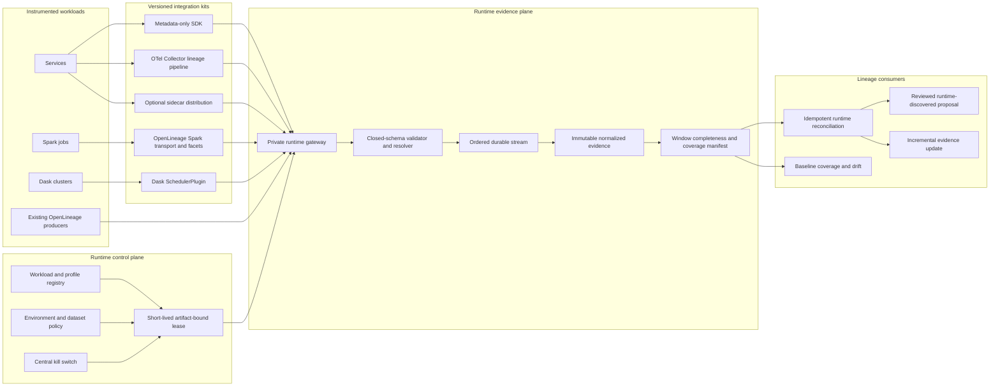

# Runtime Lineage Instrumentation and Production Collection Design

**Status:** Approved on 2026-08-07

**Goal:** Make runtime lineage a production-capable, independently trustworthy evidence plane with
the same compatibility, completeness, security, resilience and acceptance rigor as static code
analysis (SCA).

**Decision:** Use the strongest supported native integration for each runtime, normalize every
mechanism through one closed evidence contract, and enable production collection only through an
explicit workload policy with a central kill switch.

**Precedence:** This design supersedes the earlier test-only production-deny decision in the
architecture and L06/B08/B09 specifications. Those specifications must be reconciled before runtime
implementation is considered complete.

## 1. Why this track exists

The current implementation proves important intake properties: signed artifact-bound sessions,
closed metadata-only payloads, mechanism-aware normalization, idempotency, ordering, explicit
drain manifests and late reconciliation. It does not yet provide installable SDKs, an OTel Collector
lineage path, Spark and Dask integration kits, framework compatibility evidence, production leases,
or a real ATDD-to-production rollout.

Runtime evidence must answer two questions that SCA cannot answer alone:

1. Did the exact deployed artifact actually read, transform or write the expected datasets?
2. Were dynamic paths, framework plans and service interactions absent from static evidence?

SCA remains the deterministic statement of what an artifact can do. Runtime evidence is the
artifact-bound statement of what a deployed workload did. Neither plane silently substitutes for
the other.

## 2. Architectural principles

1. **Native semantics first.** Preserve OpenLineage, Spark and Dask semantics rather than flattening
   every source into generic spans.
2. **One normalized intake contract.** All sources produce the same versioned observation,
   completeness and coverage contracts while retaining mechanism and granularity.
3. **One primary collector per relationship.** A workload profile selects the authoritative path so
   SDK, OTel and framework listeners do not double-count the same operation.
4. **Metadata only.** Data values, credentials, query parameters and unsanitized query text are
   prohibited before transport and again at intake.
5. **Exact artifact binding.** Every accepted observation names the deployed digest, workload,
   instrumentation profile and observation window.
6. **No silent sampling or loss.** Bounded dropping is permitted only to protect the workload and is
   always visible in an incomplete manifest and coverage residue.
7. **Fail open for business; fail closed for confidence.** Lineage failure never takes down the
   workload and never looks like complete evidence.
8. **Production is opt-in and reversible.** Collection can be disabled globally or by workload,
   mechanism, profile or dataset without redeploying application code.
9. **Runtime discovery is reviewed.** Exact runtime evidence may propose a dynamic edge that SCA
   missed, but it cannot publish directly.
10. **Telemetry is not durable audit.** OTel operates and correlates collection; the evidence ledger
    and manifests remain the correctness authority.

## 3. Target architecture

## 4. Collection-mode selection

The workload profile selects the least invasive mechanism that retains the required semantics.

| Workload capability | Primary mode | Supported confidence | Installation |
|---|---|---|---|
| Existing OpenLineage producer | OpenLineage transport/fan-out | Dataset; element only from valid column facets | Configure an approved additional transport or gateway route |
| Spark 3.x workload | Official OpenLineage Spark listener | Dataset and supported column facets | Pinned listener JAR and `spark.extraListeners` configuration |
| Dask distributed workload | Lineage `SchedulerPlugin` | Dataset by default | Register the pinned plugin idempotently with the scheduler |
| Service with existing OTLP | OTel Collector lineage pipeline | Connectivity; dataset when approved attributes exist | Add an isolated unsampled lineage export branch |
| Service with exact application knowledge | Custom SDK | Explicit dataset or element | Add a small package and profile; no auto-instrumentation guessing |
| Workload unable to reach shared collectors | Sidecar | Semantics of its input mechanism | Run the same buffer, validation and export distribution locally |

The sidecar is a deployment choice, not a fifth evidence mechanism. Existing OpenLineage collection
is joined through transport configuration or gateway fan-out; the platform does not install a
second Spark listener when one already exists.

## 5. Versioned contracts

### 5.1 Runtime instrumentation profile

Each approved profile contains:

- profile ID and immutable version;
- workload ID, repository, owner and environment class;
- mechanism, installation mode, framework and supported version range;
- resolver snapshot and allowed dataset/attribute scope;
- artifact identity strategy and required build metadata;
- permitted granularity and parser contracts;
- buffer, event-size, retry, drain and overhead budgets;
- deployment-gate criticality, canary policy and kill-switch scope;
- package/image digest, SBOM and signature reference.

Unknown framework versions, attributes or parser contracts become explicit unsupported coverage;
they never fall back to a more authoritative interpretation.

### 5.2 Runtime lease

Production workloads use workload identity to request a renewable, short-lived lease. The lease is
bound to workload, environment, artifact digest, profile version, dataset scope and observation
window. Embedded permanent credentials are forbidden. Revocation is effective without application
redeployment.

### 5.3 Observation envelope

The normalized envelope adds the following to the existing runtime observation contract:

- deterministic observation ID and producer sequence;
- workload, window, environment and artifact digest;
- profile, emitter and mapping versions;
- mechanism and original semantic granularity;
- resolver result and evidence checksum;
- trace/run correlation when present;
- explicit unsupported or quarantine reason when normalization cannot complete.

Raw framework events are immutable source evidence. Normalized observations reference that source
by checksum so mapping behavior can be replayed with a newer resolver or profile.

### 5.4 Window manifest and coverage

A window closes as `COMPLETE`, `INCOMPLETE`, `EXPIRED`, `REVOKED` or `DISABLED`. It records attempted,
accepted, rejected, duplicate, retried, buffered, dropped, quarantined and drained counts by emitter
and reason, plus source and normalized checksums. `DISABLED` and `INCOMPLETE` are never treated as
successful runtime coverage.

## 6. Mechanism behavior

### 6.1 Custom SDK

The first production SDK is Python; JVM and Node implementations follow the same generated contract
and conformance vectors. The API is explicit and configurable: applications identify read, write,
derive or connect operations using dataset aliases and optional element mappings. The SDK resolves
no catalog identity locally, assigns no confidence and sends no data values.

Emission is asynchronous with a bounded queue, deterministic identity, batch export, retry budget,
drain and counters. A disabled or expired lease makes emission a cheap audited no-op. The SDK never
blocks the business path beyond a small configured enqueue budget.

### 6.2 OpenTelemetry

Existing OTel instrumentation continues to export ordinary telemetry to its current backend. A
separate Collector pipeline filters only supported spans, removes prohibited attributes, enriches
the event with the runtime lease/profile and exports a lineage candidate to the runtime gateway.

Standard semantic attributes can establish connectivity or, when a collection/table identifier is
already present and resolver-approved, dataset evidence. Generic spans never establish element
lineage. Element evidence requires explicit approved lineage attributes or a separately versioned
parser contract. Raw query text and parameter attributes are dropped before the lineage branch.

Trace sampling must not silently sample lineage. The lineage branch uses an independent decision
and publishes loss in the window manifest if its bounded capacity is exceeded.

### 6.3 Spark and OpenLineage

Use the supported OpenLineage Spark listener and pin the integration, Spark and Scala compatibility
cell. Preserve run/job/dataset/schema/column facets and parent-run identity. Add only platform-owned
transport, artifact/profile and environment facets using immutable schemas. Dataset-level events
remain dataset-level when the column facet is absent.

Connector-specific logical plans are accepted only for tested compatibility cells. Unknown plans,
facet versions or connectors appear in the unsupported coverage manifest.

### 6.4 Dask

The Dask kit is a scheduler plugin, registered idempotently. It observes graph annotations and
approved IO-layer metadata at graph submission and transition boundaries. It emits dataset-level
read/write relationships by default. Task arguments, partitions and computed values are forbidden.

Exact element mappings require explicit application annotations routed through the SDK contract;
the scheduler plugin does not infer fields from arbitrary Python tasks.

## 7. CI/CD, ATDD and production lifecycle

```mermaid
flowchart LR
    PR["PR contract and conformance tests"] --> Build["Immutable workload and kit artifacts"]
    Build --> ATDD["Ephemeral ATDD runtime window"]
    ATDD --> Gate["Completeness, security and overhead gate"]
    Gate --> Deploy["Deployment attestation and lease policy"]
    Deploy --> Canary["Production canary window"]
    Canary --> Rolling["Rolling production windows"]
    Rolling --> Reconcile["Incremental reconciliation"]
```

1. PR checks validate schemas, compatibility fixtures, metadata allowlists and deterministic output.
2. The build pins the application artifact and instrumentation profile/package digests.
3. ATDD deploys that exact artifact into an ephemeral environment and exercises representative
   service, OTel, Spark, Dask or OpenLineage scenarios.
4. ATDD must close a complete window and meet security, overhead, expected-edge and unexpected-edge
   thresholds before promotion when the workload profile marks runtime readiness as required.
5. Production canary validates identity, lease, connectivity, metadata policy, buffer health and
   initial evidence. Failure disables collection and follows deployment policy; it does not take down
   the workload.
6. Long-running services close rolling windows. Spark and Dask close one window per logical run.

ATDD evidence is labeled `ATDD`; it proves the candidate integration, not production behavior.
Production evidence is separately labeled and is the only runtime source for production confidence.

## 8. Orchestration triggers

- **Deployment:** attests workload, profile and collector versions; runs ATDD/canary gates; opens or
  renews the production policy only after the immutable artifact is known.
- **Incremental:** starts when a complete manifest introduces a new checksummed observation,
  materially changed mapping/schema, contradiction or previously missing runtime coverage. Manifest
  replay is idempotent.
- **Baseline:** consumes all eligible complete windows for coverage and drift. It never waits for a
  new runtime window and does not turn collection on.
- **PR gate:** remains read-only and bounded. It may query previously validated evidence for impact
  but never starts or waits for runtime collection.
- **Kill switch:** closes active windows as disabled/incomplete, stops new leases or profiles at the
  selected scope, and leaves Baseline/Incremental/SCA processing available.

## 9. Confidence and reconciliation

Mechanism fidelity is retained:

- exact SDK mappings and valid OpenLineage column facets can corroborate element evidence;
- Spark/Dask/OpenLineage dataset events can corroborate dataset relationships;
- generic OTel spans provide connectivity only;
- approved OTel dataset attributes provide dataset evidence;
- approved versioned parser contracts may provide higher granularity only within their tested scope.

Only complete, exact-artifact, resolver-valid windows advance runtime confidence. Incomplete or
disabled windows produce a coverage gap; absence never demotes SCA evidence. Contradictory evidence
enters review with both sources preserved.

Exact SDK or OpenLineage evidence may create a new reviewed proposal for a dynamic relationship
that SCA did not discover. OTel connectivity alone cannot invent a publishable edge. Runtime-derived
proposals use the normal policy, review, fencing and publication path.

## 10. Resilience and failure semantics

| Failure | Workload behavior | Evidence behavior |
|---|---|---|
| Gateway/collector unavailable | Continue; bounded enqueue/spool | Retry within budget; incomplete on remaining buffer |
| Buffer full | Continue | Drop deterministically, count loss, alert and close incomplete |
| Duplicate/reordered delivery | Continue | Idempotent identity; dataset-scoped sequence conflict quarantined |
| Process/sidecar restart | Continue | Replay durable sidecar spool; embedded queue loss is counted by producer state |
| Invalid lease/profile/artifact | Continue | Reject and quarantine; never retry deterministic policy failures |
| Unsupported framework/plan/span | Continue | Record unsupported coverage; never guess |
| Prohibited metadata | Continue | Strip before export where safe; reject/audit at intake |
| Kill switch | Continue | Stop new observations; bounded drain; disabled/incomplete manifest |

AWS production uses private intake, ordered partitioning, durable encrypted evidence, idempotency
records, DLQ/quarantine and alarms. Multi-AZ intake failure is absorbed by bounded client/sidecar
buffers; regional recovery retains manifest honesty and never fabricates a complete window.

## 11. Security and privacy

- Workload identity, scoped lease and dataset policy replace embedded secrets.
- Closed schemas and prohibited-field scanning run before transport and at intake.
- Query parameters, credentials, payloads, row values and arbitrary task arguments are forbidden.
- Packages, listener/plugin artifacts, Collector distributions and profiles are signed and carry
  SBOM and immutable digest references.
- Private TLS transport, encryption at rest, least-privilege IAM and audited grants/revocations are
  required for production.
- The kill switch is independently authorized, fully audited and does not delete accepted evidence.
- Logs and metrics use bounded identifiers and counters; they are not evidence payload stores.

## 12. SCA-equivalent assurance model

| SCA assurance | Runtime assurance |
|---|---|
| Language/parser/rule matrix | SDK/framework/collector/profile compatibility matrix |
| Exact source artifact and ruleset | Exact deployed artifact and instrumentation profile |
| Deterministic evidence bytes | Canonical normalized observations and stable checksums |
| Unsupported/dynamic residue | Unmapped spans, unsupported plans/connectors and loss coverage |
| Hostile repository fixtures | Malicious/prohibited attribute and scope fixtures |
| CPU/memory/time/disk bounds | Enqueue/CPU/memory/buffer/latency/event-size overhead bounds |
| Parser crash/redrive | Collector restart, network partition, replay, drain and deduplication |
| Corpus PR gate | SDK, OTel, OpenLineage, Spark and Dask conformance corpus |

The compatibility matrix is explicit. A framework/version cell is `SUPPORTED`, `CANARY`,
`UNSUPPORTED` or `NOT_CONFIGURED`; successful generic fixture parsing cannot promote an untested
enterprise installation to supported.

## 13. Acceptance criteria

1. Python SDK emits deterministic metadata-only dataset and element observations, survives retry and
   reports every buffered/dropped record at drain.
2. The OTel lineage path preserves the ordinary telemetry destination, excludes prohibited
   attributes, keeps generic spans at connectivity granularity and accepts approved mappings only.
3. A real local Spark job with the pinned listener produces validated dataset and column facets for
   supported connectors; unsupported plans appear in coverage.
4. A real local Dask distributed job with the pinned scheduler plugin produces dataset-level lineage
   and never serializes task values.
5. Existing OpenLineage events can be joined through transport/fan-out without installing a second
   listener or double-counting observations.
6. ATDD deploys the exact candidate artifact/profile, closes a complete window and verifies expected
   plus unexpected edges, metadata safety and overhead.
7. Kill-switch, expiry, revocation, throttling, duplicate, reorder, crash, restart, overflow and
   partial-drain tests preserve business execution and truthful manifests.
8. Complete production windows can trigger idempotent Incremental reconciliation; Baseline consumes
   them without waiting; PRGate remains read-only.
9. Exact runtime-only evidence creates a reviewed proposal; connectivity-only OTel evidence cannot
   publish or create an exact field edge.
10. Every build publishes compatibility, conformance, security, overhead and completeness evidence
    with exact artifact and package digests.

## 14. Rollout

1. Contract/profile/window v2 and deterministic producer core.
2. Python SDK and local conformance harness.
3. OTel mapping pipeline and existing-collector fan-out configuration.
4. Spark OpenLineage kit and compatibility corpus.
5. Dask scheduler plugin and compatibility corpus.
6. Runtime reconciliation, coverage and orchestration triggers.
7. ATDD deployment, production lease/canary/kill-switch infrastructure and fault acceptance.
8. JVM and Node SDKs after the generated cross-language conformance contract is stable.

Production starts disabled. Each workload advances through contract, ATDD, canary and explicit owner
approval. Disabling production leaves ATDD collection independently configurable.

## 15. Explicit non-goals

- Replacing native OpenLineage integrations with a proprietary framework analyzer.
- Treating generic OTel traces as exact data lineage.
- Capturing data values or relying on raw SQL text for production field lineage.
- Requiring lineage availability for business workload availability.
- Blocking every deployment on runtime evidence; gate criticality is profile-owned and approved.
- Claiming enterprise Spark, Dask, OTel or service compatibility before its exact matrix cell passes.

## 16. Framework references

- [OpenLineage Spark integration](https://openlineage.io/docs/integrations/spark/)
- [OpenLineage client configuration and transports](https://openlineage.io/docs/client/python/configuration/)
- [OpenLineage facet extensibility](https://openlineage.io/docs/spec/facets/)
- [OpenTelemetry Collector components](https://opentelemetry.io/docs/collector/components/)
- [OpenTelemetry database semantic conventions](https://opentelemetry.io/docs/specs/semconv/db/database-spans/)
- [Dask advanced Python and scheduler plugin API](https://docs.dask.org/en/stable/deploying-python-advanced.html)
