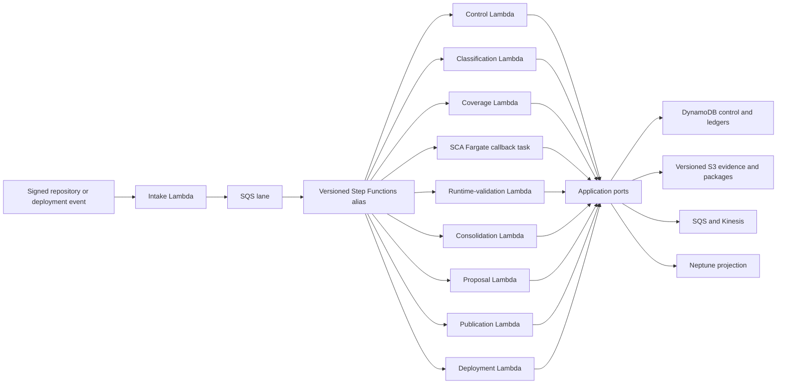

# Production AWS Application Completion Design

**Date:** 2026-08-08

**Status:** Approved for implementation

**Goal:** Turn the existing production-shaped workflow topology into a usable AWS product whose
Step Functions states execute the same classification, analysis, consolidation, review, publication
and query behavior already proven by the local application.

## 1. Current boundary

At design approval the repository contained four versioned Standard Step Functions workflows, eight
Lambda targets, an SCA Fargate task, AWS persistence adapters and guarded CDK packaging. Those assets prove
deployment shape, immutable references, leases and redrive structure. They do not yet prove the full
product behavior in AWS:

- the common AWS stage executor checkpoints a generic stage result instead of dispatching each
  workflow stage to its application use case;
- classification has a named workflow stage but no explicit production compute target;
- the Fargate callback wrapper does not yet run the deterministic SCA engine;
- the product API stack exposes only health and does not serve the local UI's API surface;
- the React build is not yet deployed through CloudFront, and production identity/RBAC is absent.

Documentation and acceptance evidence must distinguish structural `SYNTH_PASS` from business-flow
and live-AWS proof until these gaps are closed.

## 2. Alternatives considered

### A. One Lambda for every workflow state

This creates the strongest state-level isolation, but produces more than thirty deployable units,
duplicates bootstrap code and IAM, and makes compatible workflow changes operationally expensive.
It is rejected because state identity does not by itself justify a deployment boundary.

### B. One generic control Lambda for every state

This is close to the current shape and minimizes infrastructure. It also hides ownership, permits a
generic success response to masquerade as completed business work, and couples unrelated scaling and
rollback. It is rejected as the production execution model.

### C. Functional deployment units with an explicit closed stage registry — selected

Keep one versioned backend image, but deploy independently configured functional targets. Step
Functions call immutable target versions. Each target owns a closed set of stage IDs and dispatches
through application ports to the real use case. Unknown or misrouted stages fail before acquiring a
lease or writing evidence.

Classification becomes an explicit Lambda target because its policy version, compatibility matrix,
scaling and rollout are independent of workflow bookkeeping. Lightweight acceptance, pinning,
fetch/recheck and gate-policy states remain in the control target. SCA remains Fargate because it is
CPU/memory intensive. Coverage, runtime validation, consolidation, proposal, publication and
deployment retain dedicated targets.

## 3. Production execution model

Every stage consumes a closed envelope containing an immutable S3 reference. It resolves and
validates the input, runs exactly one use case, writes an immutable domain-specific output, then
records the stage completion using the existing lease epoch. Retry and replay return the same output
reference. No stage may report success merely because it persisted a generic checkpoint.

## 4. Stage ownership

| Target | Owned behavior |
|---|---|
| Intake | Authenticate, canonicalize, deduplicate, durably enqueue and start the selected workflow |
| Control | Pin inputs/determinants, fetch artifacts, recheck pointers, evaluate bounded gate policy and audit outcomes |
| Classification | Repository/path classification, policy versioning, unsupported/quarantine decision and immutable classification evidence |
| Coverage | Baseline/differential coverage plan and completeness accounting |
| SCA Fargate | Deterministic static extraction, exact citations, transform/residue and callback heartbeat |
| Runtime validation | Lease/profile/artifact validation, normalization and window evidence references |
| Consolidation | Idempotent merge, conflicts, confidence/corroboration separation and tombstones |
| Proposal | Create/reuse reviewed proposals and immutable decision history |
| Publication | Stage, verify, fence, activate and read back the graph/package pointer |
| Deployment | Execute D1–D6 exact-artifact promotion with authoritative ordering |

The registry is authoritative and versioned with the workflow contracts. CDK and ASL parity tests
must fail when a stage has no executable owner or a target is granted a stage it does not own.

## 5. Product surface

The local FastAPI routes remain the behavioral oracle. Production adds query/review Lambda entry
points and API Gateway integrations for operations, runs, proposals, corrections, lineage, edges,
impact and runtime administration. The React bundle is built once, uploaded immutably to S3 and
served by CloudFront with environment-bound API configuration.

Production removes demo reset/seed operations. OIDC groups map to viewer, reviewer, publisher,
operator and runtime-administrator capabilities. Privileged actions use conditional writes and
produce immutable audit records. Runtime collection remains disabled until an approved profile,
workload, artifact and lease are present.

## 6. Failure and security behavior

- Unknown stage, wrong target, unsupported schema, invalid reference or missing authority fails
  closed and writes no success checkpoint.
- Retriable AWS failures return `REDRIVE_REQUIRED`; deterministic domain rejection returns an
  explicit terminal outcome and evidence reference.
- Raw repository/runtime payloads never enter Step Functions state or logs; only bounded references
  and identifiers cross service boundaries.
- A failed canary cannot move a Lambda alias or workflow alias. Durable data is superseded, never
  rolled back or deleted.
- AWS IAM grants each target only its port requirements. The classification target cannot publish;
  the query target cannot mutate evidence; the UI never receives data-plane credentials.

## 7. Verification strategy

Each new behavior follows test-driven development:

1. Pure registry tests prove every workflow stage has exactly one compatible functional owner.
2. Handler tests prove target/stage mismatch fails before I/O and replays return the original output.
3. Adapter-contract tests use deterministic fake AWS clients while asserting real domain artifacts.
4. CDK tests prove immutable target versions, least privilege, API routes, CloudFront and auth.
5. Workflow integration tests start from a signed event and require a queryable published graph.
6. A guarded ephemeral AWS run retains exact source/image/profile/config digests and labels all
   unavailable production-only scale, security and recovery gates `AWS_REQUIRED`.

## 8. Delivery sequencing

The production application completion track is A1–A9 and is a prerequisite for Task 22:

1. A1 — closed stage registry and dedicated classification Lambda.
2. A2 — real application-service bindings for the remaining functional handlers.
3. A3 — deterministic SCA execution in the Fargate callback worker.
4. A4 — domain-artifact integration coverage for every AWS state.
5. A5 — product/query Lambda handlers and API Gateway routes.
6. A6 — S3/CloudFront React delivery with environment-bound API configuration.
7. A7 — OIDC/RBAC, privileged-action audit, WAF and secret/config boundaries.
8. A8 — immutable staging/production promotion, canary and rollback pipeline.
9. A9 — full AWS workflow and retained acceptance evidence.

Runtime hardening R3–R8 remains required. Task 22 may start only after both tracks are independently
reviewed, committed and truthfully verified.
